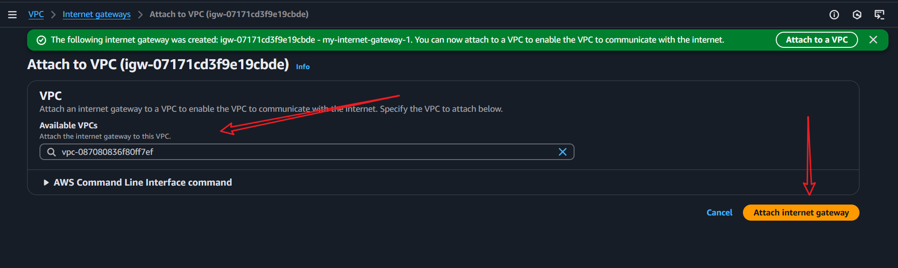
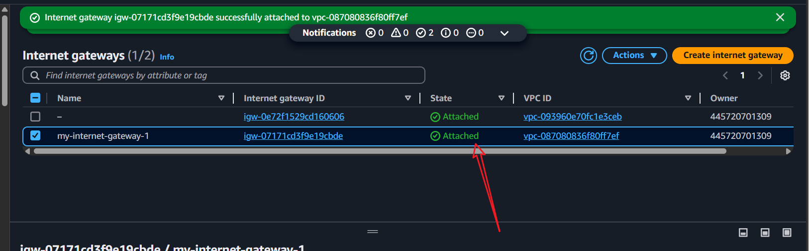
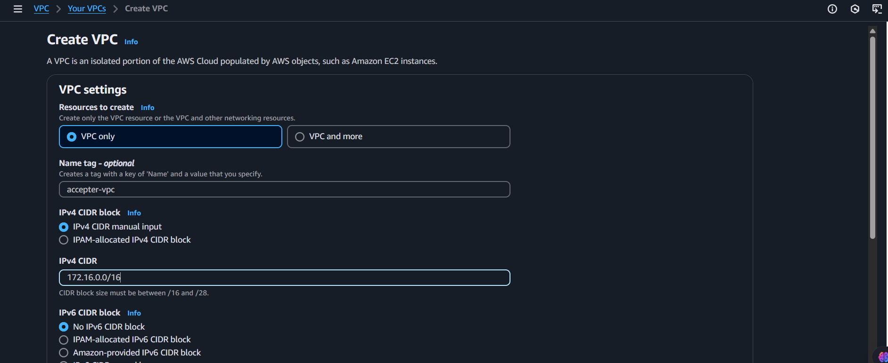

# AWS VPC Project

This project demonstrates how to set up a Virtual Private Cloud (VPC) on Amazon Web Services (AWS) with the following components:
- A VPC with a CIDR block
- Public and private subnets
- Internet Gateway
- NAT Gateway
- Security Groups
- Route Tables
- EC2 instances in public and private subnets

## Prerequisites
- An active AWS account

---

## Part 1: Create a VPC

1. Navigate to the **VPC** service in the AWS Management Console or search for "VPC" in the search bar.

   

2. Click on the **Create VPC** button.

   

3. On the "Create VPC" page, select **VPC only** and provide the following details:
   - **Name tag**: `my-vpc`
   - **IPv4 CIDR block**: `10.0.0.0/16`

4. Click the **Create VPC** button.

   
   

5. Once the VPC is created, you will be redirected to the VPC dashboard, where you can view the newly created VPC.

   

---

## Part 2: Create Subnets

1. In the VPC dashboard, navigate to the **Subnets** section in the left sidebar.
2. Click on the **Create subnet** button.

   

3. Select the VPC you just created and provide the following details for the public subnet:
   - **Name tag**: `my-public-subnet`
   - **Availability Zone**: `us-east-1a`
   - **IPv4 CIDR block**: `10.0.6.0/24`

4. Click the **Create subnet** button.

   
   

5. Repeat the process to create a private subnet with the following details:
   - **Name tag**: `my-private-subnet`
   - **Availability Zone**: `us-east-1a`
   - **IPv4 CIDR block**: `10.0.7.0/24`

6. Click the **Create subnet** button.

   
   

7. After creating the subnets, you will be redirected to the Subnets dashboard, where you can view the newly created public and private subnets.

   

---

## Part 3: Create an Internet Gateway

1. In the VPC dashboard, navigate to the **Internet Gateways** section in the left sidebar.
2. Click on the **Create internet gateway** button.
3. Provide the following details:
   - **Name tag**: `my-internet-gateway`

4. Click the **Create** button.

   
   

5. Once the Internet Gateway is created, you will be redirected to the Internet Gateways dashboard, where you can view the newly created Internet Gateway.

   

---

## Part 4: Attach the Internet Gateway to the VPC

1. In the VPC dashboard, navigate to the **VPCs** section in the left sidebar.
2. Select the VPC you created earlier.
3. From the **Actions** dropdown menu, select **Attach Internet Gateway**.
4. Choose the Internet Gateway you created earlier and click the **Attach** button.

   
   

5. Once attached, you will be redirected to the VPC dashboard, where you can see the Internet Gateway linked to the VPC.

   

---

## Part 5: Set Up Route Tables

1. In the VPC dashboard, navigate to the **Route Tables** section in the left sidebar.
2. Click on the **Create route table** button.
3. Provide the necessary details.

   
   

4. On the route table page, click on **Subnet Associations** and select the public subnet.
5. Click the **Edit subnet associations** button, select the public subnet, and click **Save associations**.

   
   

6. Navigate to the **Routes** tab and click the **Edit routes** button.
7. Add a route with the following details:
   - **Destination**: `0.0.0.0/0`
   - **Target**: `my-internet-gateway`

8. Click the **Save routes** button.

   
   

---

## Part 6: Create a NAT Gateway

1. In the VPC dashboard, navigate to the **NAT Gateways** section in the left sidebar.

   

2. Click on the **Create NAT gateway** button and provide the necessary details.

   
   

3. Once the NAT Gateway is created, you will be redirected to the NAT Gateways dashboard.

   

4. Update the route table for the private subnet:
   - Navigate to the **Route Table** tab in the subnet details.
   - Click **Edit routes**, add a route with:
     - **Destination**: `0.0.0.0/0`
     - **Target**: `my-nat-gateway`

   
   
   

5. Save the routes and associate the private subnet with the updated route table.

   
   
   

---

## VPC Peering

To enable communication between two VPCs, follow these steps:

1. Create two new VPCs in the same or different regions.

   ***First VPC***

   

   ***Second VPC***

   
   

2. In the VPC dashboard, navigate to the **Peering Connections** section.

   

3. Click on the **Create peering connection** button and provide the following details:
   - **Name tag**
   - **Requester VPC**
   - **Account to peer with**
   - **Region to peer with**
   - **Accepter VPC**

4. Click the **Create peering connection** button.

   
   

5. Once created, navigate to the Peering Connections dashboard to view the connection.

   

6. Select the peering connection, click **Actions**, and choose **Accept request**.

   
   

7. Update the route tables for both VPCs:
   - Add a route in the accepter VPC's route table to the requester's CIDR block.
   - Add a route in the requester's route table to the accepter's CIDR block.

   
   
   

---

## Conclusion

In this project, we successfully created a VPC with public and private subnets, an Internet Gateway, a NAT Gateway, and established a peering connection between two VPCs. This setup enables secure communication between resources in different VPCs within the AWS cloud.

