# DataWise Project

The aim of this project is to illustrate the use of AWS CLI and shell scripting in creating instances and S3 buckets. The S3 bucket would be created for various unit of the business.

# Prerequisites

- AWS CLI installed and configured with appropriate permissions.
- Basic knowledge of shell scripting.

# Implementation Steps

1. Confirm that you have the AWS CLI installed and configured. You can check this by running:

   ```bash
   aws --version
   ```

   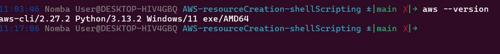

2. Setup the Key pair on AWS console by following these steps:

   - From console go to EC2
   - Look for Keypairs on the navigation pane by the left
   - Click on Create Key Pair
   - Enter the name of the key pair and select the file format as .pem
   - Click on Create Key Pair
   - Download the key pair file and save it in a secure location

   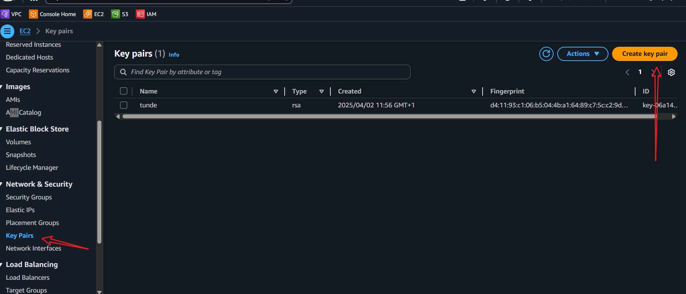

   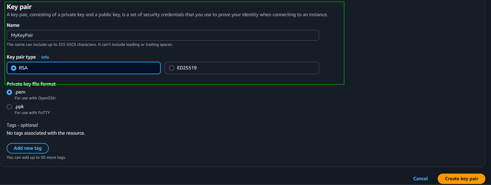

3. Create the sh file where all the commands will be written. You can name it `aws-provisioner.sh`:
   ```bash
   touch aws-provisioner.sh
   chmod +x aws-provisioner.sh
   ```
   **Note**: With this Setup we now have th requirements to create the S3 bucket and EC2 instance.

## Phase 1: Setting Up the Shell Script

4. Open the `aws-provisioner.sh` file in an editor and add the following script, our first function would be to check if aws cli is installed as shown in the image below:

   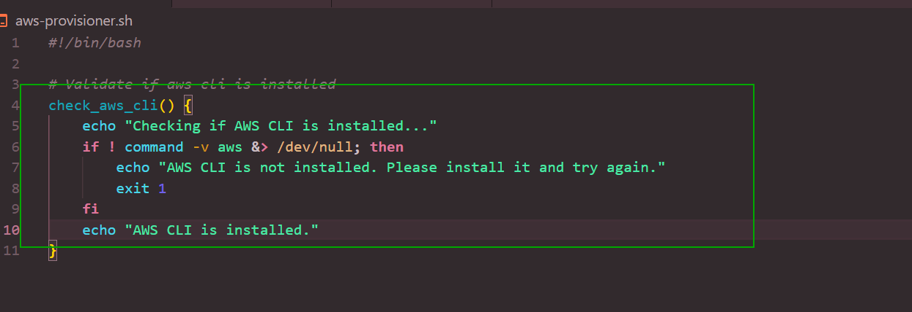

````bash
#!/bin/bash

# Validate if aws cli is installed
check_aws_cli() {
    echo "Checking if AWS CLI is installed..."
    if ! command -v aws &> /dev/null; then
        echo "AWS CLI is not installed. Please install it and try again."
        exit 1
    fi
    echo "AWS CLI is installed."
}

5. Second function would be to check if AWS_PROFILE is set, if not we will set it to the default profile:

```bash
check_aws_profile() {
    echo "Checking if AWS_PROFILE is set..."
    if [ -z "$AWS_PROFILE" ]; then
        echo "AWS_PROFILE is not set. Setting it to 'default'."
        export AWS_PROFILE=default
    fi
    echo "AWS_PROFILE is set to '$AWS_PROFILE'."
}
````

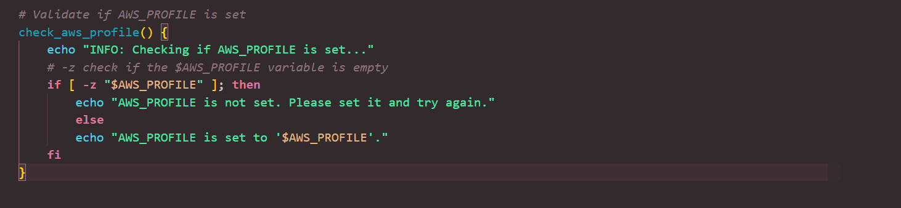

6. The third function in the script would check for script arguments and determine the environment type, if no argument is passed it will default to `dev`:

```bash
activate_infra_environment() {
    echo "Activating infrastructure environment..."
    if [ -z "$1" ]; then
        echo "No environment specified. Defaulting to 'dev'."
        ENVIRONMENT="dev"
    else
        ENVIRONMENT="$1"
    fi
    echo "Infrastructure environment is set to '$ENVIRONMENT'."

    .......
}

```

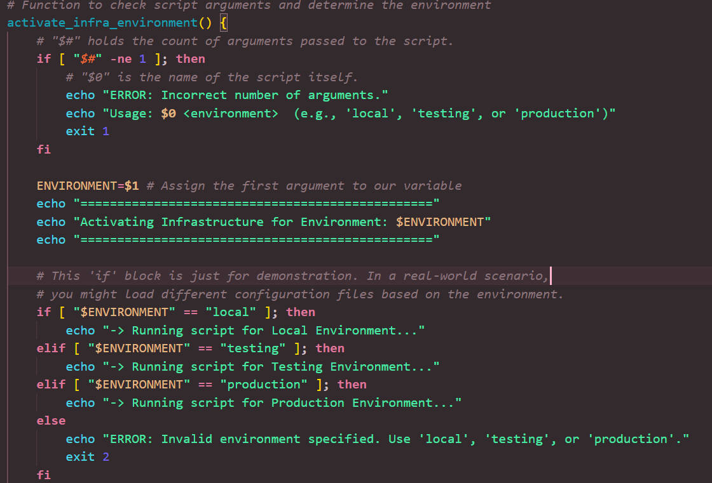

## Function 1: Provision EC2 Instances

This function encapsulates all the logic for creating our virtual servers.

**Why use a function?** It makes our code modular, readable, and reusable. We could call create_ec2_instances from multiple places without rewriting the code.

```bash
create_ec2_instances() {
    echo "Creating EC2 instances..."
    # Here you would add the AWS CLI commands to create EC2 instances
}
```

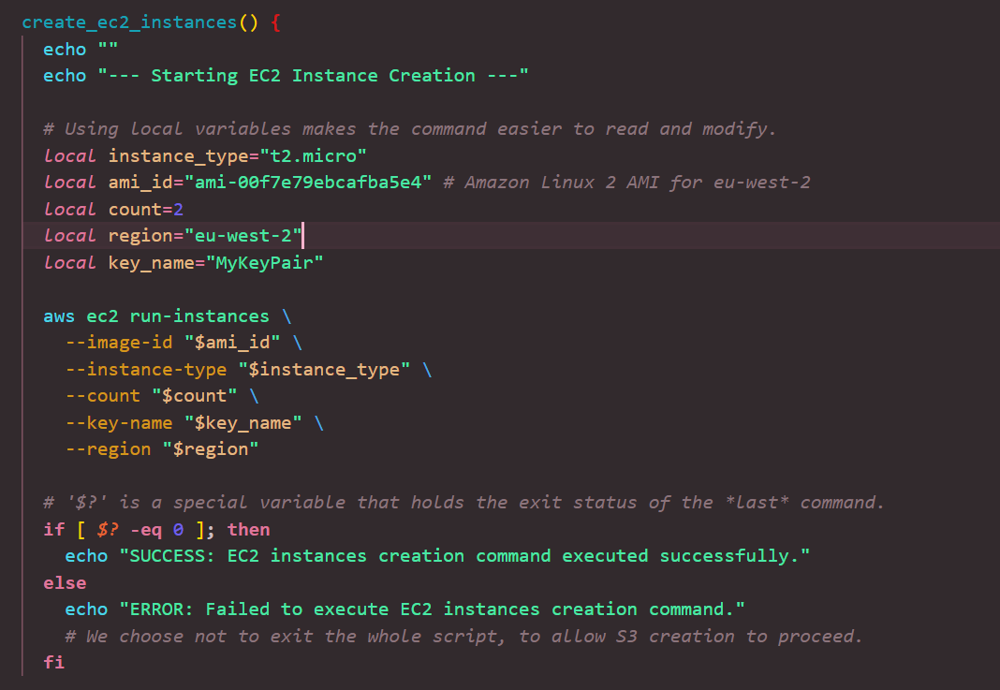

**Author's Note:** The \ at the end of each line is a line continuation character. It tells the shell that the command continues on the next line. This drastically improves the readability of long commands.

## Function 2: Create S3 Buckets with Arrays

This function demonstrates how to perform the same action on a list of items using an array and a loop.

**Why use an array?** It allows us to manage a collection of related data (like our department names) cleanly. If we need to add a new department, we just add it to the array, and the loop handles the rest. No need to copy-paste the aws s3api command.

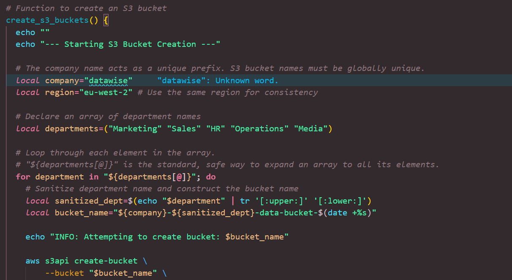

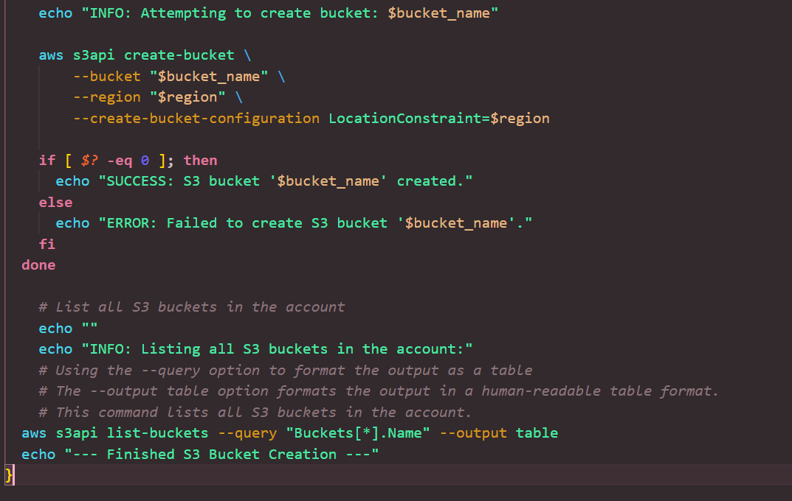

**Note:** The `aws s3api create-bucket` command is used to create a new S3 bucket. The `--bucket` option specifies the name of the bucket, and the `--region` option specifies the AWS region where the bucket will be created. Lastly is list out the buckets created:

```bash
aws s3api list-buckets --query "Buckets[*].Name" --output table
```

## Function Execution

Finally, we need to call our functions in the script to execute them. This is done at the end of the script:

```bash
# Call the functions in the correct order
check_aws_cli
check_aws_profile
activate_infra_environment "$1"
create_ec2_instances
create_s3_buckets
```

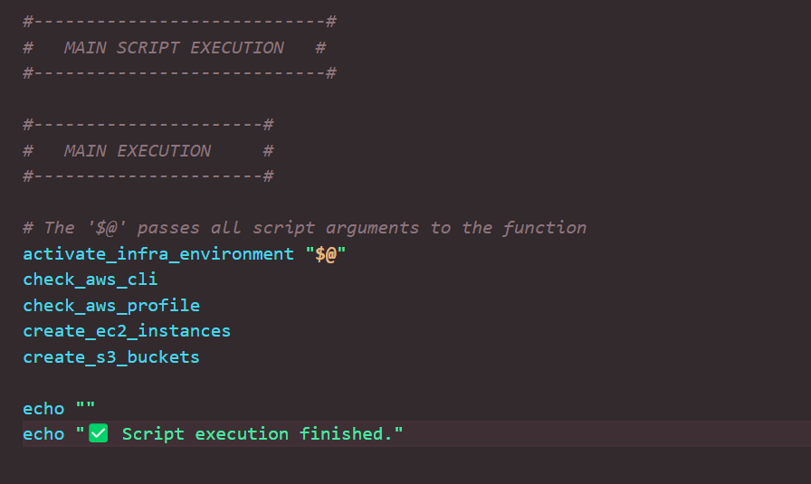

## Running the Script

To run the script, you can execute the following command in your terminal:

```bash
./aws-provisioner.sh <environment>
```

Replace `<environment>` with the desired environment (e.g., `local`, `testing`, or `production`).
If no argument is provided, it defaults to `dev`.

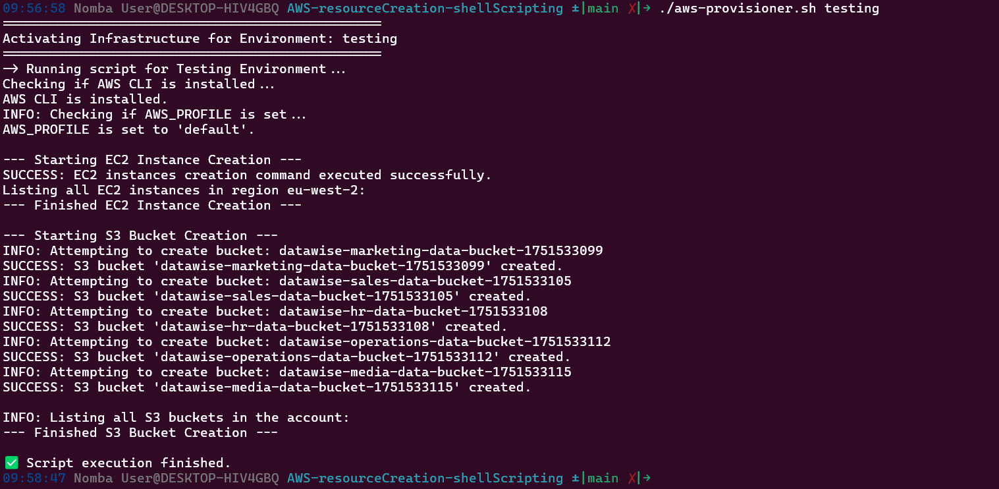

**_Instance created successfully:_**
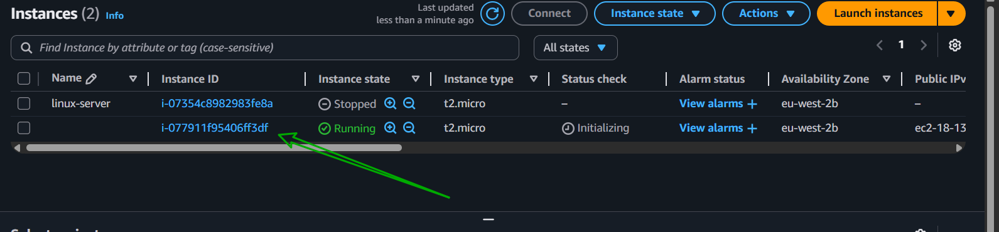

**_S3 bucket created successfully:_**
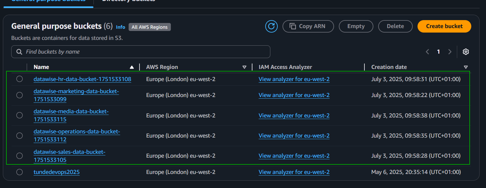

# Bonus Feature: Teardown Script

It is a good DevOps practice to have a teardown script that can clean up resources created by the provisioning script. This is especially useful in development and testing environments. The demo below would demonstrate how to create a teardown script that deletes the EC2 instance and S3 bucket created by the provisioning script.

The goal of our aws*teardown.sh script is not just to delete things randomly. \*\*\_It's to intelligently find and remove only the specific resources we created,*\*\* leaving everything else in your AWS account untouched.

1. Create a new file named `aws_teardown.sh` and make it executable:

   ```bash
   touch aws_teardown.sh
   chmod +x aws_teardown.sh
   ```

2. ***Add the Header and a Safety Warning***

   Destructive scripts should always announce their intent clearly. We'll start with our shebang and add a big warning, including a confirmation prompt to prevent accidental execution. This is a common best practice for any script that deletes data or infrastructure.

```bash
#!/bin/bash
# ============================================================================
# ======================== AWS RESOURCE TEARDOWN SCRIPT ======================
# ============================================================================
#  WARNING: This script is DESTRUCTIVE and will terminate EC2 instances
#           and delete S3 buckets created by the provisioning script.
# ============================================================================

echo "🛑 WARNING: This script will permanently delete AWS resources."
read -p "   Are you sure you want to continue? (y/n) " -n 1 -r
echo
if [[ ! $REPLY =~ ^[Yy]$ ]]
then
    [[ "$0" = "$BASH_SOURCE" ]] && exit 1 || return 1 # handle exits from shell or sourced script
fi
```

3. Add the Function to Delete EC2 Instances
   To terminate the instances, we first need to find their IDs. We can do this by querying for instances with the MyKeyPair key name we used during creation.

```bash
terminate_ec2_instances() {
    echo "Deleting EC2 instances..."
    # Here you would add the AWS CLI commands to delete EC2 instances
}
```

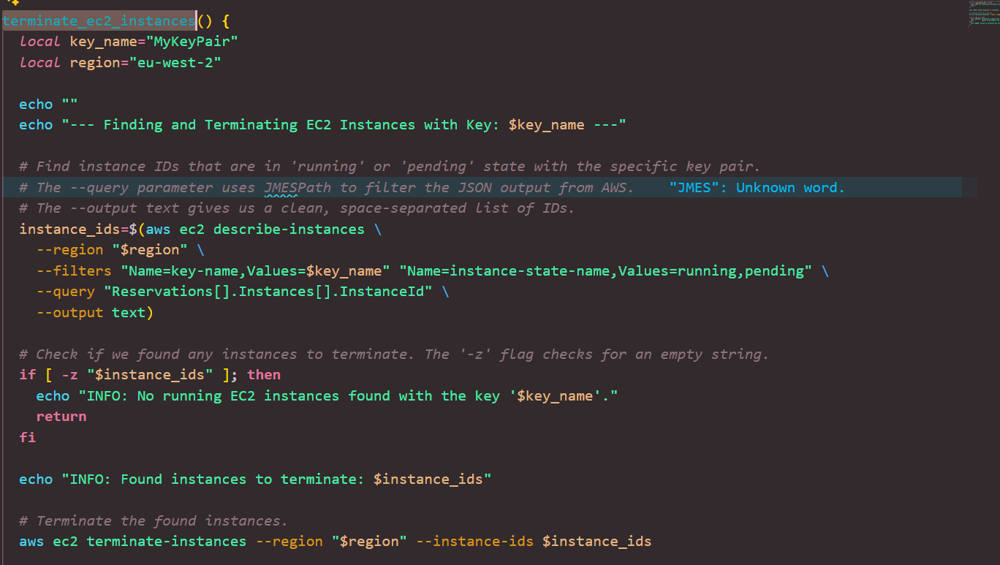

3. ***Function to Delete S3 Buckets***

This is slightly more complex because S3 buckets must be empty before they can be deleted. Luckily, the higher-level aws s3 command set has a tool for this.

```bash
terminate_s3_buckets() {
    echo "Deleting S3 buckets..."
    # Here you would add the AWS CLI commands to delete S3 buckets
}
```

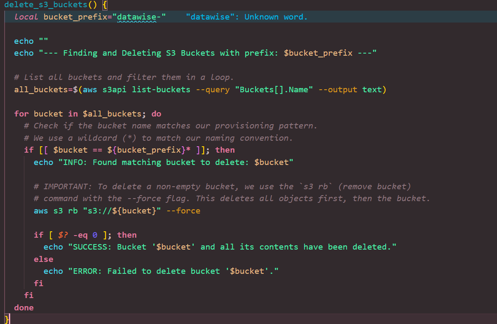

4. ***Call the Functions***

Finally, we need to call our functions in the script to execute them. This is done at the end of the script:

```bash
# Call the functions in the correct order
terminate_ec2_instances
delete_s3_buckets
```
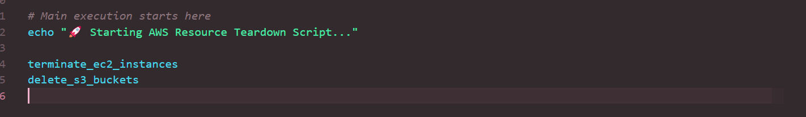

5. ***Running the Teardown Script***
To run the teardown script, you can execute the following command in your terminal:

```bash
./aws_teardown.sh
```
Replace `<environment>` with the desired environment (e.g., `local`, `testing`, or `production`).
If no argument is provided, it defaults to `dev`.

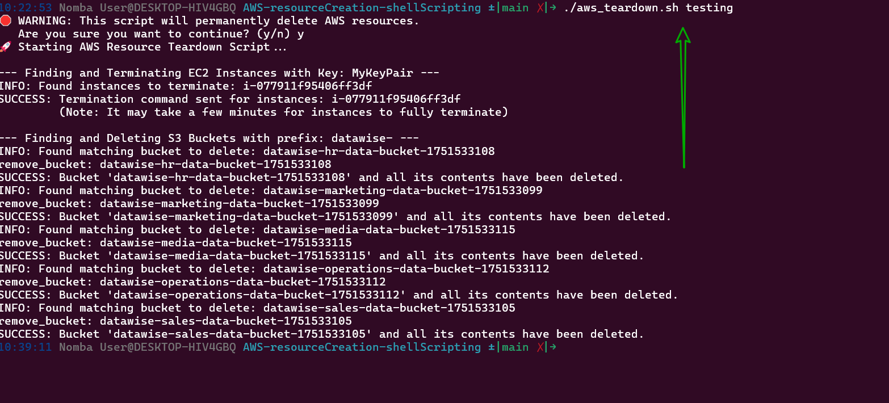

**_Instance terminated successfully:_**
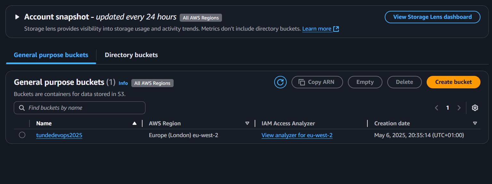

**_S3 bucket deleted successfully:_**
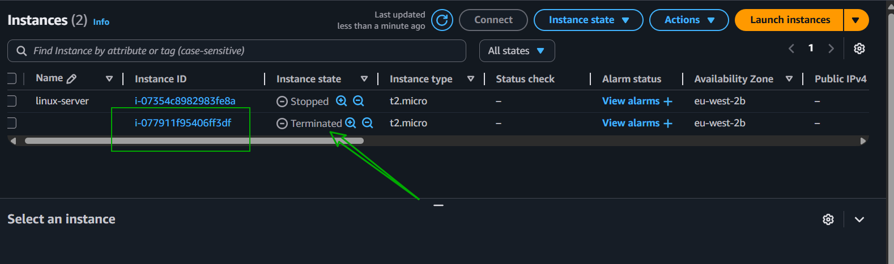

Of course. This project has been a fantastic, hands-on journey through fundamental DevOps practices. Here is a general summary and conclusion that captures your key achievements and learnings.

---

### **Project Summary and Conclusion: Automating AWS Resource Management with Shell Scripting**

#### **Project Overview**

This project demonstrated an end-to-end DevOps workflow for automating cloud infrastructure management on AWS. We developed two core shell scripts: `aws_provisioner.sh` to create resources and `aws_teardown.sh` to destroy them. The primary objective was to move away from manual console-based operations and embrace a repeatable, code-driven approach, practicing a foundational form of **Infrastructure as Code (IaC)**. The scripts focused on provisioning EC2 instances for compute power and S3 buckets for data storage, two of the most common services in the AWS ecosystem.

#### **Key Achievements and Technical Takeaways**

1.  **Modularity with Shell Functions:** We structured our code using **shell functions** (`create_ec2_instances`, `create_s3_buckets`, etc.). This approach was critical for organizing logic, improving readability, and making the code reusable and easy to maintain. Each function had a single, clear responsibility, separating concerns like validation from the core provisioning tasks.

2.  **Efficient Scaling with Arrays and Loops:** To create multiple S3 buckets without repetitive code, we leveraged **shell arrays** to store department names and a `for` loop to iterate through them. This highlighted how programmatic constructs can efficiently scale operations, as adding a new bucket is now as simple as adding one more string to the array.

3.  **Building Robust and Safe Automation:** The project heavily emphasized script safety and reliability.
    *   **Validation:** We implemented checks to verify that the AWS CLI was installed and that the required script arguments (`environment`) were provided, preventing the script from running in an improper state.
    *   **Error Handling:** By checking the **exit status (`$?`)** of each `aws` command, our script could detect success or failure and provide clear, immediate feedback, which is crucial for debugging and for integration into larger CI/CD pipelines.
    *   **User Confirmation:** The teardown script included a vital user confirmation prompt, a best practice that prevents accidental and costly deletions of infrastructure.

4.  **Real-World Debugging:** We encountered and successfully debugged common cloud operational issues, including an `VcpuLimitExceeded` error from AWS. This provided practical experience in reading cloud provider error messages, understanding account service quotas, and adapting our code to work within those constraints.

#### **Conclusion**

Through this project, we successfully built a complete lifecycle management tool for a set of AWS resources. We learned that effective automation is about more than just executing commands; it's about writing code that is **intelligent, safe, and maintainable**. By using functions for structure, loops for efficiency, and validation for safety, we created a powerful yet simple automation workflow. This foundational skill set—writing scripts to provision, configure, and tear down cloud infrastructure—is a cornerstone of modern DevOps engineering, enabling teams to build and manage complex systems with speed, consistency, and confidence.
