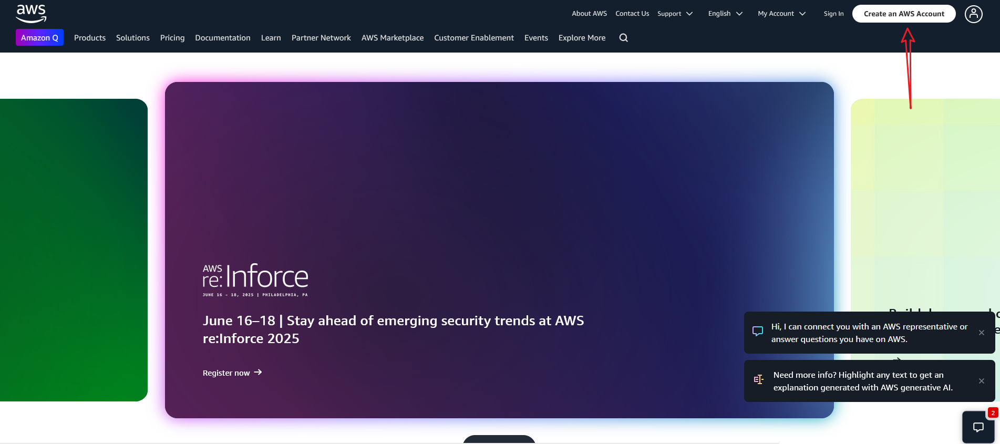
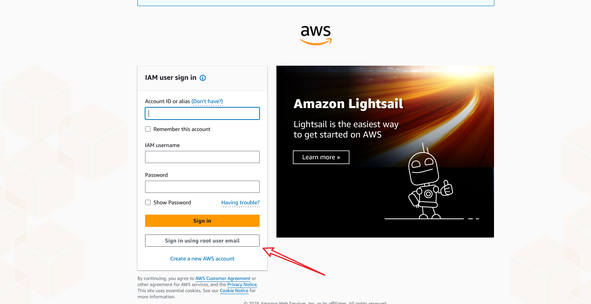
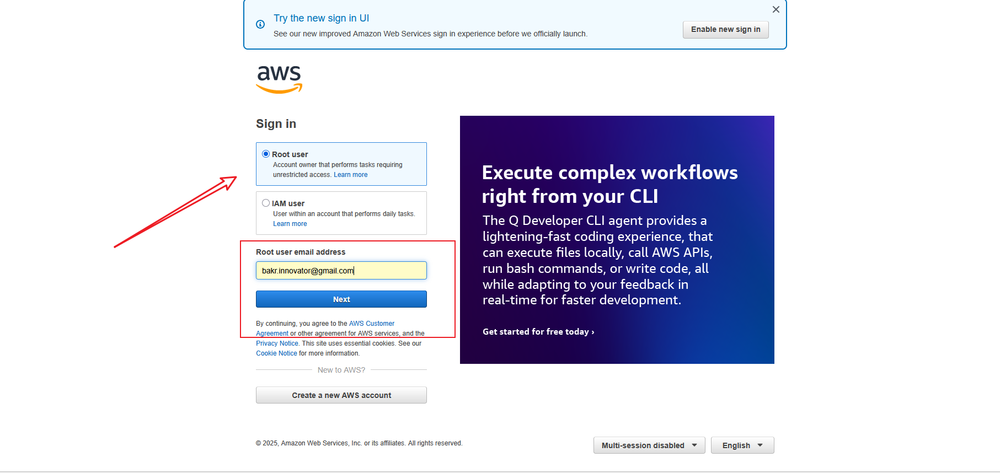
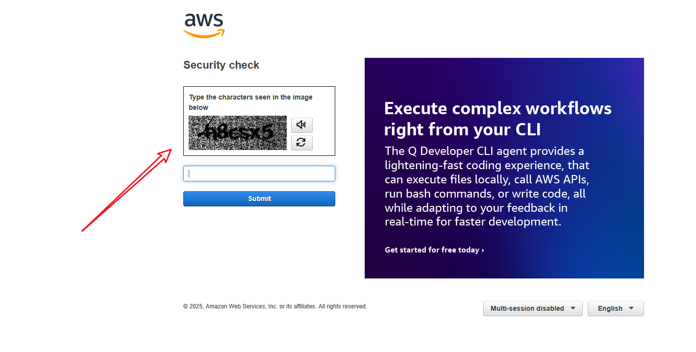
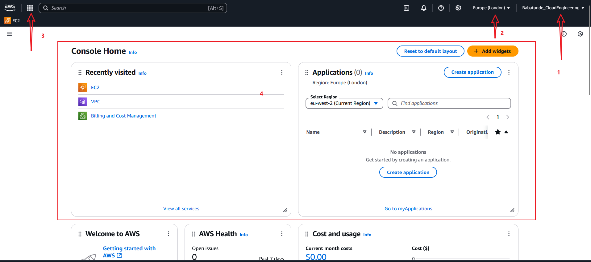
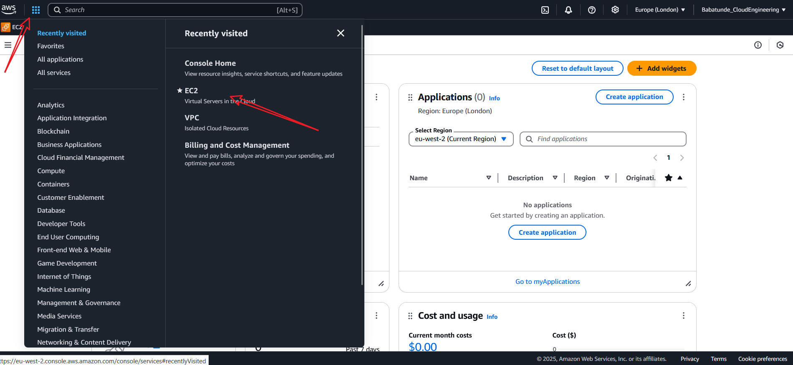

# AWS Account Creation Project
This project outlines the steps required to create and configure an AWS account for cloud services.

## Introduction to Cloud
- What is the cloud:
The cloud refers to a network of remote servers hosted on the Internet to store, manage, and process data, rather than a local server or personal computer.

- Benefits of using the cloud: 
The cloud offers scalability, flexibility, cost-effectiveness, and accessibility from anywhere with an internet.

## What is AWS Cloud
AWS (Amazon Web Services) is a comprehensive cloud computing platform provided by Amazon, offering a wide range of services including computing power, storage options, and networking capabilities, enabling businesses to scale and grow efficiently.

- Benefits of using AWS Cloud:
1. High availability and reliability through a global network of data centers.
2. Pay-as-you-go pricing model that allows businesses to only pay for what they use.
3. Extensive security features that help protect data and applications.
4. Wide variety of services and tools that cater to different business needs
5. Seamless integration with other AWS services for enhanced functionality.
6. Robust support and community resources to assist users in navigating the platform.

## Demo: Creating an AWS account
1. Visit the [AWS homepage](https://aws.amazon.com/).
Click on the "Create a Free Account" button located at the top right corner of the page.
Follow the on-screen instructions to enter your email address, choose a password, and select an AWS account name.

2. Fill in the necessary information needed on the account creation form, including your contact information and payment details.

Make sure to review the terms and conditions, then click on the "Create Account" button to finalize the process.
After your account is created, you will receive a confirmation email. Follow the instructions in the email to verify your account and complete the setup process.

***Note: I already have my AWS account set up so I am ommitting full documentation on account creation.***

3. Once your account is verified, log into the AWS console. Sign in as root user as IAM users are yet to be created.

4. Complete the captcha to proceed with the login process.

5. Upon successful login, you will be directed to the AWS Management Console, where you can access various AWS services and start configuring your cloud environment.

In the above image, the caption 1 points to your account username, caption 2 points to the location or region you are using, caption 3 points to where you can see all the AWS services available for use. Caption 4 indicates the AWS Management Console dashboard, where you can manage your resources and services.

6. Explore the various AWS services available, such as EC2 for computing.

## Best Practises while using the Cloud
- Regularly monitor your cloud resources to optimize performance and costs.
- Implement proper security measures to protect your data and applications from unauthorized access.
- Utilize automated backup solutions to ensure data integrity and availability.
- Stay informed about new features and updates from AWS to take advantage of the latest capabilities.
- Consider using tagging and resource organization strategies to manage your cloud resources effectively.
- Regularly review your resource usage to identify underutilized services and eliminate unnecessary expenses.
- Develop a clear strategy for cloud migration to minimize downtime and ensure a smooth transition.

## Conclusion
In summary, AWS Cloud provides a powerful and flexible platform for businesses to leverage cloud computing, enabling them to innovate and grow while optimizing costs and resources.

