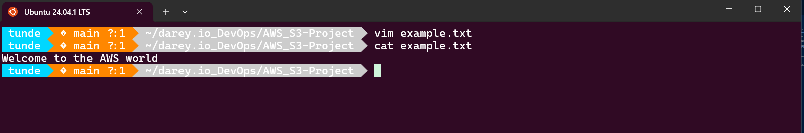
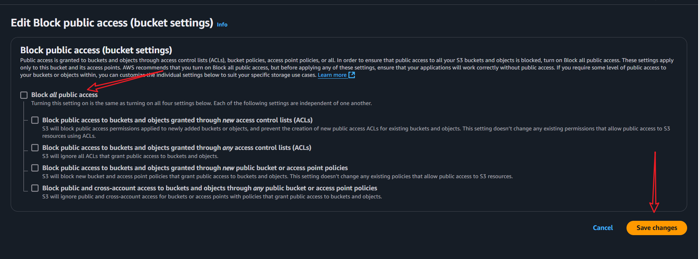
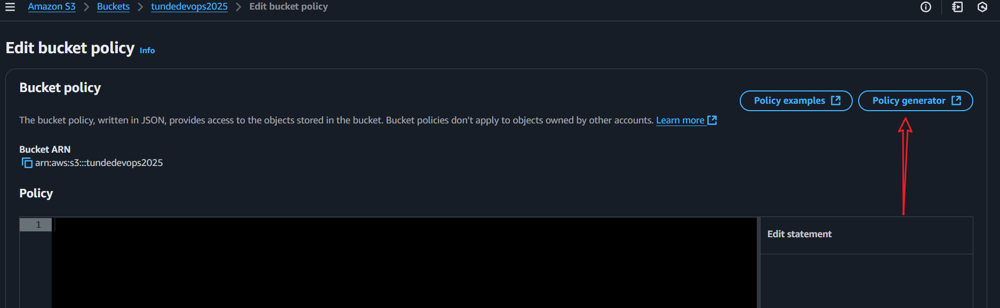

# AWS S3 Project
**This project is designed to demonstrate the use of AWS S3 for file storage and retrieval.**

## Project Structure
The Project will consistt of S3 creation, bucket creation, file upload and download, and file deletion.

## Steps
1. Log in to your AWS account.
2. Search for S3 in the AWS Management Console as seen in the image below.


3. Click on the S3 service to open the S3 dashboard.
4. From the S3 dashboard, click on the "Create bucket" button to create a new S3 bucket.


5. Ensure to provide a unique name for your bucket. The name must be globally unique across all AWS S3 buckets. You can use a combination of your name and a random number to create a unique name. For example, `mybucket1234567890`. Disable ACL (Access Control list), block public access, and also leave the versioning disabled. You can enable versioning later if needed.


6. Click on the "Create bucket" button to create your S3 bucket. You should see a success message indicating that your bucket has been created.


### Uploading Files to S3 Bucket
7. Create a file to upload to your S3 bucket. You can create a simple text file with some content. For example, create a file named `example.txt` with the following content:

```bash
vim example.txt

```




8. Save the file and exit the text editor.

9. Go back to the S3 dashboard and click on your newly created bucket to open it.
10. Click on the "Upload" button to upload your file to the S3 bucket.


11. Click on "Add files" and select the `example.txt` file you created earlier. You can also drag and drop the file into the upload area.


### Enabling Versioning
12. in the S3 bucket, click on the "Properties" tab and scroll down to the "Bucket Versioning" section. Click on "Edit" and enable versioning for your bucket. ***The versioning should be currently disabled.***


13. Select `Enable` and click on `Save changes`. You should see a success message indicating that versioning has been enabled.


14. Add a new version of the file uploaded by adding a new content to the file. For example, add the following content to the `example.txt` file:

```bash
echo "I am adding this content after enabling versioning." >> example.txt
```
15. Save the file and exit the text editor.


16. Go back to the S3 dashboard and click on your bucket to open it. Click on the "Upload" button again and upload the updated `example.txt` file.
17. Click on "Add files" and select the updated `example.txt` file. You can also drag and drop the file into the upload area.
18. Click on "Upload" to upload the updated file.
19. Click on the "example.txt" file and click on "show versions" to see the different versions of the file. You should see two versions of the file listed.


### Changing permissions in order to enable viewing of changes done to the file
20. Click on the "Permissions" tab and scroll down to the "Public access" section. Click on "Edit" and uncheck the "Block all public access" option. This will allow public access to your bucket.





21. Click on "Save changes" to save the changes. You should see a success message indicating that the public access settings have been updated.

22. Edit bucket policy to specify the types of actions you want to perform.
23. Click on edit on the bucket policy


24. Click on the "Policy generator" button to generate a bucket policy.




25. Select "S3 Bucket Policy" as the policy type and select "Allow" as the effect. In the "Principal" field, enter `*` to allow access to all users. In the "Actions" field, select "GetObject" to allow users to get objects from your bucket. In the "ARN" field, enter the ARN of your bucket in the following format: `arn:aws:s3:::your-bucket-name/*`. Replace `your-bucket-name` with the name of your bucket.

26. Click on "Add statement" to add the policy statement to your bucket policy.
27. Click on "Generate policy" to generate the bucket policy.
28. Copy the generated policy and paste it into the bucket policy editor in the S3 dashboard.
29. Click on "Save changes" to save the bucket policy. You should see a success message indicating that the bucket policy has been updated.


30. On the object tab, click on the versioning to see the different versions of the file. You should see two versions of the file listed.


31. Click on one of the versions and then click on the object URL to view the file in your browser. You should see the content of the file displayed in your browser.


32. Click on the edited version of the file and then click on the object URL to view the file in your browser. You should see the updated content of the file displayed in your browser.

### Creating a lifecycle policy to delete the old version of the file
33. Click on the "Management" tab and scroll down to the "Lifecycle rules" section. Click on "Create lifecycle rule" to create a new lifecycle rule.


34. Enter the name of the rule, select the rule scope, select the prefix, the minimum object size and the maximum ojbect size. Select the rule actions to delete the old version of the file. You can also select the expiration date for the rule.


35. Click on "Create rule" to create the lifecycle rule. You should see a success message indicating that the lifecycle rule has been created.

36. Click on the "Lifecycle rules" tab to see the list of lifecycle rules. You should see the rule you just created listed.


# Project Reflection and best practices
## Project Reflection
This project demonstrates the use of AWS S3 for file storage and retrieval. It covers the following topics:
- Creating an S3 bucket
- Uploading files to S3 bucket
- Enabling versioning for S3 bucket
- Changing permissions for S3 bucket
- Creating a lifecycle policy to delete old versions of files
- Viewing different versions of files in S3 bucket
- Deleting files from S3 bucket

## Best Practices
- Use unique names for S3 buckets to avoid conflicts with other users.
- Use versioning to keep track of changes made to files in S3 bucket.
- Use lifecycle policies to automatically delete old versions of files to save storage costs.
- Use bucket policies to control access to S3 bucket and its contents.
- Use IAM roles and policies to control access to S3 bucket and its contents.
- Use encryption to protect sensitive data stored in S3 bucket.
- Use logging to track access to S3 bucket and its contents.
