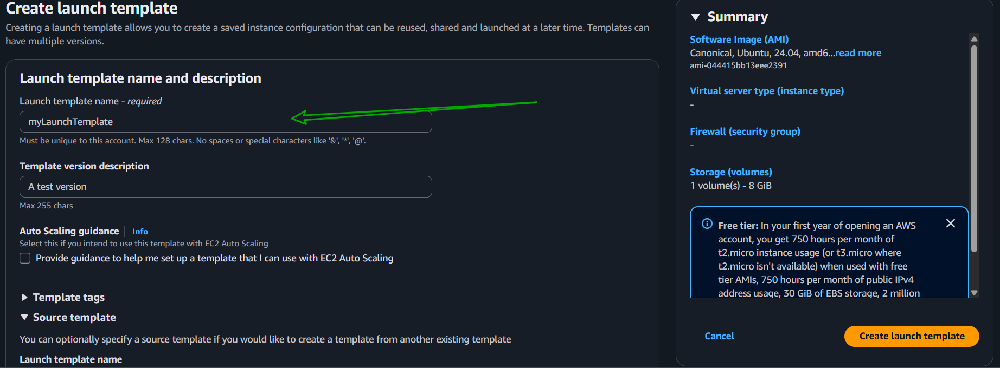

# Mini Project: Auto-Scaling with ALB

## Overview

**Purpose:** Learn to configure Auto Scaling in AWS using a Launch Template and integrate it with an Application Load Balancer (ALB).

## Objectives:
- Create a Launch Template with all required specs.
- Set up an Auto Scaling Group using that template.
- Configure Scaling Policies to match traffic demand.
- Attach ALB to the Auto Scaling Group.
- Test Auto Scaling responsiveness by simulating demand.

Project Tasks
**Task 1: Create Launch Template**

- Navigate to EC2 > Launch Templates

- Click Create and fill in AMI, instance type, user data, etc.

**Task 2: Set Up Auto Scaling Group**

- Navigate to EC2 > Auto Scaling Groups

- Click Create, use the launch template

- Configure settings: capacity, network, subnets, scaling rules

**Task 3: Configure Scaling Policies**

- Add policies for scaling in/out based on demand triggers

**Task 4: Attach ALB**

- Go to Load Balancing section and select existing ALB

### Task 1: Create Launch Template
- Sign in to AWS Management Console.

- Navigate to the EC2 Dashboard.
- In the left navigation pane, click on "Launch Templates".

- Click on "Create launch template".
- Fill in the required details such as name, AMI, instance type, key pair, security groups, and user data.
- Click "Create launch template" to save.

  

!

!

### Task 2: Set Up Auto Scaling Group
- In the EC2 Dashboard, click on "Auto Scaling Groups" in the left navigation pane.

- Click on "Create Auto Scaling group".

- Select the launch template you created in Task 1.

- Configure the Auto Scaling group settings:
  - Name your group.
  - Set the VPC and subnets.
  - Define the desired capacity, minimum, and maximum instances.

