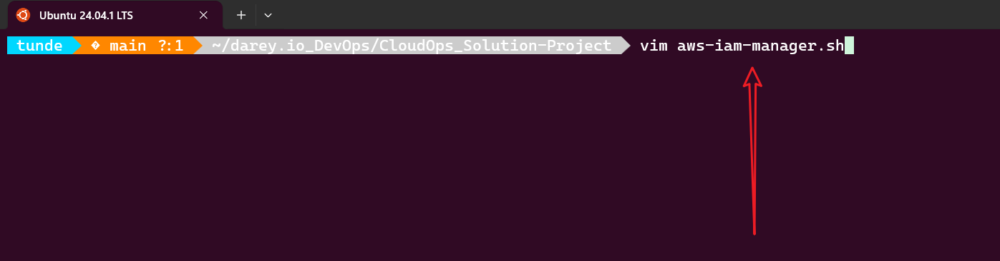
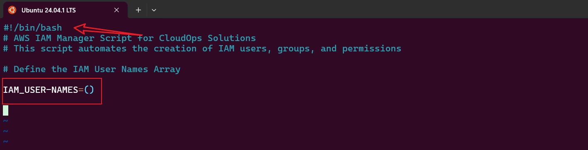
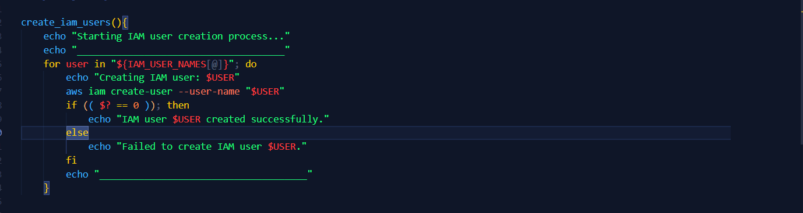
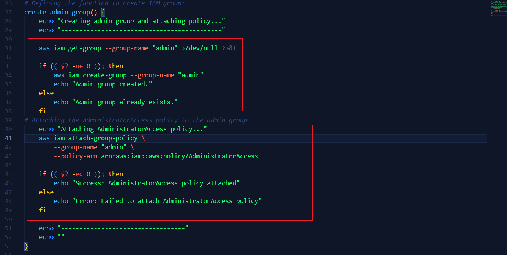
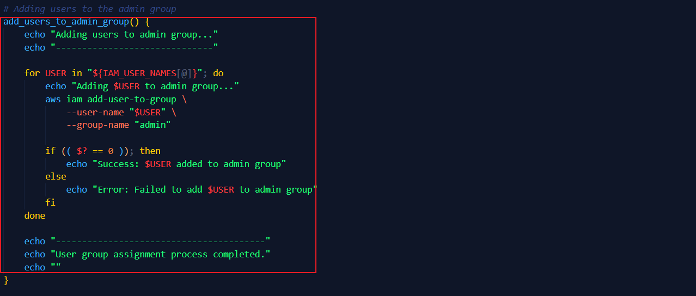
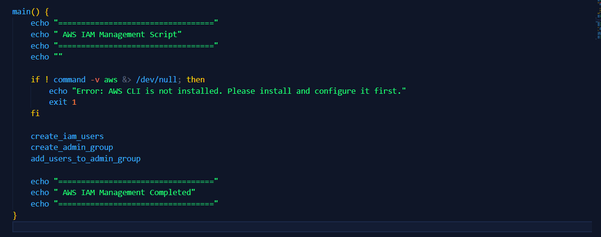
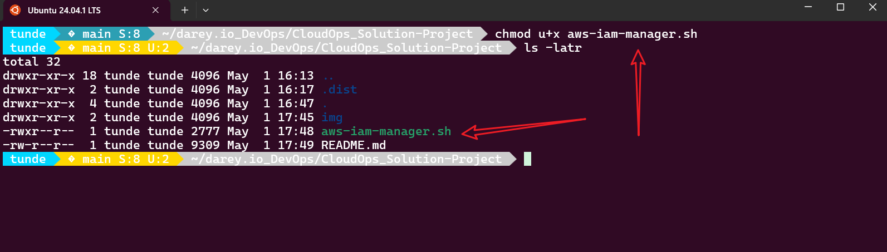
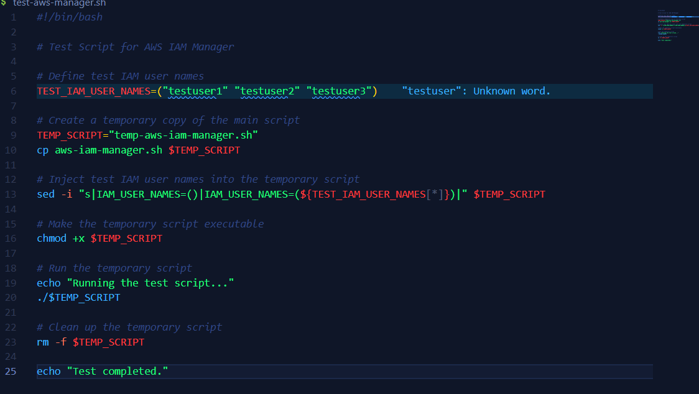
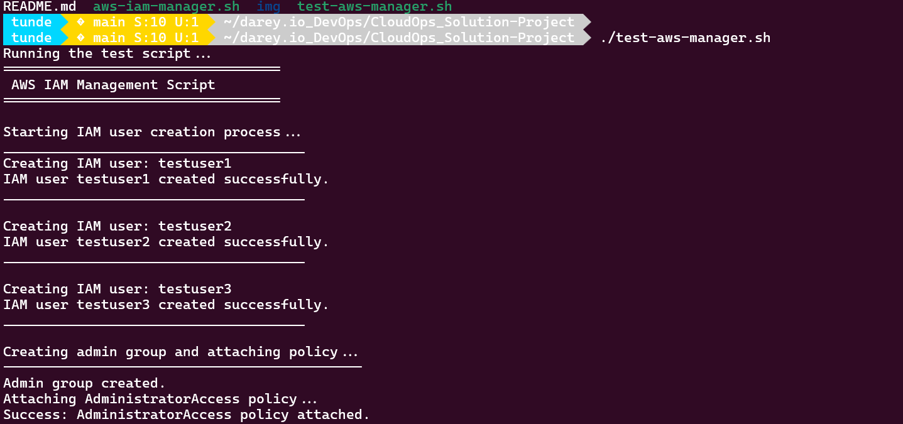
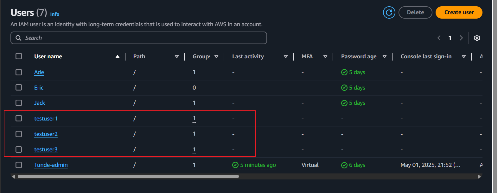

# CloudOps Solution Mini Project

## Overview
CloudOps Solutions, a growing company using AWS for cloud management, is automating the management of AWS IAM resources, including creating users, user groups, and assigning permissions, particularly for their DevOps team. This project aims to streamline the process and enhance security measures.

## Objectives:

Extend the provided script to include IAM management by:

1. Defining IAM User Names Array to store the names of the five IAM users in an array for easy iteration during user creation.

2. Create the IAM Users as you iterate through the array using AWS CLI commands.

3. Define and call a function to create an IAM group named "admin" using the AWS CLI commands.

4. Attach an AWS-managed administrative policy (e.g., "AdministratorAccess") to the "admin" group to grant administrative privileges.

5. Iterate through the array of IAM user names and assign each user to the "admin" group using AWS CLI commands.


## Pre-provided Code Snippet
```bash
#!/bin/bash

# AWS IAM Manager Script for CloudOps Solutions
# This script automates the creation of IAM users, groups, and permissions

# Define IAM User Names Array
IAM_USER_NAMES=()

# Function to create IAM users
create_iam_users() {"\n    echo \"Starting IAM user creation process...\"\n    echo \"-------------------------------------\"\n    \n    echo \"---Write the loop to create the IAM users here---\"\n    \n    echo \"------------------------------------\"\n    echo \"IAM user creation process completed.\"\n    echo \"\"\n"}

# Function to create admin group and attach policy
create_admin_group() {"\n    echo \"Creating admin group and attaching policy...\"\n    echo \"--------------------------------------------\"\n    \n    # Check if group already exists\n    aws iam get-group --group-name \"admin\" >/dev/null 2>&1\n    echo \"---Write this part to create the admin group---\"\n    \n    # Attach AdministratorAccess policy\n    echo \"Attaching AdministratorAccess policy...\"\n    echo \"---Write the AWS CLI command to attach the policy here---\"\n        \n    if [ $? -eq 0 ]; then\n        echo \"Success: AdministratorAccess policy attached\"\n    else\n        echo \"Error: Failed to attach AdministratorAccess policy\"\n    fi\n    \n    echo \"----------------------------------\"\n    echo \"\"\n"}

# Function to add users to admin group
add_users_to_admin_group() {"\n    echo \"Adding users to admin group...\"\n    echo \"------------------------------\"\n    \n    echo \"---Write the loop to handle users addition to the admin group here---\"\n    \n    echo \"----------------------------------------\"\n    echo \"User group assignment process completed.\"\n    echo \"\"\n"}

# Main execution function
main() {"\n    echo \"==================================\"\n    echo \" AWS IAM Management Script\"\n    echo \"==================================\"\n    echo \"\"\n    \n    # Verify AWS CLI is installed and configured\n    if ! command -v aws &> /dev/null; then\n        echo \"Error: AWS CLI is not installed. Please install and configure it first.\"\n        exit 1\n    fi\n    \n    # Execute the functions\n    create_iam_users\n    create_admin_group\n    add_users_to_admin_group\n    \n    echo \"==================================\"\n    echo \" AWS IAM Management Completed\"\n    echo \"==================================\"\n"}

# Execute main function
main

exit 0
```

## Implementation Steps:
1. Create a new file named `aws-iam-manager.sh` with the `vim` command and copy the provided code snippet into it.
```bash
vim aws-iam-manager.sh
```


2. Include the `shebang` line at the top of the script to specify the shell interpreter.
```bash
#!/bin/bash
```
3. Define an empty array named `IAM_USER_NAMES` to store the names of the five IAM users.
```bash
IAM_USER_NAMES=()
```


4. Create a function named `create_iam_users` to automate the creation of IAM users. Inside this function, use a loop to iterate through the `IAM_USER_NAMES` array and create each user using the AWS CLI command `aws iam create-user --user-name <username>`.
```bash
create_iam_users() {
    echo "Starting IAM user creation process..."
    echo "-------------------------------------"
    
    # Loop to create IAM users
    for user in "${IAM_USER_NAMES[@]}"; do
        aws iam create-user --user-name "$user"
        if [ $? -eq 0 ]; then
            echo "Success: User $user created."
        else
            echo "Error: Failed to create user $user."
        fi
    done
    
    echo "------------------------------------"
    echo "IAM user creation process completed."
    echo ""
}
```



5. Create a function named `create_admin_group` to create an IAM group named "admin" and attach the AWS-managed administrative policy (e.g., "AdministratorAccess") to it. Use the AWS CLI command `aws iam create-group --group-name admin` to create the group and `aws iam attach-group-policy --group-name admin --policy-arn arn:aws:iam::aws:policy/AdministratorAccess` to attach the policy.



```bash
create_admin_group() {
    echo "Creating admin group and attaching policy..."
    echo "--------------------------------------------"
    
    # Check if group already exists
    aws iam get-group --group-name "admin" >/dev/null 2>&1
    if [ $? -ne 0 ]; then
        aws iam create-group --group-name "admin"
        if [ $? -eq 0 ]; then
            echo "Success: Group 'admin' created."
        else
            echo "Error: Failed to create group 'admin'."
        fi
    else
        echo "Group 'admin' already exists."
    fi
    
    # Attach AdministratorAccess policy
    echo "Attaching AdministratorAccess policy..."
    aws iam attach-group-policy --group-name "admin" --policy-arn arn:aws:iam::aws:policy/AdministratorAccess
    
    if [ $? -eq 0 ]; then
        echo "Success: AdministratorAccess policy attached."
    else
        echo "Error: Failed to attach AdministratorAccess policy."
    fi
    
    echo "----------------------------------"
    echo ""
}
```
***Code Explanation:***
- The function `create_admin_group` checks if the group "admin" already exists using the `aws iam get-group` command. If it doesn't exist, it creates the group using `aws iam create-group`.
- It then attaches the "AdministratorAccess" policy to the group using the `aws iam attach-group-policy` command.
- The function provides feedback on the success or failure of each operation.

6. Create a function named `add_users_to_admin_group` to iterate through the `IAM_USER_NAMES` array and add each user to the "admin" group using the AWS CLI command `aws iam add-user-to-group --group-name admin --user-name <username>`.
```bash
add_users_to_admin_group() {
    echo "Adding users to admin group..."
    echo "------------------------------"

    for USER in "${IAM_USER_NAMES[@]}"; do
        echo "Adding $USER to admin group..."
        aws iam add-user-to-group \
            --user-name "$USER" \
            --group-name "admin"

        if [ $? -eq 0 ]; then
            echo "Success: $USER added to admin group"
        else
            echo "Error: Failed to add $USER to admin group"
        fi
    done

    echo "----------------------------------------"
    echo "User group assignment process completed."
    echo ""
}
```


***Code Explanation:***
- The function `add_users_to_admin_group` iterates through the `IAM_USER_NAMES` array and adds each user to the "admin" group using the `aws iam add-user-to-group` command.
- It provides feedback on the success or failure of each operation.
- The function also includes error handling to ensure that any issues during the user addition process are reported.

7. Create a `main` function to verify that the AWS CLI is installed and configured. If it is, call the functions `create_iam_users`, `create_admin_group`, and `add_users_to_admin_group` in order.
```bash
main() {
    echo "=================================="
    echo " AWS IAM Management Script"
    echo "=================================="
    echo ""

    # Verify AWS CLI is installed and configured
    if ! command -v aws &> /dev/null; then
        echo "Error: AWS CLI is not installed. Please install and configure it first."
        exit 1
    fi

    # Execute the functions
    create_iam_users
    create_admin_group
    add_users_to_admin_group

    echo "=================================="
    echo " AWS IAM Management Completed"
    echo "=================================="
}
```


***Code Explanation:***
- The `main` function checks if the AWS CLI is installed and configured. If not, it exits with an error message.
- If the AWS CLI is available, it calls the functions `create_iam_users`, `create_admin_group`, and `add_users_to_admin_group` in order to execute the IAM management tasks.
- It provides a summary of the script's execution status.

8. Make the script executable using the `chmod` command.
```bash
chmod +x aws-iam-manager.sh
```


9. Run the script using the `./` command.
```bash
./aws-iam-manager.sh
```

## Extra Credit:
- Add error handling to ensure that the script exits gracefully if any AWS CLI command fails.
- Create a test sh file to validate the functionality of the script.



- Output of the test script:



- The users now exist in the IAM console, and the group "admin" has been created with the users assigned to it.



## Conclusion
This project successfully automates the management of AWS IAM resources, including creating users, groups, and assigning permissions. The script is designed to be modular and easy to extend for future enhancements. By following best practices in error handling and user feedback, the script ensures a smooth user experience while managing IAM resources.


