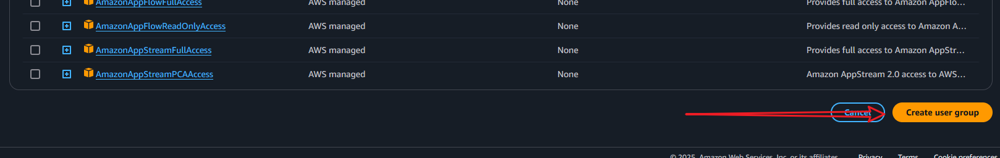
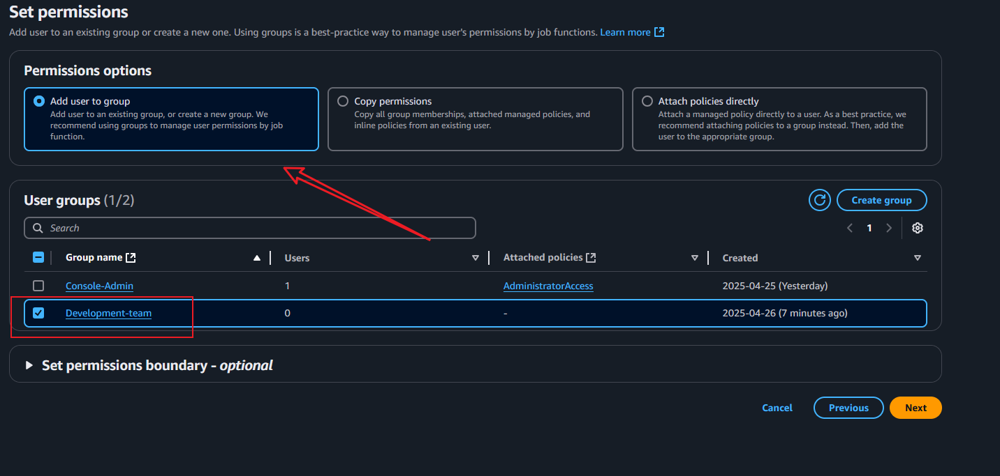

# Project for GatoGrowFast.com 

## Description
A growth marketing consultancy company called GatoGrowFast.com wants to give some access to their employee Eric, Jack and Ade to the Aws resources. This project would cover the use of AWS IAM to create a user and assign them the necessary permissions to access the resources.

## Prerequisites
- AWS account
- AWS console access

## Part 1: Create an IAM policy
1. Go to the IAM console in AWS.

2. Click on "Policies" in the left sidebar.

3. Search EC2 and select the "AmazonEC2FullAccess" policy and then click on "Create policy".    

4. Select "all actions" and "all resources" and click on "Next: Tags".

5. Click on "Next: Review".
6. Name the policy 'Policy_for _Eric' and add a description.

7. Click on "Create policy".

8. Policy created successfully.

9. Now proceed to create a user.
10. Click on "Users" in the left sidebar.
11. Click on "Create user".

12. Enter the username 'Eric' and select "Provide user access to AWS console".
13. Select "Generate password" and "Require password reset".

14. Click on "Next: Permissions".
15. Select "Attach existing policies directly".
16. Search for the policy you created earlier and select it.

17. Review the permissions and click on "Create user".

18. User created successfully.

19. Download the credentials and save them in a secure location.

## Part 2: Create a group and assign permissions
1. Go to the IAM console in AWS.
2. Click on "Groups" in the left sidebar.

3. Click on "Create group".

4. Enter the group name "Development-Team" and click on "Create group".

### Now let's create two new users 'Jack' and 'Ade' and assign them to the group.
1. Click on "Users" in the left sidebar.
2. Click on "Create user".
3. Enter the username 'Jack' and select "Provide user access to AWS console".
4. Select "Generate password" and "Require password reset".
5. Click on "Next: Permissions".

6. Select "Add user to group".
7. Select the group "Development-Team". 

8. Click on "Next" and review the permissions.
9. Click on "Create user".

10. Download the credentials and save them in a secure location.

12. Now repeat the same steps to create a user 'Ade' and assign them to the group "Development-Team".
13. Click on "Users" in the left sidebar.
14. Click on "Create user".
15. Enter the username 'Ade' and select "Provide user access to AWS console".
16. Select "Generate password" and "Require password reset".
17. Click on "Next: Permissions".
18. Select "Add user to group".
19. Select the group "Development-Team".
20. Click on "Next" and review the permissions.
21. Click on "Create user".
22. Download the credentials and save them in a secure location.

On the IAM console, you can see the users and the group created.

23. Navigate to IAM policy and creata a new policy.
24. Click on "Policies" in the left sidebar.
25. Click on "Create policy".

26. Choose "EC2" and "S3" services and select "all actions" and "all resources".

27. Click on "Next: Tags".
28. Click on "Next: Review".
29. Name the policy 'development-team-policy' and add a description.

30. Click on "Create policy".
31. Policy created successfully.

32. Navigate to users group "Development-Team".
33. Click on "Groups" in the left sidebar.

34. Click on "Development-Team".
35. Click on "Permissions" tab.

36. Click on "Attach policies".
37. Filter type by "Customer managed".
38. Search for the policy you created earlier and select it.
39. Click on "Attach policy".

40. Policy attached successfully.
41. Now you can see the policy attached to the group.

***Now you can login to the AWS console using the credentials of the users you created and access the resources.***

## Conclusion
This project covered the use of AWS IAM to create users, groups, and policies to manage access to AWS resources. You can now assign permissions to users and groups based on their roles and responsibilities. This is a crucial step in ensuring the security and management of your AWS resources.