# Linux Administration Basic Commands Mini-Project

## Project Overview
This project is a collection of basic Linux commands that are commonly used for administration tasks. Each command is demonstrated with actual execution screenshots for verification.

## Table of Contents
- [Prerequisites](#prerequisites)
- [Basic File System Operations](#basic-file-system-operations)
- [File Management Commands](#file-management-commands)
- [System Information Commands](#system-information-commands)
- [Advanced Operations](#advanced-operations)
- [Side Hustle Challenge](#side-hustle-challenge)

## Prerequisites
- A Linux system (e.g., Ubuntu, CentOS)
- Basic knowledge of Linux commands
- Sudo privileges for administrative commands

## Basic File System Operations

### 1. Creating a folder in the root directory without sudo
```bash
mkdir /root/example
```

The screenshot below shows the output of the command:

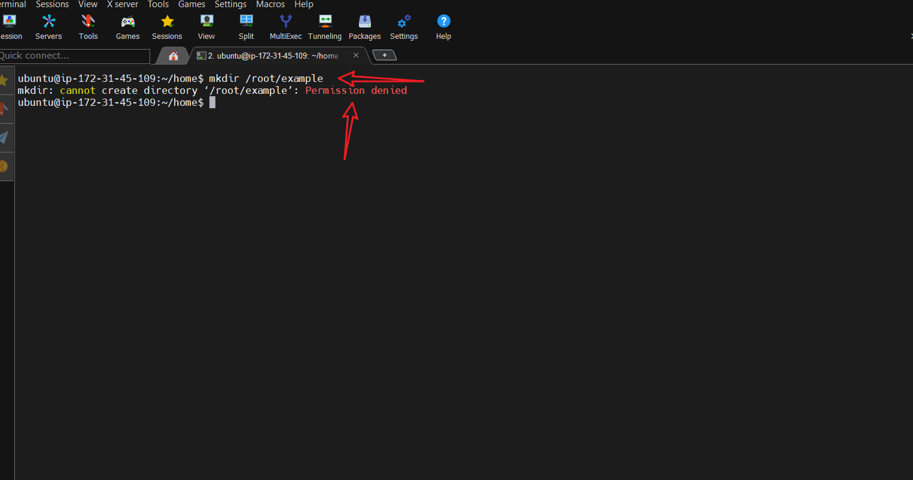

### 2. Using the sudo command along with the mkdir command to create a folder in the root directory
```bash
sudo mkdir /root/example
```

The screenshot below shows the output of the command:

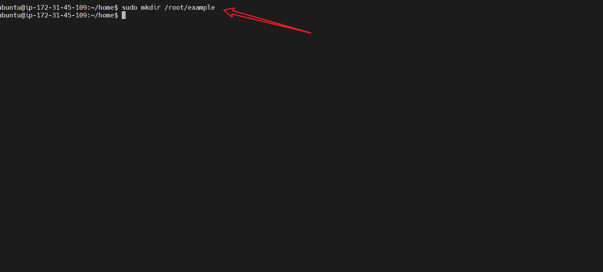

### 3. Using the ls command to list all files in the root directory
```bash
ls /root
```

The screenshot below shows the output of the command:

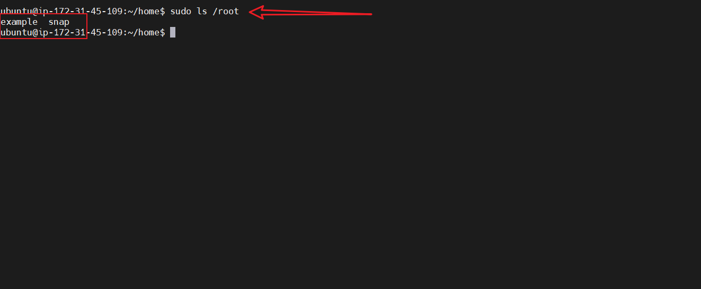

### 4. Using the pwd command to display the current working directory
```bash
pwd
```

The screenshot below shows the output of the command:

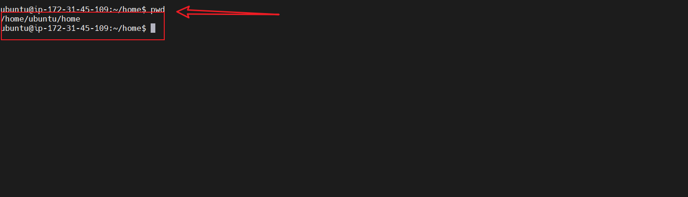

## File Management Commands

### 5. Using the sudo ls /etc command to list all files in the /etc directory
```bash
sudo ls /etc
```

The screenshot below shows the output of the command:

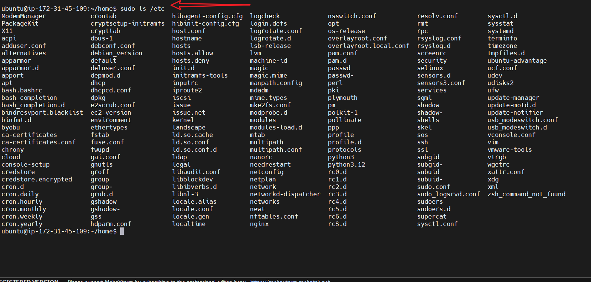

### 6. Using the sudo tree command with step 1 to display the directory structure of usr directory
```bash
sudo tree /usr
```

The screenshot below shows the output of the command:

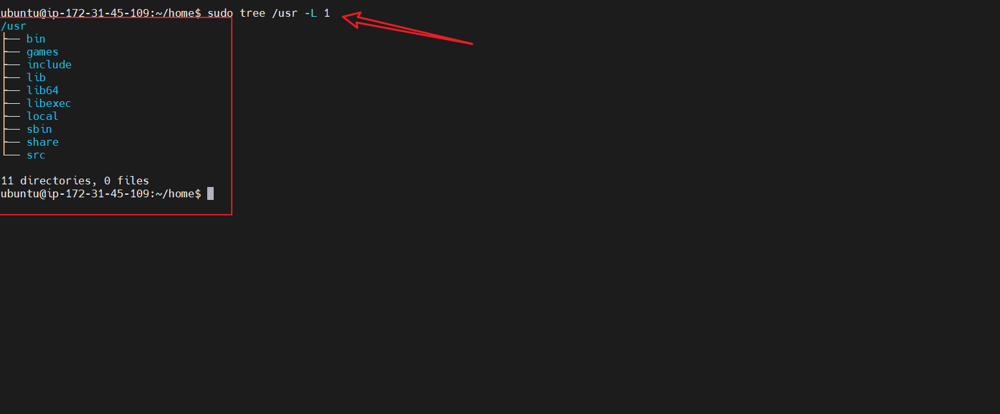

### 7. Switching to the root user and listing all files in the root directory
```bash
sudo su
ls /root
```

The screenshot below shows the output of the command:

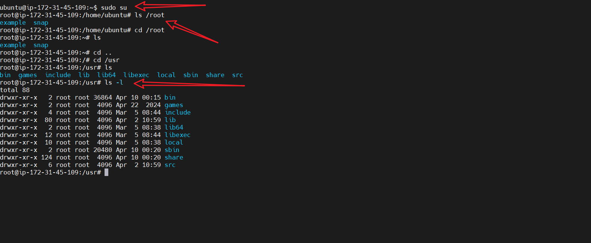

### 8. Using the ls command on a directory
```bash
ls
```

The screenshot below shows the output of the command:

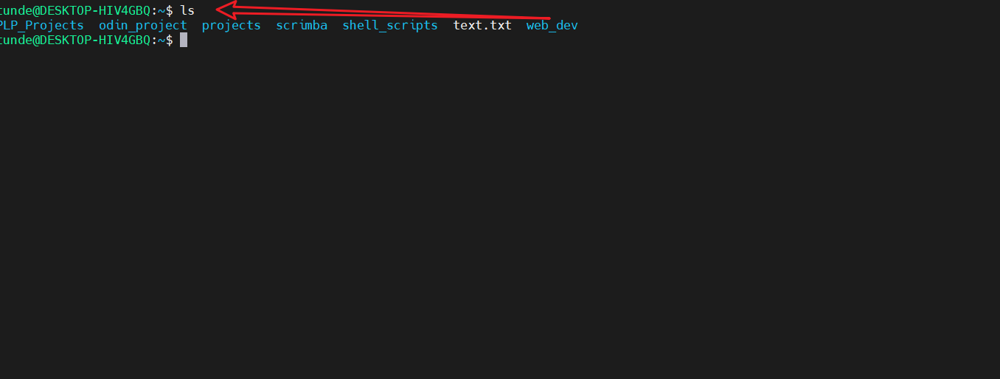

### 9. Using the ls command with the -R option to list all files in the current directory and all subdirectories
```bash
ls -R
```

The screenshot below shows the output of the command:

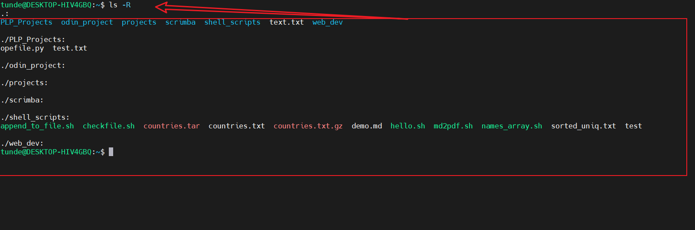

### 10. Using the ls command with the -a option to list all files in the current directory and all subdirectories
```bash
ls -a
```

The screenshot below shows the output of the command:

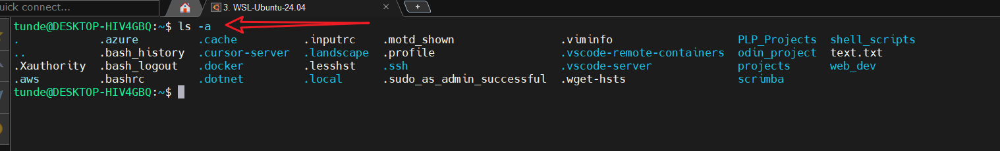

## System Information Commands

### 11. Using the sudo cat to view the os-release file
```bash
sudo cat /etc/os-release
```

The screenshot below shows the output of the command:

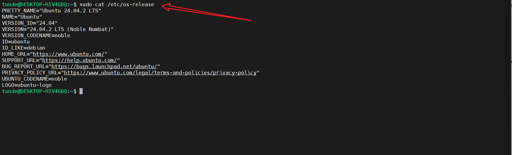

## Advanced Operations

### 12. Copying text.txt to folder_1/text.txt
```bash
cp text.txt folder_1/
```

The screenshot below shows the output of the command:

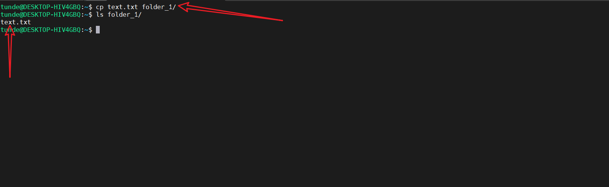

### 13. Created 3 more txt files in the present working directory
```bash
touch file1.txt file2.txt file3.txt
```

The screenshot below shows the output of the command:

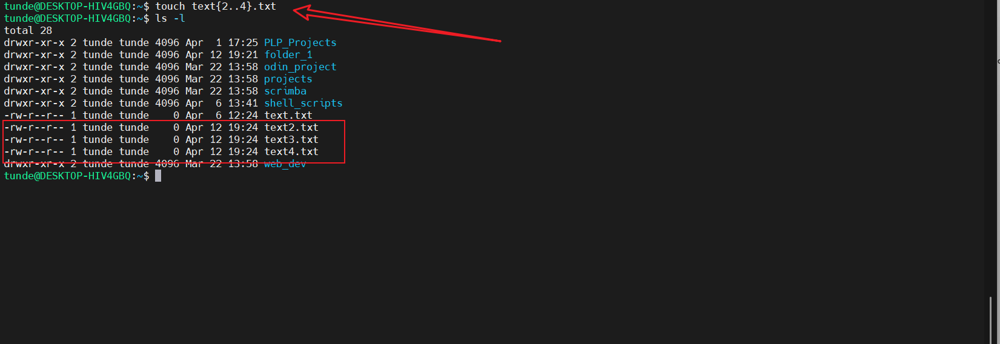

### 14. Copy the 3 txt files to folder_1
```bash
cp file1.txt file2.txt file3.txt folder_1/
```

The screenshot below shows the output of the command:

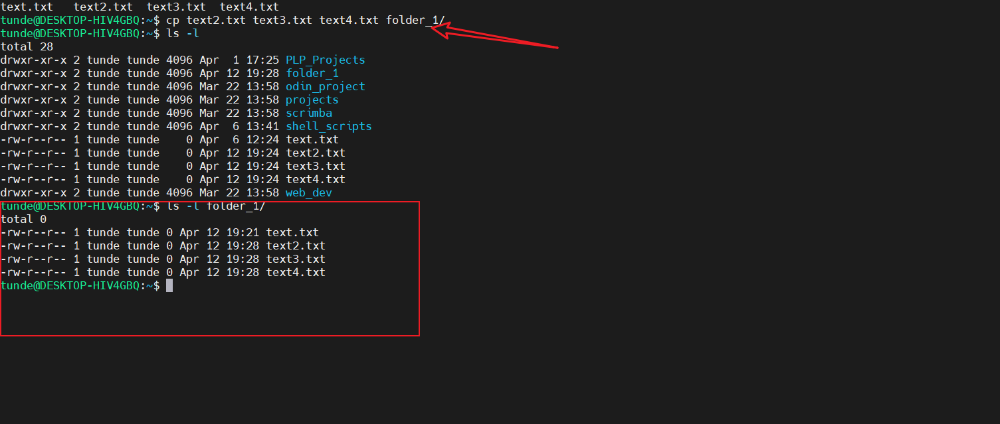

### 15. Copied the entire file path to a different directory using the -R option
```bash
cp -R /root/folder_1 /root/folder_2
```

The screenshot below shows the output of the command:

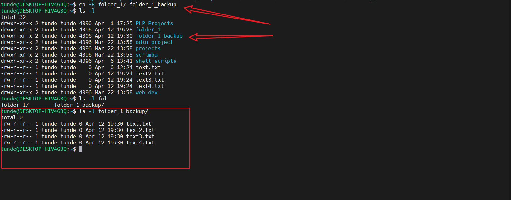

### 16. Used the mv command to move a file to a different directory
```bash
mv file1.txt folder_1/
```

The screenshot below shows the output of the command:

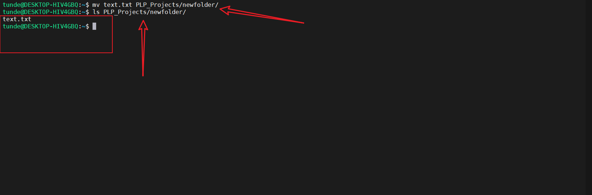

### 17. Moved multiple files to a different directory
```bash
mv file1.txt file2.txt file3.txt folder_1/
```

The screenshot below shows the output of the command:

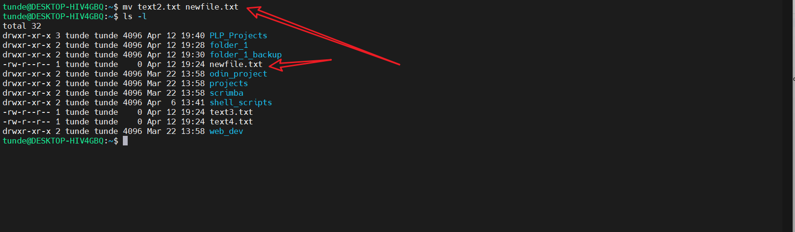

### 18. Used the mv command to rename a file
```bash
mv file1.txt file1_new.txt
```

The screenshot below shows the output of the command:

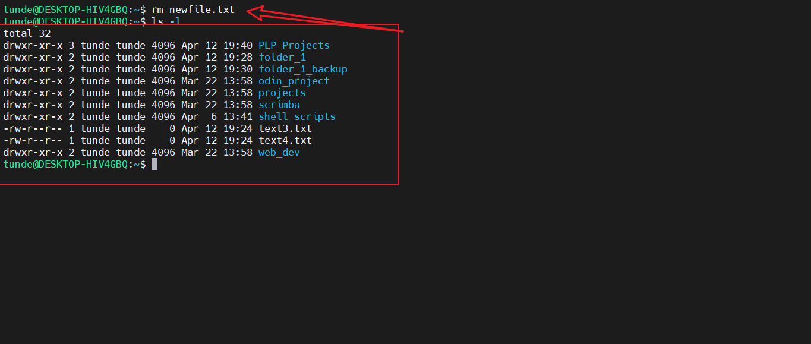

### 19. Used the rm command to remove a file using the -i option
```bash
rm -i file1.txt
```

The screenshot below shows the output of the command:

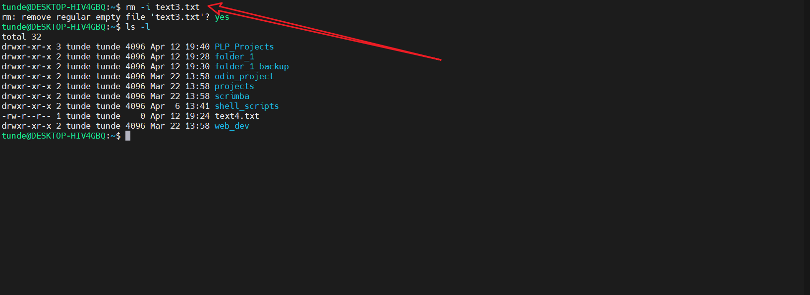

### 20. Used the rm to remove multiple files
```bash
rm file1.txt file2.txt file3.txt
```

The screenshot below shows the output of the command:

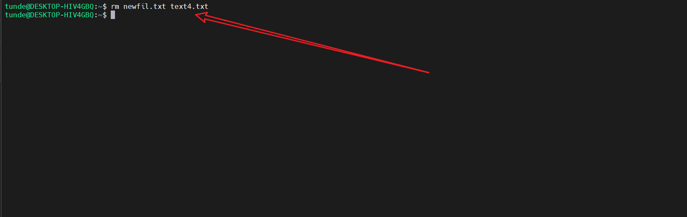

### 21. Used the touch command to create index.html file inside a folder web_dev
```bash
touch web_dev/index.html
```

The screenshot below shows the output of the command:

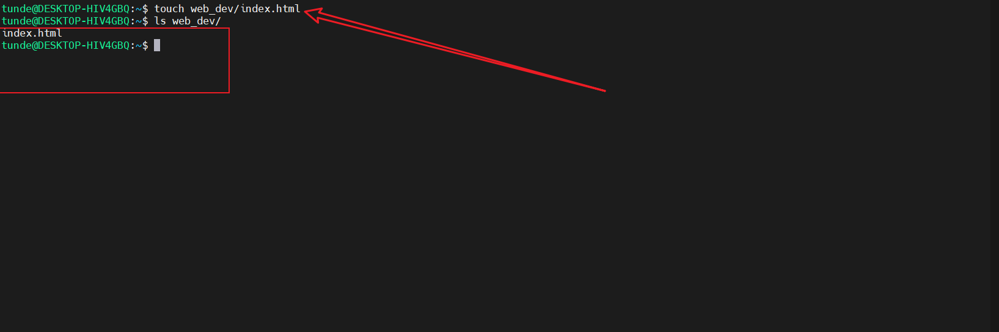

### 22. Using the find command to find the index.html in the web_dev folder
```bash
find web_dev -name index.html
```

The screenshot below shows the output of the command:

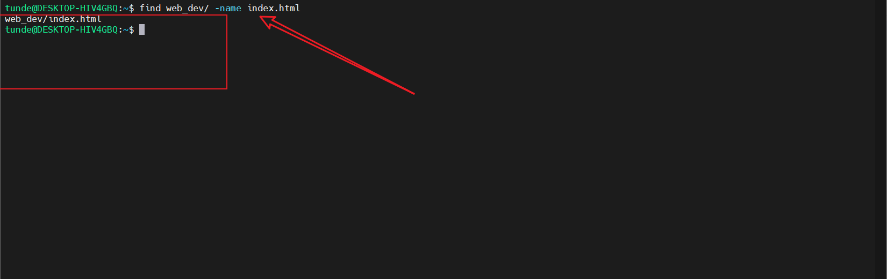

## Side Hustle Challenge

### Task Description
Create a directory structure in the /usr directory with the following requirements:
1. Create a directory called `photos` inside /usr
2. Navigate into the photos directory
3. Create 3 random directories inside photos
4. Display the newly created directories
5. Navigate into one of them
6. Show the current full path

### Solution
The solution demonstrates the execution of all required steps:

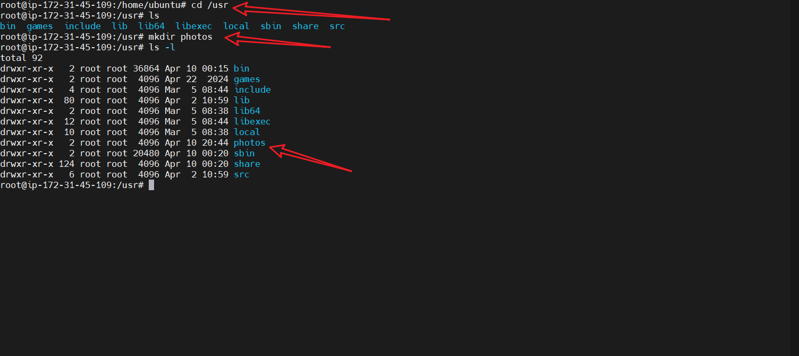
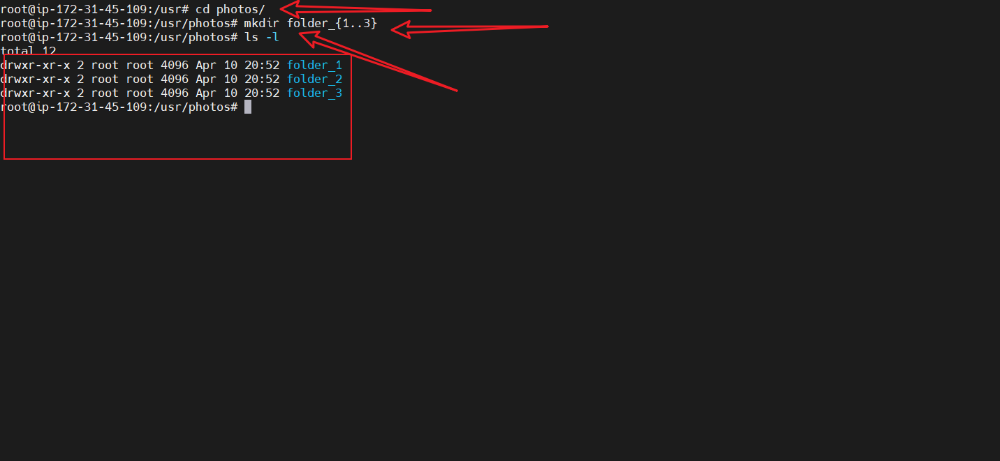
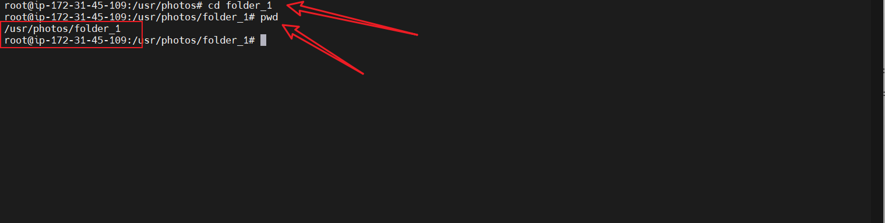

## Contributing
Feel free to contribute to this project by:
- Adding more command examples with screenshots
- Improving documentation
- Suggesting better practices
- Reporting issues

## License
This project is open source and available under the MIT License.


