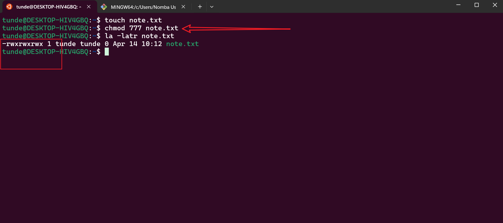

# Advanced Linux Administration Commands

## Overview
This exercise demonstrates practical usage of advanced Linux administration commands for user and group management, file permissions, and system administration tasks. These commands are essential for system administrators, DevOps engineers, and anyone managing Linux systems.

## Prerequisites
- Linux operating system (Ubuntu/Debian recommended)
- Sudo privileges
- Basic understanding of Linux command line

## Core Commands Covered
| Command | Description | Use Case |
|---------|-------------|----------|
| `ls` | List directory contents | Viewing files and directories, checking permissions |
| `cd` | Change directory | Navigating through the file system |
| `pwd` | Print working directory | Confirming current location in file system |
| `cat` | Concatenate and display file contents | Viewing file contents, combining files |
| `adduser` | Add a new user | Creating new user accounts with home directories |
| `usermod` | Modify user account properties | Changing user groups, shell, or other attributes |
| `userdel` | Delete a user account | Removing user accounts and optionally their home directories |
| `groupadd` | Create a new group | Setting up new user groups for permission management |
| `groupmod` | Modify a group | Changing group names or IDs |
| `groupdel` | Delete a group | Removing groups when no longer needed |

## Basic Exercise
### Task Requirements
1. Create a new user called `testuser`
2. Add the user to the `sudo` group
3. Create a new group called `testgroup`
4. Add the user to the `testgroup` group

## File and Directory Permissions

### Concept
File permissions in Linux control who can read, write, and execute files. They are fundamental to Linux security and are managed through a combination of user and group ownership, along with permission bits.

### Use Cases
- Restricting access to sensitive files
- Allowing multiple users to collaborate on shared files
- Controlling execution of scripts and programs
- Managing web server file access

### Checking Permissions
The `ls -latr` command provides detailed information about files and directories:
- `-l`: Long listing format
- `-a`: Show hidden files
- `-t`: Sort by modification time
- `-r`: Reverse order

```bash
ls -latr
```

To check permissions of a specific file:
```bash
ls -latr filename
```


### Understanding Permission Numbers
Permission numbers in Linux use octal notation:
- 4: Read (r)
- 2: Write (w)
- 1: Execute (x)

Common permission combinations:
- 755: rwxr-xr-x (User: rwx, Group: r-x, Others: r-x)
- 777: rwxrwxrwx (Full permissions for all)
- 644: rw-r--r-- (User: rw-, Group: r--, Others: r--)

### Modifying Permissions with chmod

#### Example 1: Creating and Modifying script.sh
1. Create a new file:
```bash
touch script.sh
```


2. Check initial permissions:
```bash
ls -latr script.sh
```

3. Add execute permission:
```bash
chmod +x script.sh
```


4. Set specific permissions (755):
```bash
chmod 755 script.sh
```


#### Example 2: Setting Full Permissions
1. Create a new file:
```bash
touch note.txt
```


2. Set 777 permissions:
```bash
chmod 777 note.txt
```


## User Management

### Concept
User management in Linux involves creating, modifying, and deleting user accounts. It's crucial for system security and access control, allowing administrators to manage who can access the system and what they can do.

### Use Cases
- Setting up new employee accounts
- Managing system access for contractors
- Implementing security policies
- Controlling resource access

### Superuser Access
To access superuser privileges:
```bash
sudo -i
```


To exit superuser mode:
```bash
exit
```

### User Operations

#### Creating a New User
```bash
adduser johndoe
```


#### Granting Admin Privileges
```bash
usermod -aG sudo johndoe
```


#### Switching Users
```bash
su johndoe
```


#### Changing User Password
```bash
passwd johndoe
```


## Group Management

### Concept
Groups in Linux allow administrators to manage permissions for multiple users simultaneously. They're essential for implementing role-based access control and managing shared resources.

### Use Cases
- Managing team access to shared directories
- Implementing department-wide permissions
- Setting up project-based access controls
- Managing service accounts

### Creating Groups
```bash
groupadd developers
```


### Adding Users to Groups
```bash
usermod -aG developers johndoe
```


### Verifying Group Membership
```bash
id johndoe
```


### Managing Group Permissions
1. Set group ownership:
```bash
sudo chown :developers script.sh
```


2. Grant group permissions:
```bash
sudo chmod g+rw script.sh
```


## Practical Project: DevOps Team Setup

### Concept
This project demonstrates a real-world scenario of setting up a development team environment with proper user and group management, showing how to implement role-based access control in a practical setting.

### Use Cases
- Setting up new development teams
- Managing access to development environments
- Implementing team-based resource sharing
- Establishing secure collaboration environments

### Project Requirements
1. Create a `devops` group
2. Create 5 users: mary, mohammed, ravi, tunji, sofia
3. Add users to the devops group
4. Create home directories
5. Set proper group ownership

### Implementation Steps

1. Create the devops group:
```bash
groupadd devops
```


2. Create users:
```bash
adduser mary
adduser mohammed
adduser ravi
adduser tunji
adduser sofia
```


3. Verify home directories:
```bash
ls -l /home
```


4. Add users to devops group:
```bash
usermod -aG devops mary
usermod -aG devops mohammed
usermod -aG devops ravi
usermod -aG devops tunji
usermod -aG devops sofia
```


5. Set group ownership:
```bash
sudo chown :devops /home/mary
sudo chown :devops /home/mohammed
sudo chown :devops /home/ravi
sudo chown :devops /home/tunji
sudo chown :devops /home/sofia
```


6. Verify final setup:
```bash
ls -latr /home
```


## Best Practices
1. Always use specific permissions (e.g., 755) instead of broad permissions (777)
2. Regularly audit user and group memberships
3. Follow the principle of least privilege
4. Document all user and group management changes
5. Regularly backup user configurations

## Troubleshooting
- If permission changes don't take effect, try logging out and back in
- Use `groups` command to verify group membership
- Check `/etc/group` and `/etc/passwd` for user/group information
- Use `sudo -l` to verify sudo privileges
