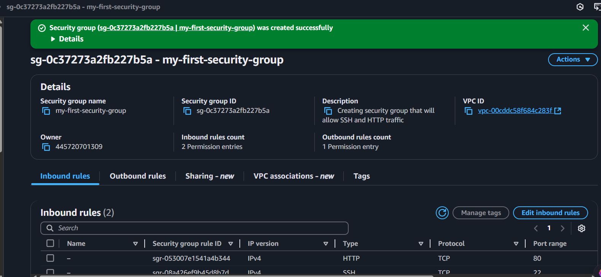
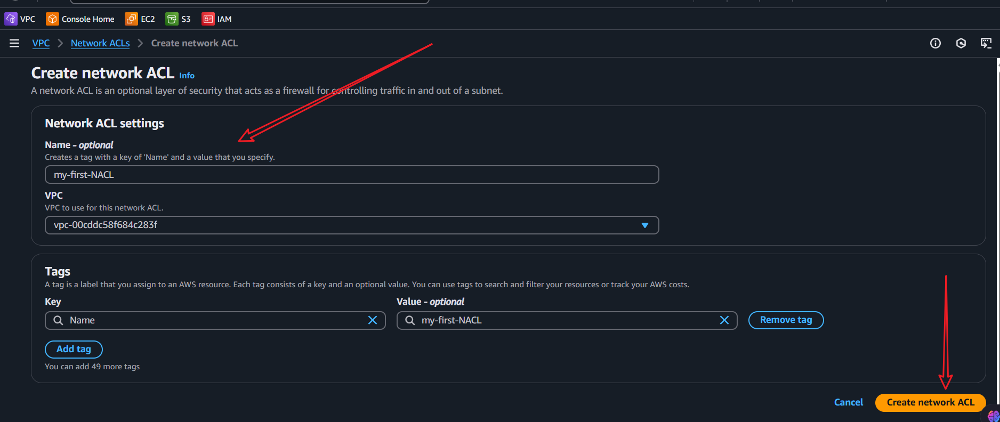
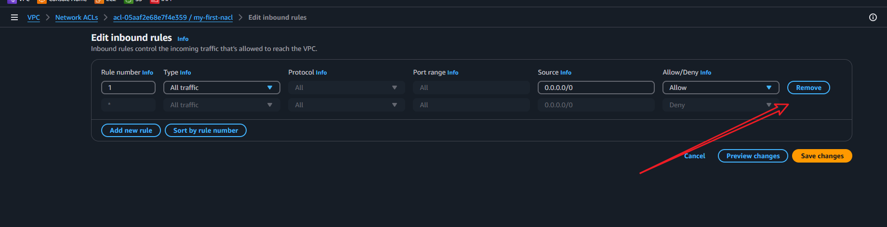

# Security Group and NACL Mini Project

## Overview
This project is designed to help you understand and implement AWS Security Groups and Network Access Control Lists (NACLs) using Terraform. You will create a VPC with public and private subnets, configure security groups for EC2 instances, and set up NACLs for additional security.

## Part 1
1. Log into your AWS account and navigate the EC2 dashboard.
2. Click on instances in the left navigation pane.
3. Check for the test instance that was created in the previous mini project. If it is not there, create a new instance.


4. If the test instance is not running, start it. If it is running, stop it and then start it again.


5. On the details tab of the instance, click ont the public IP address and you will be redirected to another webpage displaying an error. What this means is that the instance is not reachable from the internet. This is because the security group does not allow inbound traffic on port 80.


6. To resolve this, create a ne security group, navigate to the security group tab on the left navigation pane, and click on the create security group button.


7. Fill in the details for the security group. Make sure to select the VPC that was created in the previous mini project. For the inbound rules, select HTTP and HTTPS from the dropdown menu. This will allow inbound traffic on ports 80 and 443.


8. Click on add rule and select HTTP from the dropdown menu. This will allow inbound traffic on port 80. Click on the create security group button to create the security group.


9. Leave the outbound rules as default. The default outbound rule allows all outbound traffic. Click on the create security group button to create the security group.


10. After the security group is created, you will be redirected to the security group details page. Now is time to attach the security group to the test instance. Click on the instances tab on the left navigation pane and select the test instance. Click on the actions button and select security and then change security groups.



11. Navigate to the instances and click on the test instance. Then click on the actions button and select security and then change security groups.


12. Change the security group to the one you just created. Click on the add security groups button to attach the security group to the instance.


13. After the security group is attached to the instance, click on the public IP address of the instance to access the webpage. You should now be able to access the webpage.

14. Now go the outbound rules tab and click on the edit outbound rules button. Delete the default outbound rule and add a new rule that allows all outbound traffic. This will allow all outbound traffic from the instance. 


15. Click on the save rules button to save the changes.

16. Now also go the inbound rules and try to delete the inbound rule that allows HTTP traffic. This will block inbound traffic on port 80. Click on the save rules button to save the changes.

17. On the outbound rules tab, click on the edit outbound rules to allow HTTP traffic. This will allow outbound traffic on port 80. Click on the save rules button to save the changes.


18. On the add rules page:
    - Select HTTP from the dropdown menu.
    - Select the source as anywhere.
    - Choose the CIDR block as 0.0.0.0/0
    - Click on the save rules button to save the changes.


19. From the configuration if we try to access the webpage, we will be redirected to another page displaying an error. This is because the security group does not allow inbound traffic on port 80. However, the outbound rules allow all outbound traffic. This means that the instance can send traffic to the internet, but it cannot receive traffic from the internet. This is because the inbound rules do not allow inbound traffic on port 80.

***Inbound***


***Outbound***


## Part 2: NACLs
1. From the search bar, search for VPC and click on the VPC link.
2. Click on the NACLs tab on the left navigation pane and click on the create NACL button.
3. On the NACL page, click on create NACL button.
4. Fill the necessary details for the NACL. Make sure to select the VPC that was created in the previous mini project. For the inbound rules, select HTTP and HTTPS from the dropdown menu. This will allow inbound traffic on ports 80 and 443.



5. On the NACL page, click on the inbound rules you will notice that the inbound rules is set to deny all traffic. This is because the NACL is set to deny all traffic by default. Click on the edit inbound rules button to allow inbound traffic on port 80.


***This is also the same for the outbound rules. The outbound rules is set to deny all traffic by default. Click on the edit outbound rules button to allow outbound traffic on port 80.***

6. To make changes, go to the NACL and select the inbound tab, edit inbound rules and add a new rule that allows all inbound traffic. This will allow all inbound traffic from the instance.


7. Choose the rule number
    - Specify the type
    - Select the source
    - Determine whether to allow or deny the traffic
    - Click on the save rules button to save the changes.


8. Now lets associate the NACL with a subnet 
    - On the NACL page, select the NACL and click on the actions button and select associate subnet.


9. Select the subnet that you want to associate with the NACL. Click on the associate button to associate the subnet with the NACL.


10. Now we have successfully associated the NACL with the subnet. To test the NACL, go to the instances tab and select the test instance. Click on the actions button and select security and then change security groups.


11. Despite allowing inbound traffic on port 80, the instance is still not reachable from the internet. This is because NACl is stateless. This means that the NACL does not keep track of the state of the connection. Therefore, if you allow inbound traffic on port 80, you also need to allow outbound traffic on port 80. This is because the NACL does not keep track of the state of the connection.


## Allowing traffic for HTTP and SSH using Security Groups
1. Go to the security group tab and click on the create security group button.
2. Fill in the details for the security group. Make sure to select the VPC that was created in the previous mini project. For the inbound rules, select HTTP and HTTPS from the dropdown menu. This will allow inbound traffic on ports 80 and 443.
3. Click on the add rule button and select SSH from the dropdown menu. This will allow inbound traffic on port 22. Click on the create security group button to create the security group.
4. After the security group is created, you will be redirected to the security group details page. Now is time to attach the security group to the test instance. Click on the instances tab on the left navigation pane and select the test instance. Click on the actions button and select security and then change security groups.





## Remove all NACLs traffic
1. Go to the NACL tab and select the NACL that you want to remove all traffic from. Click on the actions button and select edit inbound rules.
2. On the edit inbound rules page, select all the rules and click on the delete button to remove all the rules. Click on the save rules button to save the changes.
3. Now go to the outbound rules tab and click on the edit outbound rules button. Select all the rules and click on the delete button to remove all the rules. Click on the save rules button to save the changes.
4. Now go to the instances tab and select the test instance. Click on the actions button and select security and then change security groups.


# bonus
- NACL configuration using Terraform
- Security group configuration using Terraform
- Create a VPC with public and private subnets using Terraform
- Configure security groups for EC2 instances using Terraform
- Set up NACLs for additional security using Terraform
- Test the NACLs using Terraform
- Remove all traffic from NACLs using Terraform
- Allow traffic for HTTP and SSH using security groups using Terraform
- Remove all traffic from security groups using Terraform
- Allow traffic for HTTP and SSH using security groups using Terraform

- NACL configuration using Terraform
1. Create a new file called `nacl.tf` in the project directory.
2. Add the following code to the `nacl.tf` file to create a new NACL and associate it with the VPC:

```hcl
resource "aws_network_acl" "example" {
  vpc_id = aws_vpc.example.id

  ingress {
    rule_no   = 100
    protocol  = "tcp"
    from_port = 80
    to_port   = 80
    cidr_block = "0.0.0.0/0"
    action    = "allow"
  }

  egress {
    rule_no   = 100
    protocol  = "tcp"
    from_port = 80
    to_port   = 80
    cidr_block = "0.0.0.0/0"
    action    = "allow"
  }
}
resource "aws_network_acl_rule" "example" {
  network_acl_id = aws_network_acl.example.id
  rule_no        = 100
  protocol       = "tcp"
  from_port      = 80
  to_port        = 80
  cidr_block     = "0.0.0.0/0"
  action        = "allow"
}
    depends_on = [aws_vpc.example]
  }
}
```


3. Add the following code to the `nacl.tf` file to create a new NACL rule and associate it with the VPC:

```hcl
resource "aws_network_acl_rule" "example" {
  network_acl_id = aws_network_acl.example.id
  rule_no        = 100
  protocol       = "tcp"
  from_port      = 80
  to_port        = 80
  cidr_block     = "0.0.0.0/0"
  action        = "allow"
}
  depends_on = [aws_vpc.example]
}
```
4. Add the following code to the `nacl.tf` file to create a new NACL rule and associate it with the VPC:

```hcl
resource "aws_network_acl_rule" "example" {
  network_acl_id = aws_network_acl.example.id
  rule_no        = 100
  protocol       = "tcp"
  from_port      = 80
  to_port        = 80
  cidr_block     = "0.0.0.0/0"
  action        = "allow"
}
  depends_on = [aws_vpc.example]
}
```
4. Add the following code to the `nacl.tf` file to create a new NACL rule and associate it with the VPC:

```hcl
resource "aws_network_acl_rule" "example" {
  network_acl_id = aws_network_acl.example.id
  rule_no        = 100
  protocol       = "tcp"
  from_port      = 80
    to_port        = 80
    cidr_block     = "0.0.0.0/0"
    action        = "allow"
}
  depends_on = [aws_vpc.example]
}
```
4. Add the following code to the `nacl.tf` file to create a new NACL rule and associate it with the VPC:

```hcl
resource "aws_network_acl_rule" "example" {
  network_acl_id = aws_network_acl.example.id
  rule_no        = 100
  protocol       = "tcp"
  from_port      = 80
    to_port        = 80
    cidr_block     = "0.0.0.0/0"
    action        = "allow"
}
  depends_on = [aws_vpc.example]
}
```
4. Add the following code to the `nacl.tf` file to create a new NACL rule and associate it with the VPC:

```hcl
resource "aws_network_acl_rule" "example" {
  network_acl_id = aws_network_acl.example.id
  rule_no        = 100
  protocol       = "tcp"
  from_port      = 80
    to_port        = 80
    cidr_block     = "0.0.0.0/0"
    action        = "allow"
}
  depends_on = [aws_vpc.example]
}
```
4. Add the following code to the `nacl.tf` file to create a new NACL rule and associate it with the VPC:

```hcl
resource "aws_network_acl_rule" "example" {
  network_acl_id = aws_network_acl.example.id
  rule_no        = 100
  protocol       = "tcp"
  from_port      = 80