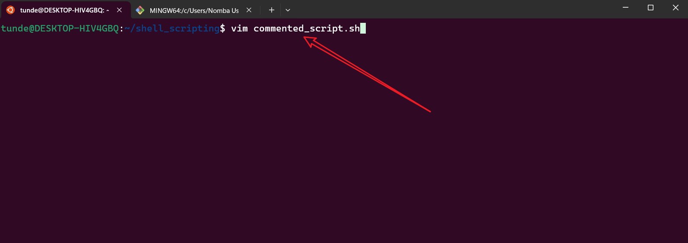
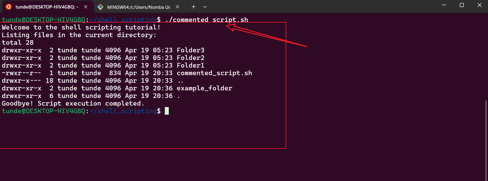

# Comments in Shell Scripting

Comments are essential parts of shell scripting. They help us document or take notes related to the script we are writing. Just like in programming, comments can also be used to instruct the shell to ignore specific parts of the script by commenting out the targeted lines. This is particularly useful for debugging or explaining the purpose of the code.

## Why Use Comments in Shell Scripting?

- **Documentation**: Comments make scripts easier to understand for others (or even yourself) when revisiting the code after some time.
- **Debugging**: Temporarily disable parts of the script without deleting them.
- **Collaboration**: Helps team members understand the logic and purpose of the script.
- **Maintainability**: Makes it easier to update or modify the script in the future.

---

## Types of Comments in Shell Scripting

There are two types of comments in shell scripting: **single-line comments** and **multi-line comments**.

### Single-line Comments

Single-line comments are used to comment out a single line of code. They are denoted by a single `#` sign followed by the comment.

---

### Task: Single-line Comments

#### 1. Create a file with `vim` called `comment.sh`

To create a file with `vim`, use the `vim` command followed by the name of the file.

- **Command**:
```bash
vim comment.sh
```
- **Screenshot**:


#### 2. Write a script that echoes "Hello World!"

To write a script that echoes "Hello World!", we use the `echo` command.

```bash
#!/bin/bash
# This is a single-line comment in this script
echo "Hello World!"
```

- **Screenshot 1**:


- **Screenshot 2**:


In Screenshot 1, the script is shown without comments. In Screenshot 2, a single-line comment is applied.

#### 3. Save the script in `vim` by pressing the `esc` key, typing `:wq`, and pressing `Enter`.

```bash
:wq
```
- **Screenshot**:


#### 4. Confirm the presence of the `.sh` file and check its permissions using the `ls -latr` command.

```bash
ls -latr
```
- **Screenshot**:


From the screenshot above, the user only has read and write permissions.

#### 5. Change user permissions to execute the file using the `chmod` command.

```bash
chmod u+x comment.sh
```
- **Screenshot**:


#### 6. Run the script using `./`.

```bash
./comment.sh
```

- **Screenshot**:


In the screenshot above, the script prints out "Hello World!" without the comments.

---

### Multi-line Comments

Multi-line comments are used to comment on multiple lines of code. In shell scripting, there is no direct syntax for multi-line comments, but we can achieve this by using `#` at the beginning of each line.

---

### Task: Multi-line Comments

#### 1. Create a file with `vim` called `comment2.sh`.

```bash
vim comment2.sh
```
- **Screenshot**:


#### 2. Write a script that creates two `.txt` files (`text1.txt` and `text2.txt`) while adding a multi-line comment.

```bash
#!/bin/bash
# This is a multi-line comment
# This script creates two text files called text1.txt and text2.txt
# Creating text1.txt
touch text1.txt
# Creating text2.txt
touch text2.txt
```

- **Screenshot**:


#### 3. Save the script in `vim` by pressing the `esc` key, typing `:wq`, and pressing `Enter`.

```bash
:wq
```

#### 4. Confirm the presence of the `.sh` file and check its permissions using the `ls -latr` command.

```bash
ls -latr
```
- **Screenshot**:


#### 5. Change user permissions to execute the file using the `chmod` command.

```bash
chmod u+x comment2.sh
```
- **Screenshot**:


#### 6. Run the script using `./`.

```bash
./comment2.sh
```
- **Screenshot**:


In the screenshot above, the script creates two text files: `text1.txt` and `text2.txt`.

#### 7. Confirm the presence of the text files created and check their permissions using the `ls -latr` command.

```bash
ls -latr
```
- **Screenshot**:


---

## Use Cases for Comments in Shell Scripting

1. **Debugging**: Temporarily disable parts of the script to identify issues.
   ```bash
   # echo "This line is commented out for debugging"
   ```
2. **Documentation**: Explain complex logic or commands.
   ```bash
   # This loop iterates through all files in the directory
   for file in *; do
       echo $file
   done
   ```
3. **Version Control**: Mark changes or updates in the script.
   ```bash
   # Updated on 2025-04-19: Added file permission check
   ```
4. **Configuration Files**: Provide instructions or default values.
   ```bash
   # Set the default directory
   DEFAULT_DIR="/home/user"
   ```

---

## Best Practices for Comments in Shell Scripting

1. **Be Clear and Concise**: Write comments that are easy to understand.
   ```bash
   # This script backs up the /home directory to /backup
   ```
2. **Avoid Redundancy**: Do not state the obvious.
   ```bash
   # Bad: This is a comment
   echo "Hello World!" # Prints Hello World!
   ```
3. **Use Comments for Complex Logic**: Explain why something is done, not just what is done.
   ```bash
   # Check if the backup directory exists; if not, create it
   if [ ! -d "/backup" ]; then
       mkdir /backup
   fi
   ```
4. **Keep Comments Updated**: Ensure comments reflect the current state of the script.
5. **Use Multi-line Comments Sparingly**: Use them only when necessary to explain complex logic or provide detailed documentation.
6. **Standardize Commenting Style**: Use a consistent format for comments throughout the script.

---

By following these guidelines, you can create well-documented, maintainable, and easy-to-understand shell scripts.