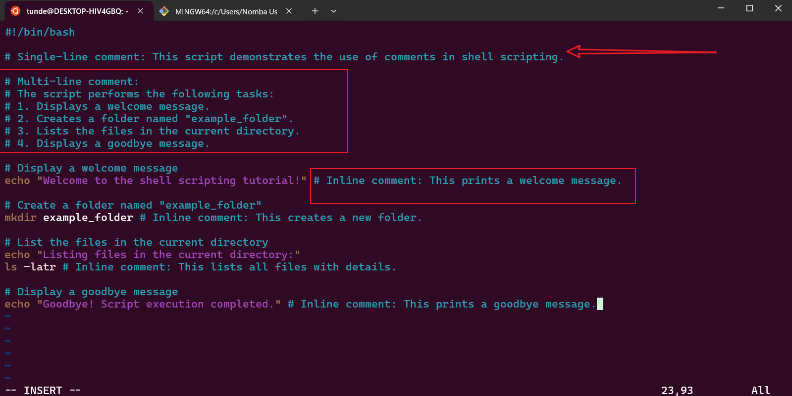
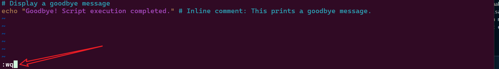

# Comments in Shell Scripting

Comments are essential parts of shell scripting. They help us document or take notes related to the script we are writing. Just like in programming, comments can also be used to instruct the shell to ignore specific parts of the script by commenting out the targeted lines. This is particularly useful for debugging or explaining the purpose of the code.

## Why Use Comments in Shell Scripting?

- **Documentation**: Comments make scripts easier to understand for others (or even yourself) when revisiting the code after some time.
- **Debugging**: Temporarily disable parts of the script without deleting them.
- **Collaboration**: Helps team members understand the logic and purpose of the script.
- **Maintainability**: Makes it easier to update or modify the script in the future.

---

## Types of Comments in Shell Scripting

There are three types of comments in shell scripting: **single-line comments**, **multi-line comments**, and **inline comments**.

### Single-line Comments

Single-line comments are used to comment out a single line of code. They are denoted by a single `#` sign followed by the comment.

### Multi-line Comments

Multi-line comments are used to comment on multiple lines of code. In shell scripting, there is no direct syntax for multi-line comments, but we can achieve this by using `#` at the beginning of each line.

### Inline Comments

Inline comments are comments written on the same line as a command. They are useful for providing context or explanations for specific commands.

---

## Task: Create `commented_script.sh`

The following script demonstrates the use of single-line, multi-line, and inline comments while performing the specified tasks: displaying a welcome message, creating a folder, listing files, and displaying a goodbye message.

### Script: `commented_script.sh`

```bash
#!/bin/bash

# Single-line comment: This script demonstrates the use of comments in shell scripting.

# Multi-line comment:
# The script performs the following tasks:
# 1. Displays a welcome message.
# 2. Creates a folder named "example_folder".
# 3. Lists the files in the current directory.
# 4. Displays a goodbye message.

# Display a welcome message
echo "Welcome to the shell scripting tutorial!" # Inline comment: This prints a welcome message.

# Create a folder named "example_folder"
mkdir example_folder # Inline comment: This creates a new folder.

# List the files in the current directory
echo "Listing files in the current directory:"
ls -latr # Inline comment: This lists all files with details.

# Display a goodbye message
echo "Goodbye! Script execution completed." # Inline comment: This prints a goodbye message.
```

---

## Steps to Create and Execute the Script

### 1. Create the Script File

Use the `vim` command to create the script file.

```bash
vim commented_script.sh
```

- **Screenshot**: 


### 2. Write the Script

Copy and paste the script above into the `commented_script.sh` file.

- **Screenshot**:

### 3. Save and Exit

Press the `esc` key, type `:wq`, and press `Enter` to save and exit.

- **Screenshot**:


### 4. Make the Script Executable

Change the file permissions to make it executable.

```bash
chmod u+x commented_script.sh
```

- **Screenshot**: 


### 5. Run the Script

Execute the script using the following command:

```bash
./commented_script.sh
```

- **Screenshot**: 

---

## Use Cases for Comments in Shell Scripting

1. **Debugging**: Temporarily disable parts of the script to identify issues.
   ```bash
   # echo "This line is commented out for debugging"
   ```
2. **Documentation**: Explain complex logic or commands.
   ```bash
   # This loop iterates through all files in the directory
   for file in *; do
       echo $file
   done
   ```
3. **Version Control**: Mark changes or updates in the script.
   ```bash
   # Updated on 2025-04-19: Added file permission check
   ```
4. **Configuration Files**: Provide instructions or default values.
   ```bash
   # Set the default directory
   DEFAULT_DIR="/home/user"
   ```

---

## Best Practices for Comments in Shell Scripting

1. **Be Clear and Concise**: Write comments that are easy to understand.
   ```bash
   # This script backs up the /home directory to /backup
   ```
2. **Avoid Redundancy**: Do not state the obvious.
   ```bash
   # Bad: This is a comment
   echo "Hello World!" # Prints Hello World!
   ```
3. **Use Comments for Complex Logic**: Explain why something is done, not just what is done.
   ```bash
   # Check if the backup directory exists; if not, create it
   if [ ! -d "/backup" ]; then
       mkdir /backup
   fi
   ```
4. **Keep Comments Updated**: Ensure comments reflect the current state of the script.
5. **Use Multi-line Comments Sparingly**: Use them only when necessary to explain complex logic or provide detailed documentation.
6. **Standardize Commenting Style**: Use a consistent format for comments throughout the script.

---

By following these guidelines, you can create well-documented, maintainable, and easy-to-understand shell scripts.