# Shell Scripting Capstone Project

## Project Overview
The project demonstrates the power of shell scripting by creating a Bash script that generates a multiplication table for a number entered by the user. This project serves as a practical exercise in using loops, handling user input, and applying conditional logic in Bash scripting.

## Use Cases
1. **Educational Tool**: Perfect for teaching basic arithmetic and multiplication concepts to students
2. **Quick Reference**: Useful for quick multiplication calculations without using a calculator
3. **Learning Resource**: Excellent for practicing shell scripting concepts and bash programming
4. **Customizable Tables**: Allows users to generate specific ranges of multiplication tables as needed
5. **Interactive Learning**: Provides hands-on experience with command-line interfaces and user input handling

## Best Practices Implemented
1. **Input Validation**: Thorough checking of user inputs to prevent errors
2. **Error Handling**: Graceful handling of invalid inputs with informative error messages
3. **Code Documentation**: Comprehensive comments explaining code functionality
4. **Modular Design**: Clear separation of different functionalities
5. **User Experience**: Intuitive prompts and clear output formatting
6. **Code Reusability**: Implementation of both traditional and C-style loops
7. **Testing**: Dedicated test script for verifying functionality
8. **Security**: Input sanitization to prevent command injection
9. **Maintainability**: Well-structured code with consistent formatting
10. **Flexibility**: Support for both full and partial table generation

# Project Requirements
- User Input for Number:
The script must first ask the user to input a number for which the multiplication table will be generated.
- Choice of Table Range:
Ask the user if they want a full multiplication table (1 to 10) or a partial table. If they choose partial, prompt them for the start and end of the range.
- Use of Loops:
Implement the logic to generate the multiplication table using loops. You may use either the list form or C-style for loop depending on what's appropriate.
- Conditional Logic:
Use if-else statements to handle the logic based on the user's choices (full vs. partial table and valid range input).
- Input Validation:
Ensure that the user enters valid numbers for the multiplication table and the specified range. Provide feedback for invalid inputs and default to a full table if the range is incorrect.
- Error Handling for Invalid Range:
If the user enters an invalid range (e.g., starting number greater than ending number or values out of bounds), the script should inform the user and display the full table instead.
- Readable Output:
Display the multiplication table in a clear and readable format, adhering to the user's choice of range.
- Comments and Code Quality:
The script should be well-commented, explaining the purpose of different sections and any important variables or logic used. Ensure the code is neatly formatted for easy readability.
## Bonus Features (Optional):
- Provide clear output formatting for ease of reading.
- Incorporate additional checks or features, like repeating the program for another number without restarting the script.
- Offer different formatting styles for the table display and let the user choose.

## Project Structure
- `README.md`: This file, containing the project overview, requirements, use cases, and best practices
- `multiplication_table.sh`: The main shell script implementing the core functionality
- `multiplication_cStyle_table.sh`: Alternative implementation using C-style loops
- `test_cases.sh`: Comprehensive test script for validating functionality
- `LICENSE`: Project license information
- `img/`: Directory containing screenshots and visual documentation

# Task Breakdown
1. Create the main script (multiplication_table.sh) to handle user input and generate the multiplication table with vim editor, using the command.
```bash
vim multiplication_table.sh
```
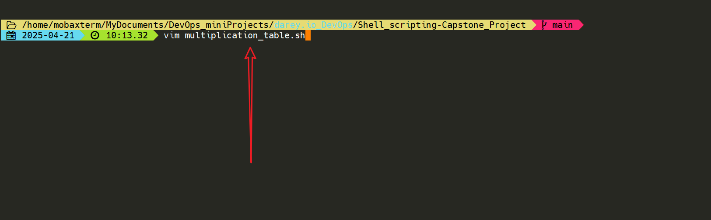

2. Implement the logic to ask the user for a number and check if it is a valid number.
```bash
#!/bin/bash
# This script generates a multiplication table for a given number

# Ask the user for a number
read -p "Enter a number to generate its multiplication table: " number
# Check if the input is a valid number
if ! [[ "$number" =~ ^[0-9]+$ ]]; then
    echo "Error: Please enter a valid number."
    exit 1
fi
```
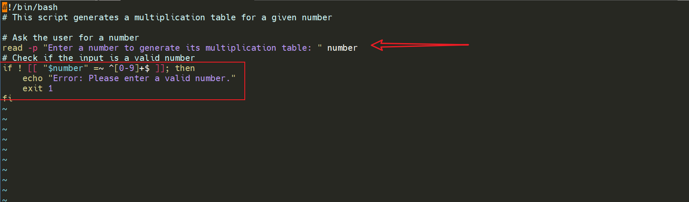
Let break down the code:
- The first line `#!/bin/bash` is called a shebang. It tells the system that this script should be run using the Bash shell.
- The second line is a comment that describes what the script does. Comments in Bash start with `#` and are ignored by the shell.
- The third line `read -p "Enter a number to generate its multiplication table: " number` prompts the user to enter a number and stores it in the variable `number`. The `-p` option allows you to specify a prompt message.
- The fourth line checks if the input is a valid number using a regular expression. The `[[ "$number" =~ ^[0-9]+$ ]]` condition checks if the variable `number` contains only digits (0-9). If it doesn't, an error message is displayed, and the script exits with a status code of 1 (indicating an error).

3. Implement the logic to ask the user if they want a full multiplication table (1 to 10) or a partial table.
```bash
# Ask the user to specify if they want a full or partial table
read -p "Do you want a full table (1-10) or a partial table (1-5)? (Enter 'full' or 'partial'): " choice
# Generate the multiplication table based on the user's choice
if [[ "$choice" == "full" ]]; then
    echo "Multiplication table for $number (1-10):"
    for i in {1..10}; do
        result=$((number * i))
        echo "$number x $i = $result"
    done
# if the user chooses partial, the script ask the user from what start and to what end
elif [[ "$choice" == "partial" ]]; then
    read -p "Enter the start number for the partial table (1-10): " start
    read -p "Enter the end number for the partial table (1-10): " end
    # Check if the input is a valid range
    if ! [[ "$start" =~ ^[1-10]$ && "$end" =~ ^[1-10]$ && "$start" -le "$end" ]]; then
        echo "Error: Please enter a valid range between 1 and 5."
        exit 1
    fi
    echo "Multiplication table for $number ($start-$end):"
    for i in $(seq $start $end); do
        result=$((number * i))
        echo "$number x $i = $result"
    done
else
    echo "Error: Invalid choice. Please enter 'full' or 'partial'."
    exit 1
fi
```
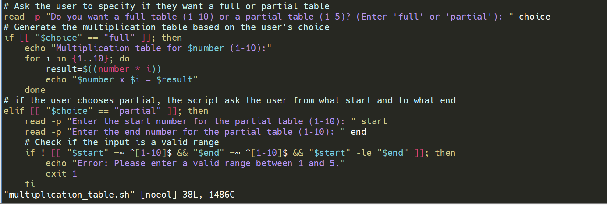
Let break down the code:
- The first line `read -p "Do you want a full table (1-10) or a partial table (1-5)? (Enter 'full' or 'partial'): " choice` prompts the user to enter their choice for the multiplication table type and stores it in the variable `choice`.
- The second line checks if the user's choice is "full". If it is, the script generates a full multiplication table from 1 to 10 using a for loop. The loop iterates through numbers 1 to 10, calculates the result of multiplying the input number by the current loop variable `i`, and prints the result in a formatted way.
- If the user's choice is "partial", the script prompts the user to enter the start and end numbers for the partial table. It then checks if the inputs are valid (between 1 and 10, and that the start number is less than or equal to the end number). If the inputs are valid, it generates the multiplication table for the specified range using a for loop and prints the results.
- If the user's choice is neither "full" nor "partial", an error message is displayed, and the script exits with a status code of 1.

## Bonus Features
4.  Ask the user if they want the table in ascending or descending order
```bash
# Ask the user if they want the table in ascending or descending order
read -p "Do you want the table in ascending or descending order? (Enter 'asc' or 'desc'): " order

# Generate the multiplication table based on the order
if [[ "$order" == "asc" ]]; then
    echo "Multiplication table for $number ($start-$end) in ascending order:"
    for i in $(seq $start $end); do
        result=$((number * i))
        echo "$number x $i = $result"
    done
elif [[ "$order" == "desc" ]]; then
    echo "Multiplication table for $number ($start-$end) in descending order:"
    for i in $(seq $end -1 $start); do
        result=$((number * i))
        echo "$number x $i = $result"
    done
else
    echo "Error: Invalid order choice. Please enter 'asc' or 'desc'."
    exit 1
fi
```
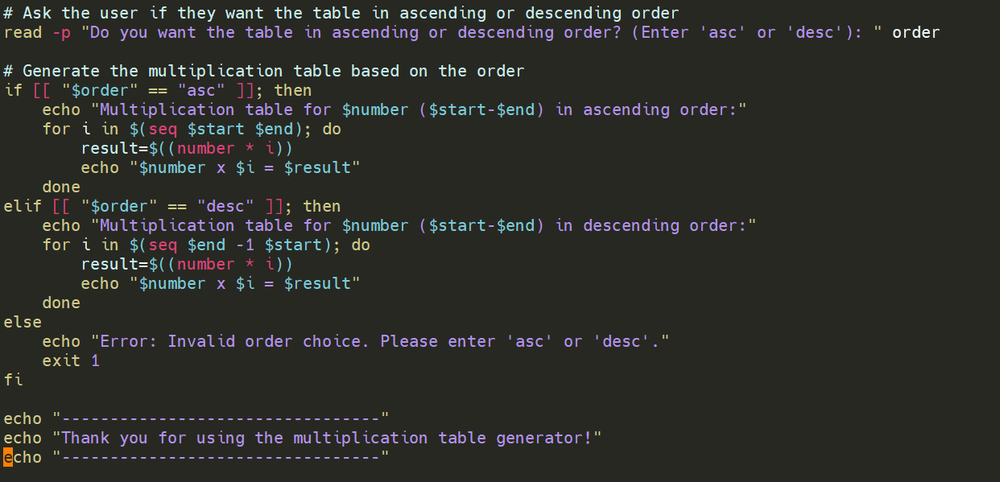

Let break down the code:
- The first line `read -p "Do you want the table in ascending or descending order? (Enter 'asc' or 'desc'): " order` prompts the user to enter their choice for the order of the multiplication table and stores it in the variable `order`.
- The second line checks if the user's choice is "asc". If it is, the script generates a multiplication table in ascending order using a for loop. The loop iterates through the specified range from start to end, calculates the result of multiplying the input number by the current loop variable `i`, and prints the result in a formatted way.
- If the user's choice is "desc", the script generates a multiplication table in descending order using a for loop. The loop iterates through the specified range from end to start, calculates the result of multiplying the input number by the current loop variable `i`, and prints the result in a formatted way.
- If the user's choice is neither "asc" nor "desc", an error message is displayed, and the script exits with a status code of 1.

6. Save the script and make it executable
```bash
chmod +x multiplication_table.sh
```
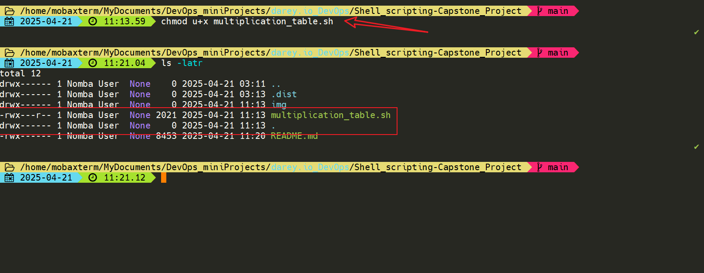

7. Run the script to test its functionality for full and ascending order
```bash
./multiplication_table.sh
```
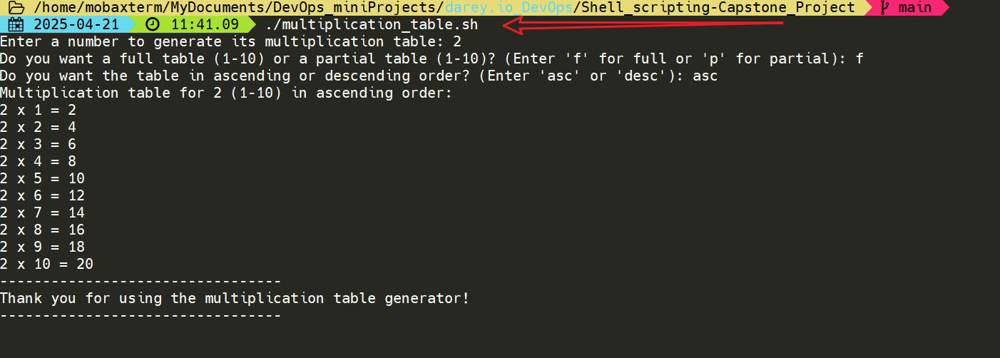

8. Run the script to test its functionality for full and descending order
```bash
./multiplication_table.sh
```
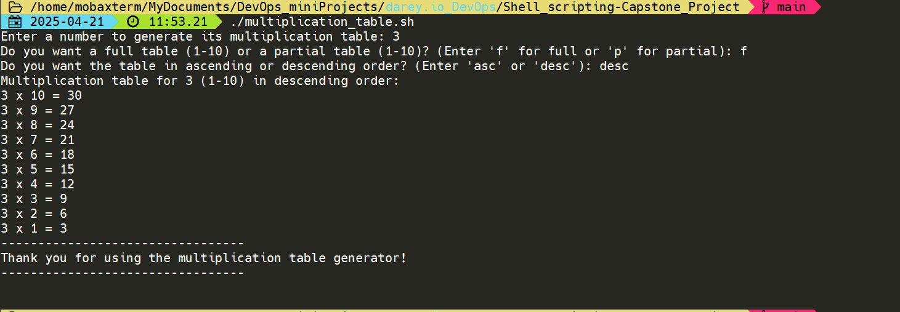

9. Run the script to test its functionality for partial and ascending order
```bash
./multiplication_table.sh
```
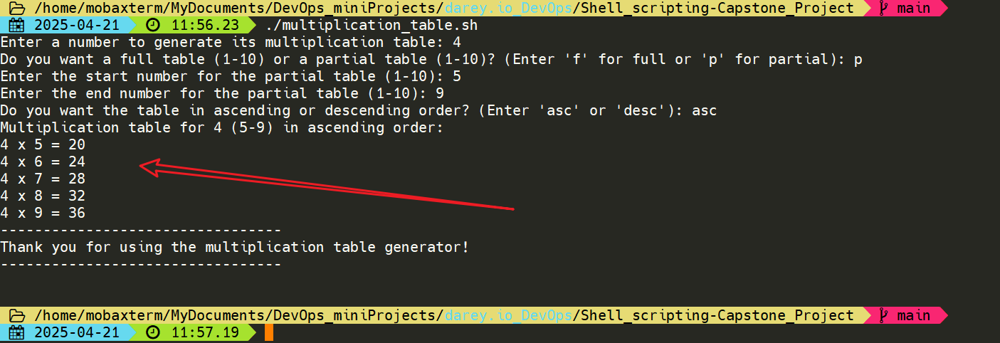

10. Run the script to test its functionality for partial and descending order
```bash
./multiplication_table.sh
```
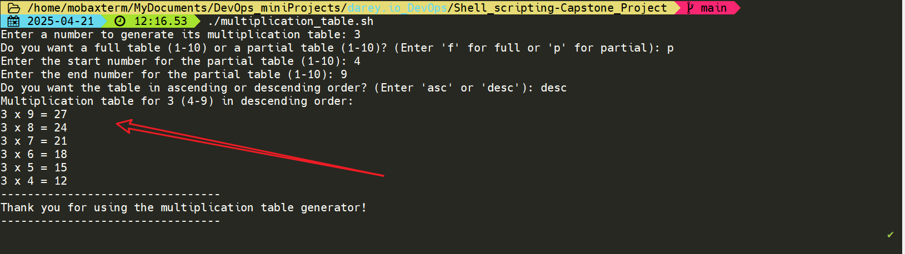

11. Run the script to test its functionality for invalid range
```bash
./multiplication_table.sh
```
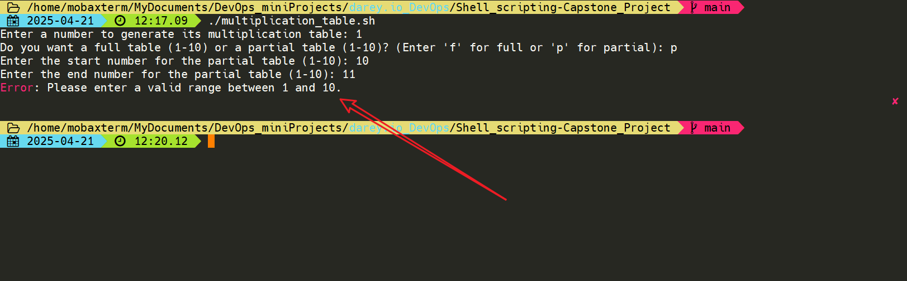

# Using the C style for loop
1. Create a duplicate of the script and name it multiplication_cStyle_table.sh
```bash
vim multiplication_cStyle_table.sh
```
2. Copy the content of multiplication_table.sh and paste it into multiplication_cStyle_table.sh and change the for loop to C style for loop
```bash
# Generate the multiplication table based on the order
if [[ "$order" == "asc" ]]; then
    echo "Multiplication table for $number ($start-$end) in ascending order:"
    for ((i = start; i <= end; i++)); do
        result=$((number * i))
        echo "$number x $i = $result"
    done
elif [[ "$order" == "desc" ]]; then
    echo "Multiplication table for $number ($start-$end) in descending order:"
    for ((i = end; i >= start; i--)); do
        result=$((number * i))
        echo "$number x $i = $result"
    done
else
    echo "Error: Invalid order choice. Please enter 'asc' or 'desc'."
    exit 1
fi
```
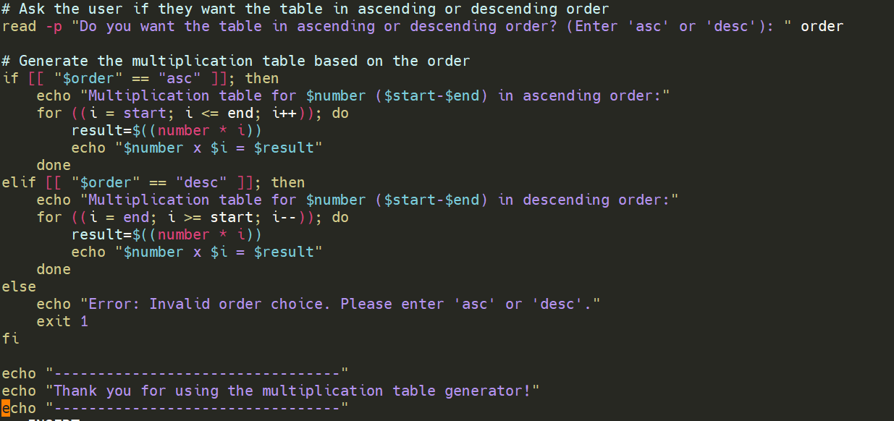

3. Save the script and make it executable
```bash
chmod +x multiplication_cStyle_table.sh
```

# Creating a test script
1. Create a test script named test_cases.sh
```bash
vim test_cases.sh
```
2. Add the following test cases to the script
```bash
#!/bin/bash
# This script tests the multiplication table generator script
# It checks for valid inputs and expected outputs
# Usage: ./test_cases.sh

# Define the script to be tested
SCRIPT="./multiplication_table.sh"

# Define the expected output for a full table
EXPECTED_OUTPUT_FULL="Multiplication table for 5 (1-10) in ascending order:
5 x 1 = 5
5 x 2 = 10
5 x 3 = 15
5 x 4 = 20
5 x 5 = 25
5 x 6 = 30
5 x 7 = 35
5 x 8 = 40
5 x 9 = 45
5 x 10 = 50
---------------------------------
Thank you for using the multiplication table generator!
---------------------------------"

# Define the expected output for a partial table
EXPECTED_OUTPUT_PARTIAL="Multiplication table for 5 (3-7) in ascending order:
5 x 3 = 15
5 x 4 = 20
5 x 5 = 25
5 x 6 = 30
5 x 7 = 35
---------------------------------
Thank you for using the multiplication table generator!
---------------------------------"

# Define the expected output for a descending order table
EXPECTED_OUTPUT_DESCENDING="Multiplication table for 5 (1-10) in descending order:
5 x 10 = 50
5 x 9 = 45
5 x 8 = 40
5 x 7 = 35
5 x 6 = 30
5 x 5 = 25
5 x 4 = 20
5 x 3 = 15
5 x 2 = 10
5 x 1 = 5
---------------------------------
Thank you for using the multiplication table generator!
---------------------------------"
---------------------------------
run_test "$input8" "$expected_output8"
---------------------------------
```
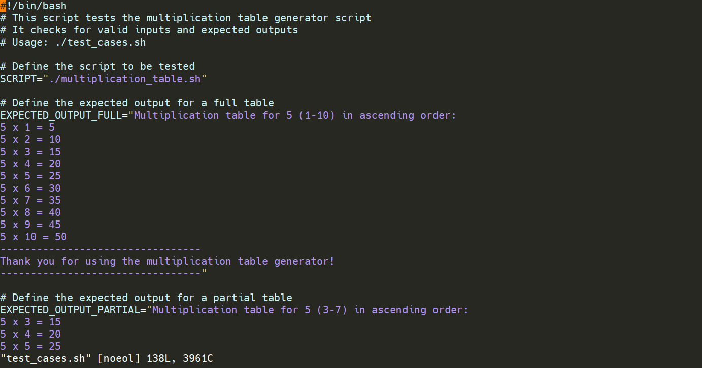

***Note: The complete test script is in the test_cases.sh file. The above code is just a snippet of the test script.***

3. Save the script and make it executable
```bash
chmod +x test_cases.sh
```
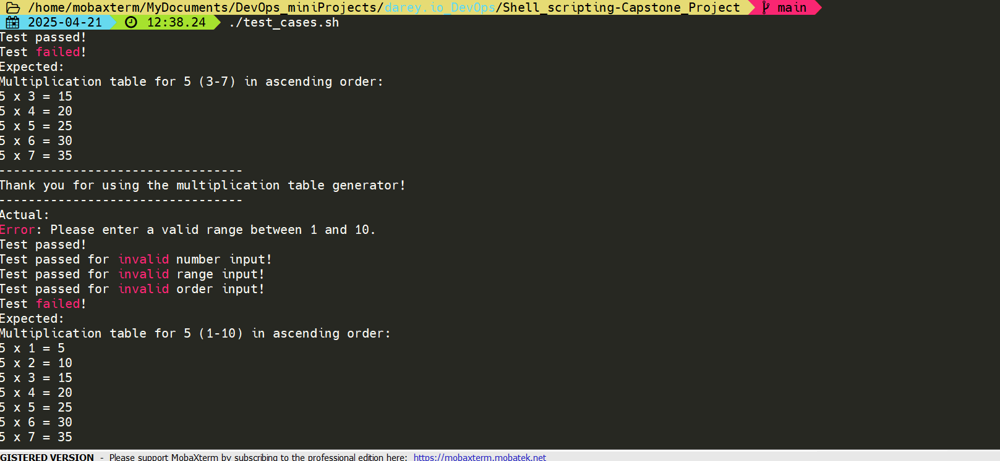

## Additional Features
1. **Formatting Options**: Choose between different table display styles
2. **Order Control**: Generate tables in ascending or descending order
3. **Range Validation**: Automatic validation of user-specified ranges
4. **Interactive Mode**: Option to generate multiple tables without restarting
5. **Visual Feedback**: Clear formatting and separation of output

## Best Practices for Using the Script
1. **Input Guidelines**:
   - Use positive integers for the multiplication number
   - Specify ranges between 1 and 10 for partial tables
   - Choose 'full' or 'partial' for table type
   - Select 'asc' or 'desc' for table order

2. **Error Prevention**:
   - Ensure start number is less than or equal to end number
   - Use valid numeric inputs only
   - Follow the prompt instructions carefully

3. **Output Interpretation**:
   - Results are displayed in a clear, formatted manner
   - Each multiplication is shown on a new line
   - Error messages are descriptive and helpful

4. **Script Maintenance**:
   - Keep the script executable with proper permissions
   - Regularly test with the provided test cases
   - Document any modifications made to the script
