# Shell Scripting Mini Project one

## Overview
This shell scripting project demonstrates fundamental Linux/Unix system administration tasks that are commonly used in DevOps, system administration, and automation workflows. These skills are essential for:
- System administrators managing user accounts
- DevOps engineers automating deployment processes
- Developers creating build and deployment scripts
- IT professionals handling system maintenance tasks

## Prerequisites
- Linux/Unix-based operating system
- Sudo privileges for user management
- Basic understanding of terminal commands
- Vim editor installed

## Project Tasks
This shell scripting project covers the very basics of scripting such as:
- Creating a directory
- Creating users
- Checking for permission
- Checking user's id
- Granting permission to owner with the use of 'chmod'

## Task one
### 1. Create a directory called 'shell_scripting' with the use of the mkdir command
```bash
mkdir shell_scripting
```

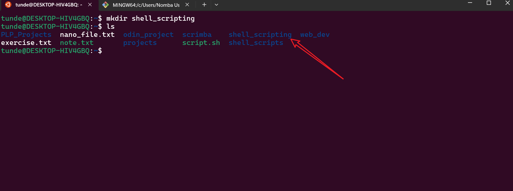

The above command creates a directory called 'shell_scripting' in the current working directory. To check the presence of the new directory, we can use the 'ls' command:
```bash
ls -l
```
This command lists the files and directories in the current working directory, including the newly created 'shell_scripting'.

> 💡 **Tip**: Always verify directory creation, especially in production environments where directory structure is critical for application deployment.

### 2. Using vim, created a shell file called my_first_shell_script
```bash
vim my_first_shell_script
```
This command opens the vim editor where we can write our first shell script. To save the file, we can use the 'wq' command in vim.

> ⚠️ **Caution**: If you're new to vim, you might want to consider using more beginner-friendly editors like `nano` or `gedit`. However, vim is powerful and worth learning for advanced text editing.

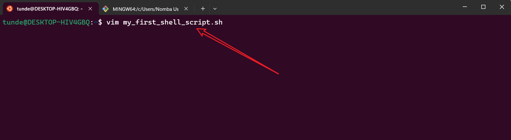

### 3. Write the following code in the my_first_shell_script file
The following code is written in the my_first_shell_script file using vim editor:
```bash
#!/bin/bash
# Create 3 directories
mkdir folder1
mkdir folder2
mkdir folder3

# create 3 users
sudo adduser user1
sudo adduser user2
sudo adduser user3
```

In the above script 3 folders are created and 3 users are created using the 'adduser' command. The 'sudo' command is used to execute commands with administrative privileges.

> 🔍 **Real-world Use Case**: This type of script is commonly used in:
> - Setting up new development environments
> - Creating user accounts for new team members
> - Automating server provisioning
> - Setting up test environments

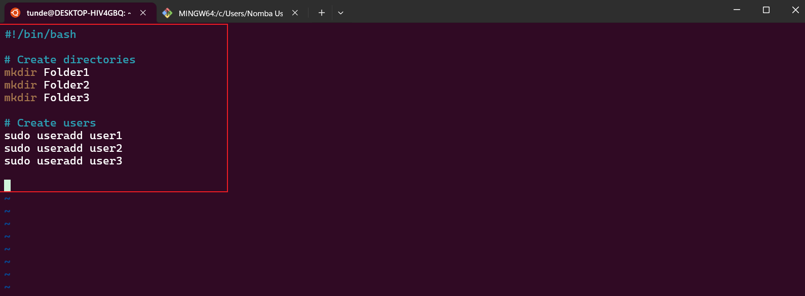

### 4. To save the file and exit vim, we use the 'wq' command to enter command mode on vim use the esc key and then type ':wq' and press enter
```bash
:wq
```
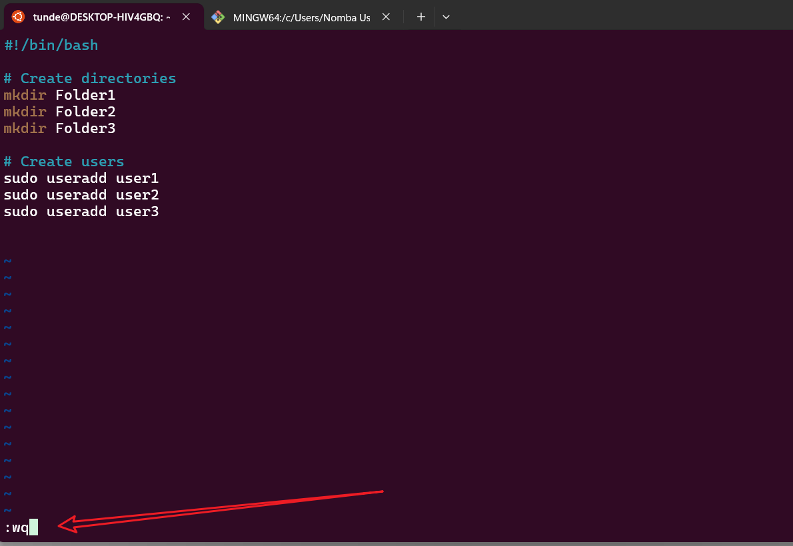

> 💡 **Vim Tips**:
> - Press `Esc` to ensure you're in command mode
> - `:w` saves without exiting
> - `:q` quits without saving
> - `:wq` saves and quits
> - `:q!` force quits without saving

### 5. Used 'ls -latr' command to confirm the presence of the script in the shell_scripting directory
```bash
ls -latr
```
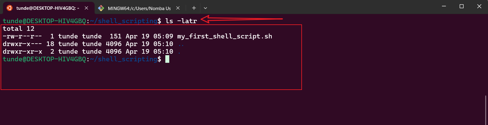

> 🔍 **Command Explanation**:
> - `-l`: long listing format
> - `-a`: show hidden files
> - `-t`: sort by modification time
> - `-r`: reverse order

### 6. Running the script without the right execute permission throws off the 'Permission denied' message to user
```bash
./my_first_shell_script
```
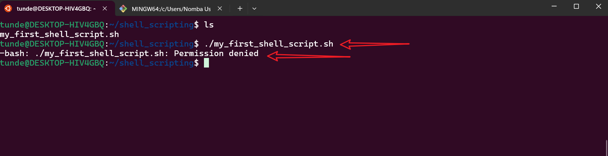

The above command throws a 'Permission denied' message because the script does not have the right execute permission.

> ⚠️ **Security Note**: This is a Linux security feature that prevents unauthorized scripts from executing. Always verify script contents before granting execute permissions.

## Task Two: Adding Execute Permission to the Script
### 1. To add execute permission to the user only use the 'chmod u+x' command
```bash
chmod u+x my_first_shell_script
```
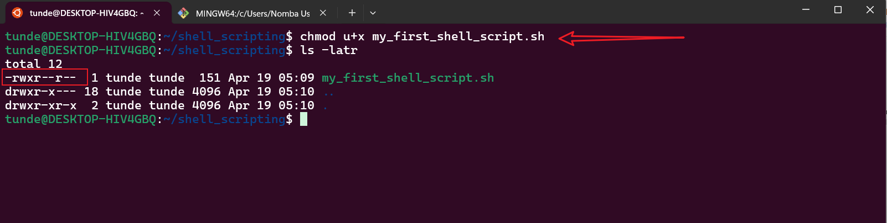

Use the 'ls -latr' command to confirm the execute permission has been added to the user only

> 💡 **Permission Tips**:
> - `u+x`: adds execute permission for user only
> - `g+x`: adds execute permission for group
> - `o+x`: adds execute permission for others
> - `a+x`: adds execute permission for all

### 2. Running the script with the execute permission added to the user only
```bash
./my_first_shell_script
```
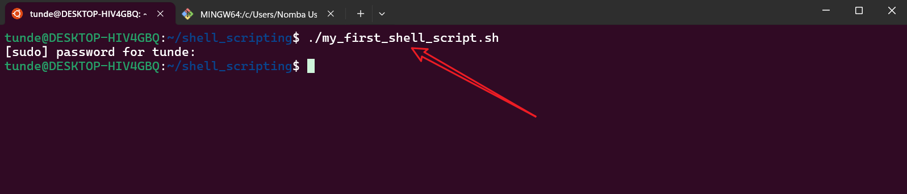

The script runs successfully with the execute permission added to the user only.

> 🔍 **Real-world Application**: This permission model is crucial in:
> - Multi-user systems
> - Shared hosting environments
> - Production servers
> - Development environments

### 3. To confirm the presence of the 3 directories created by the script use the 'ls -latr' command
```bash
ls -latr
```
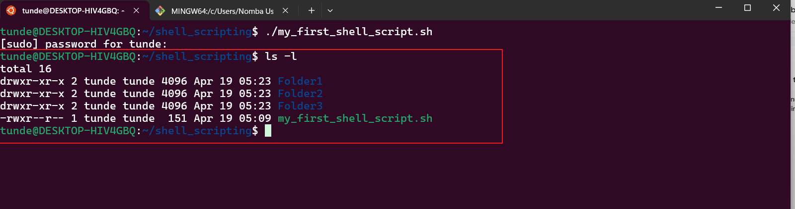

### 4. To check and confirm the id of the users created by the script use the 'id' command
```bash
id user1 user2 user3
```
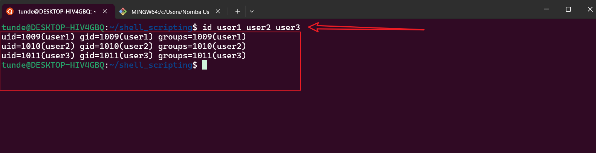

Alternatively, you can also get the list of new users by using the ls command in the /home directory
```bash
sudo ls /home
```

> ⚠️ **Important**: Always verify user creation in production environments. Failed user creation can cause issues with:
> - Application permissions
> - Service accounts
> - System security
> - Access control

## Task Three: Check the types of shell your kernel is supporting
### 1. To check the types of shell your kernel is supporting use the 'sudo cat /etc/shells' command
```bash
sudo cat /etc/shells
```
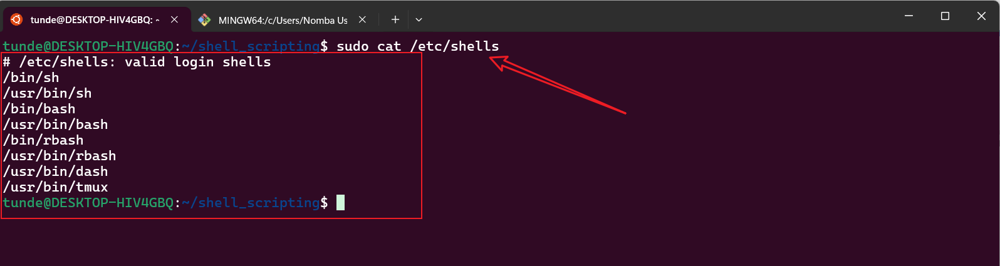

The above command will display the list of supported shells in your kernel.

> 💡 **Shell Selection Tips**:
> - Bash: Most common, good for compatibility
> - Zsh: Enhanced features, popular for development
> - Fish: User-friendly, modern features
> - Dash: Lightweight, POSIX compliant

## Side Task: Variable Usage
- Assign a name to the variable name
- Assign a value to the variable name
- Print the value of the variable name

```bash
name="Tunde"
```
```bash
echo $name
```
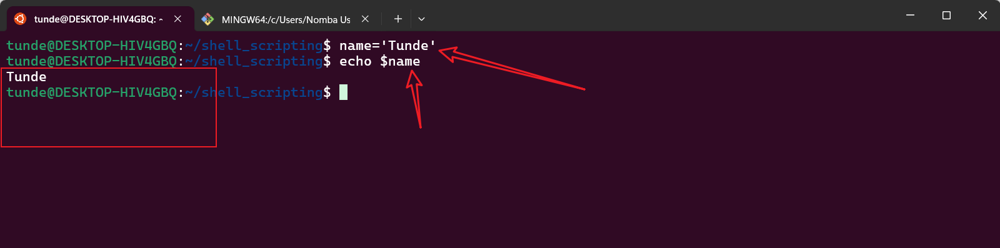

> 🔍 **Variable Best Practices**:
> - Use meaningful variable names
> - Always quote string values
> - Use uppercase for environment variables
> - Use lowercase for local variables

## Additional Tips and Best Practices
1. **Script Safety**:
   - Always backup files before running scripts
   - Test scripts in a non-production environment first
   - Use `set -e` to exit on errors
   - Add proper error handling

2. **Documentation**:
   - Comment your scripts thoroughly
   - Include usage instructions
   - Document dependencies
   - Keep a changelog

3. **Security**:
   - Follow the principle of least privilege
   - Regularly audit user permissions
   - Monitor script execution logs
   - Validate user input

4. **Maintenance**:
   - Keep scripts version controlled
   - Regular security updates
   - Monitor disk space usage
   - Clean up temporary files

## Common Use Cases
1. **System Administration**:
   - User management
   - System monitoring
   - Backup automation
   - Log rotation

2. **DevOps**:
   - Deployment automation
   - Configuration management
   - Environment setup
   - CI/CD pipelines

3. **Development**:
   - Build automation
   - Test automation
   - Code deployment
   - Environment configuration

## Troubleshooting Guide
1. **Permission Issues**:
   - Check file ownership
   - Verify execute permissions
   - Confirm sudo access
   - Review SELinux/AppArmor settings

2. **Script Errors**:
   - Enable debug mode with `set -x`
   - Check error messages
   - Verify syntax with `bash -n script.sh`
   - Review system logs

3. **User Management**:
   - Verify user existence
   - Check home directory permissions
   - Review group memberships
   - Confirm password policies

