# Control Flow in Shell Scripting

Control flow is essential in shell scripting. It allows you to control the execution of commands based on conditions or loops. The following are the main control flow statements in shell scripting:

- **if-else statements**: Used to execute a block of code based on a condition.
- **for loops**: Used to iterate over a list of items or a range of numbers.
- **while loops**: Used to execute a block of code as long as a condition is true.
- **case statements**: Used to execute a block of code based on the value of a variable.

---

## Syntax Overview

### if-else Statement
The `if-else` statement is used to execute a block of code based on a condition. The syntax is as follows:
```bash
if [ condition ]; then
    # code to be executed if condition is true
else
    # code to be executed if condition is false
fi
```

### for Loop
The `for` loop is used to iterate over a list of items or a range of numbers. The syntax is as follows:
```bash
for variable in list; do
    # code to be executed for each item in the list
done
```

---

## Use Cases

### if-else Statement
- **Input Validation**: Check if a user input meets certain criteria.
- **Conditional Execution**: Execute specific commands based on system states or user input.

### for Loop
- **Batch Processing**: Iterate over files in a directory to perform operations like renaming or moving.
- **Automation**: Automate repetitive tasks such as sending emails or generating reports.

---

## Tasks and Examples

### Task 1: Using `if-else` Statements
1. Create a file called `control_flow.sh`:
   ```bash
   vim control_flow.sh
   ```
   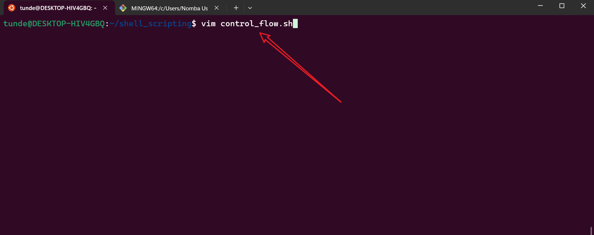

2. Add the following code:
   ```bash
   #!/bin/bash
   read -p "Enter a number: " num
   ```
   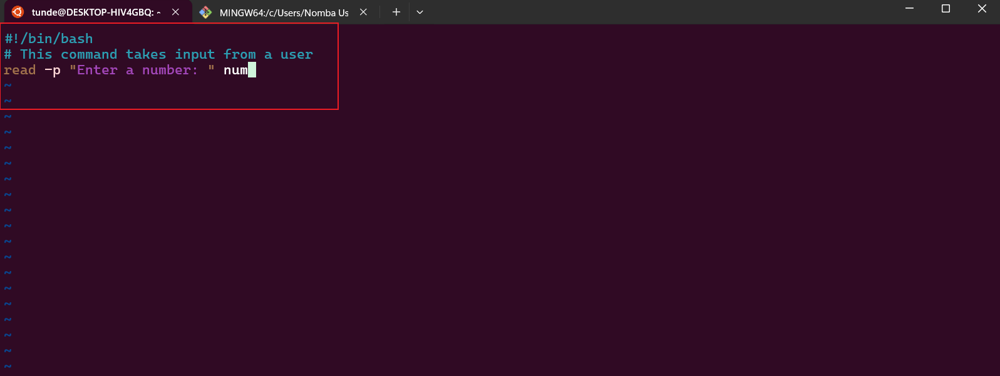

3. Save and exit the file by pressing `Esc` and typing `:wq`.
   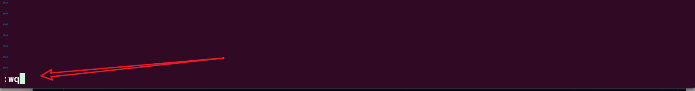

4. Confirm that the file was created:
   ```bash
   ls -latr control_flow.sh
   ```
   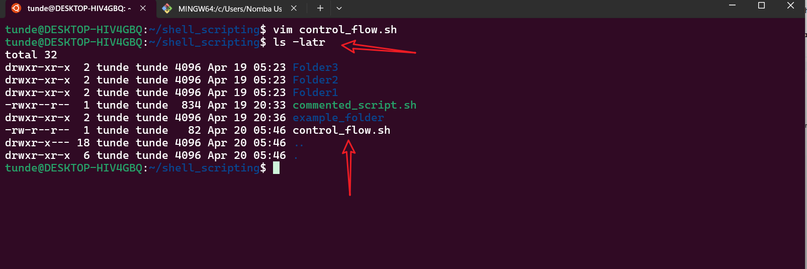

5. Make the file executable:
   ```bash
   chmod +x control_flow.sh
   ```
   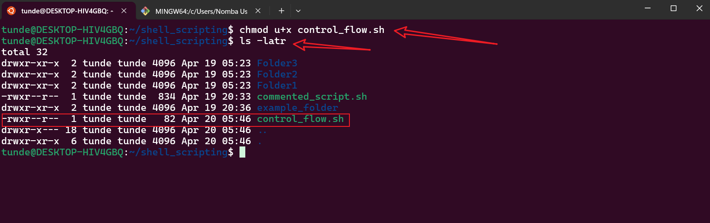

6. Run the script:
   ```bash
   ./control_flow.sh
   ```
   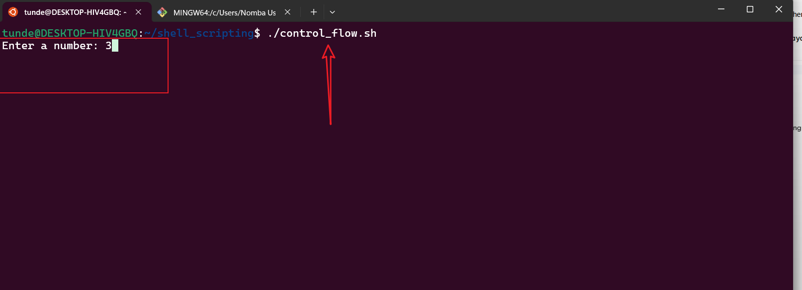

7. Update the file with the following code:
   ```bash
   #!/bin/bash
   read -p "Enter a number: " num
   echo "You have entered the number $num"
   ```
   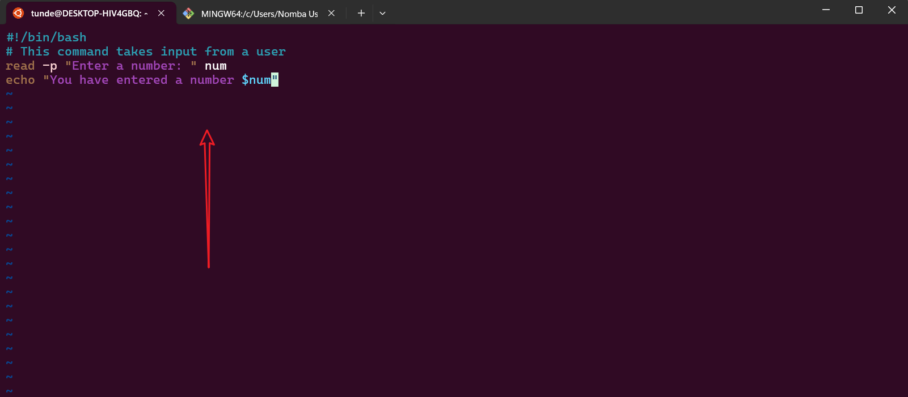

8. Save and exit the file, then execute the script again:
   ```bash
   ./control_flow.sh
   ```
   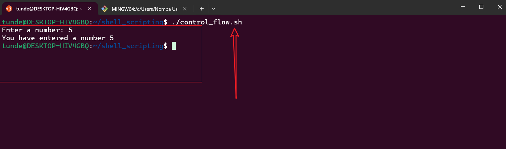

9. Add conditional logic to check if the number is positive:
   ```bash
   #!/bin/bash
   if [ $num -gt 0 ]; then
       echo "The number is positive."
   fi
   ```
   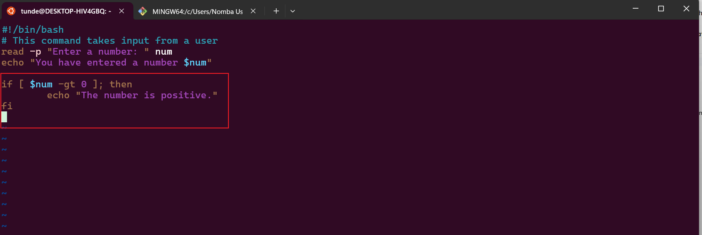

10. Save and exit the file, then run the script:
    ```bash
    ./control_flow.sh
    ```
    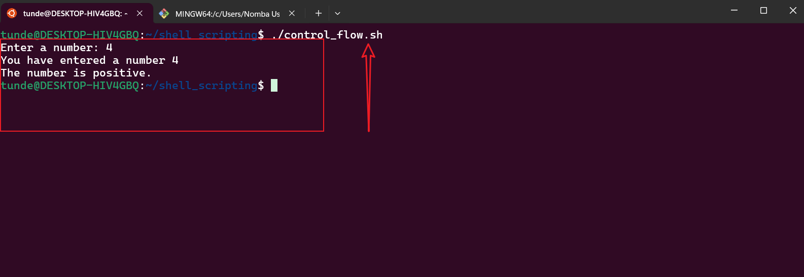

11. Extend the script to handle negative numbers:
    ```bash
    #!/bin/bash
    read -p "Enter a number: " num
    echo "You have entered the number $num"
    if [ $num -gt 0 ]; then
        echo "The number is positive."
    elif [ $num -lt 0 ]; then
        echo "The number is negative."
    fi
    ```
    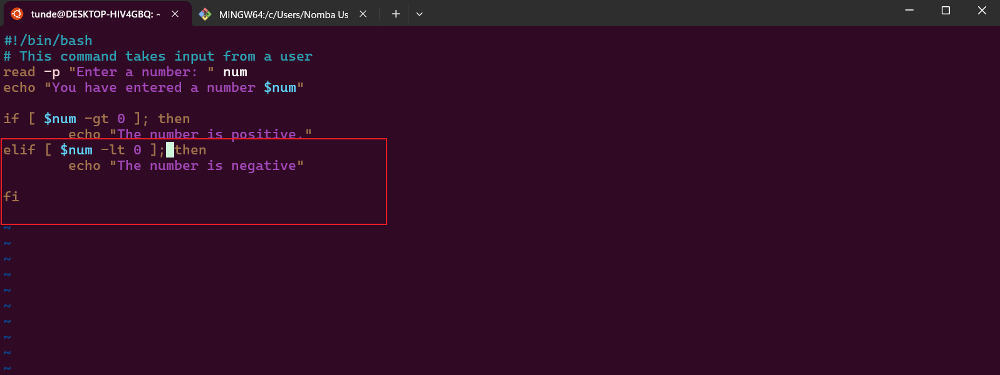

12. Save and exit the file, then run the script:
    ```bash
    ./control_flow.sh
    ```
    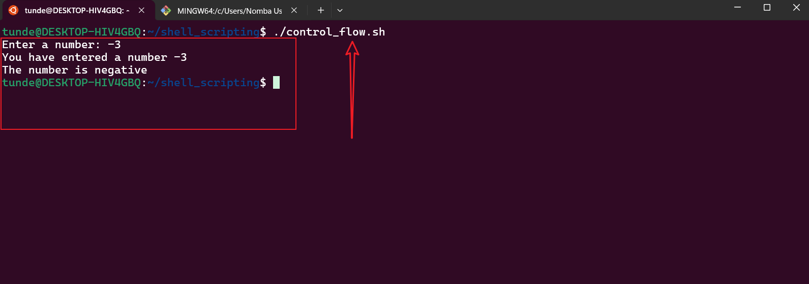

---

### Task 2: Using `for` Loops

#### Example 1: Basic for Loop
1. Create a file called `for_loop.sh`:
   ```bash
   vim for_loop.sh
   ```
2. Add the following code:
   ```bash
   #!/bin/bash
   for i in 1 2 3 4 5; do
       echo "Hello, World! This is message $i"
   done
   ```
   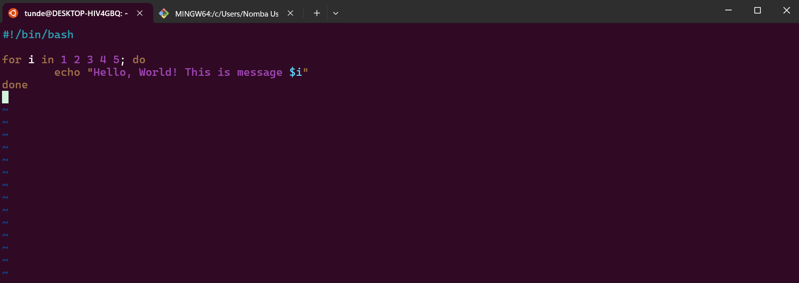

3. Save and exit the file, then confirm it was created:
   ```bash
   ls -latr for_loop.sh
   ```
   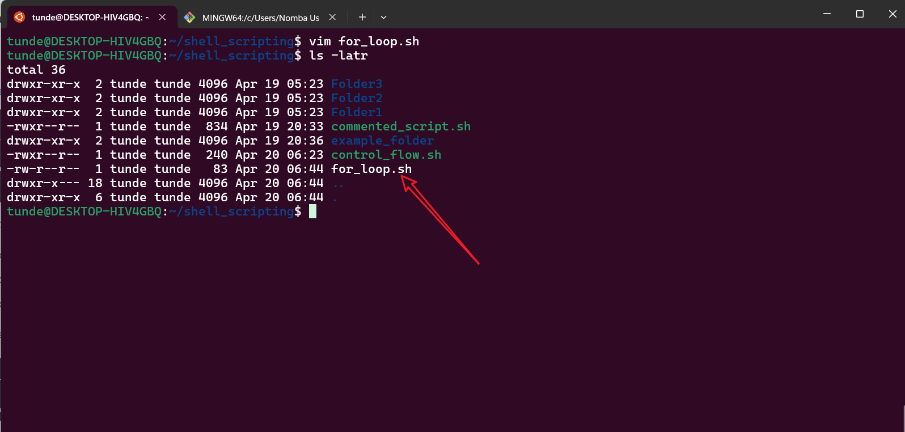

4. Make the file executable:
   ```bash
   chmod +x for_loop.sh
   ```
   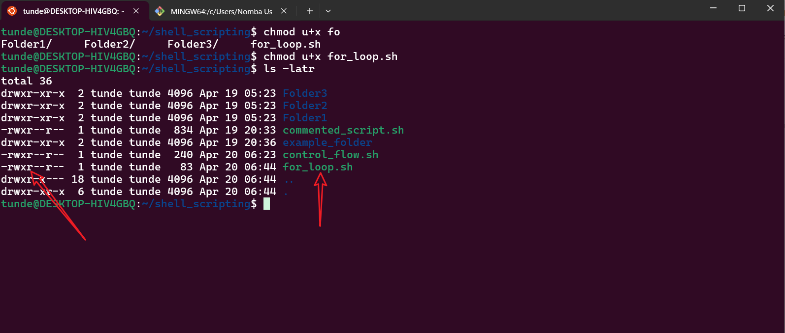

5. Run the script:
   ```bash
   ./for_loop.sh
   ```
   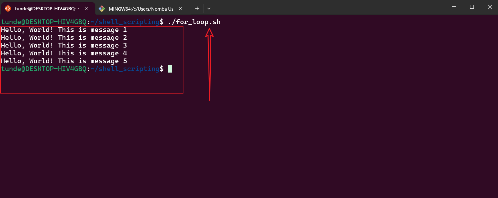

#### Example 2: Alternative Syntax
1. Create a file called `for_loop_alternative.sh`:
   ```bash
   vim for_loop_alternative.sh
   ```
   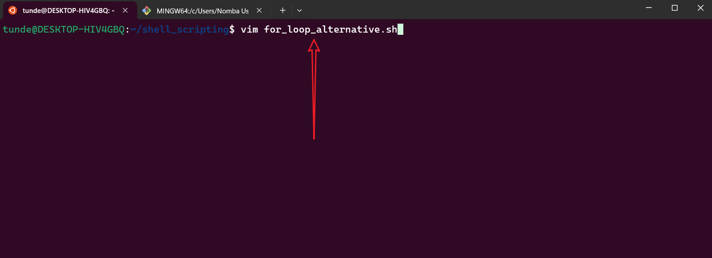

2. Add the following code:
   ```bash
   #!/bin/bash
   for i in {1..5}; do
       echo "Counting... $i"
   done
   ```
   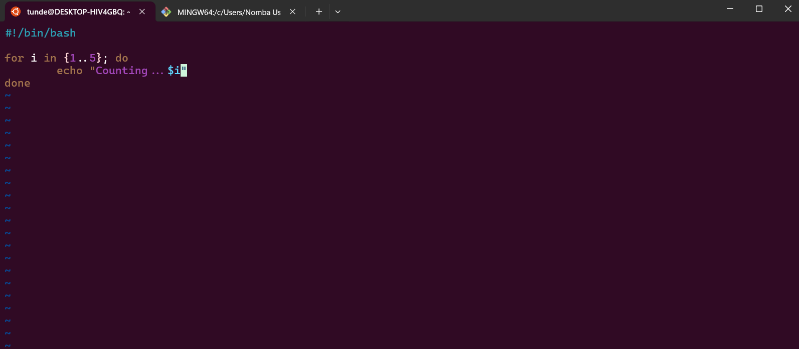

3. Save and exit the file, then confirm it was created:
   ```bash
   ls -latr for_loop_alternative.sh
   ```
   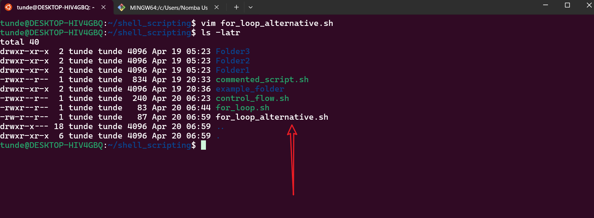

4. Make the file executable:
   ```bash
   chmod +x for_loop_alternative.sh
   ```
   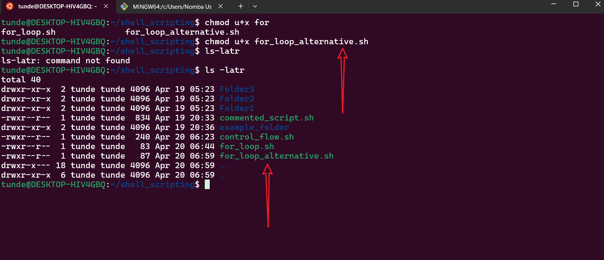

5. Run the script:
   ```bash
   ./for_loop_alternative.sh
   ```
   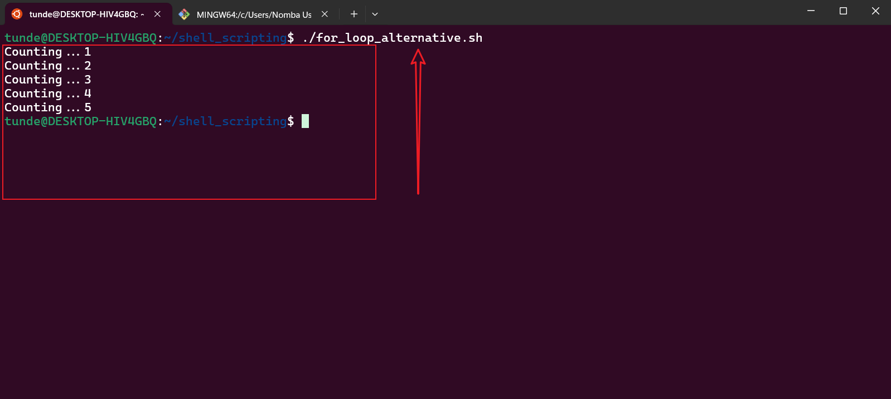

#### Example 3: C-Style for Loop
1. Create a file called `for_loop_c_style.sh`:
   ```bash
   vim for_loop_c_style.sh
   ```
   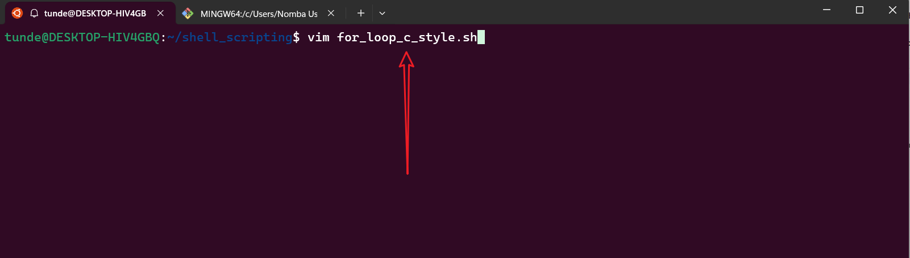

2. Add the following code:
   ```bash
   #!/bin/bash
   for (( i=1; i<=5; i++ )); do
       echo "Number $i"
   done
   ```
   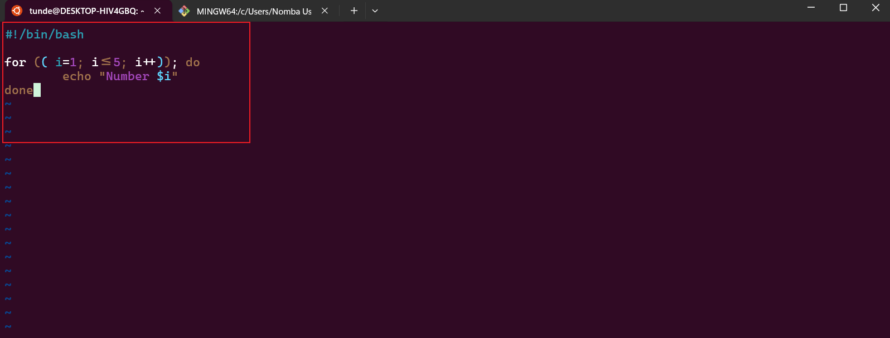

3. Save and exit the file, then confirm it was created:
   ```bash
   ls -latr for_loop_c_style.sh
   ```
   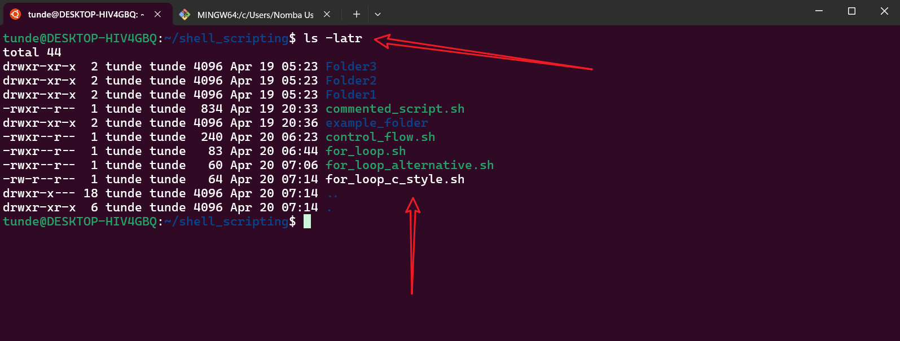

4. Make the file executable:
   ```bash
   chmod +x for_loop_c_style.sh
   ```
   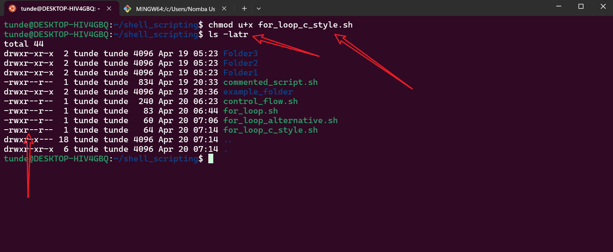

5. Run the script:
   ```bash
   ./for_loop_c_style.sh
   ```
   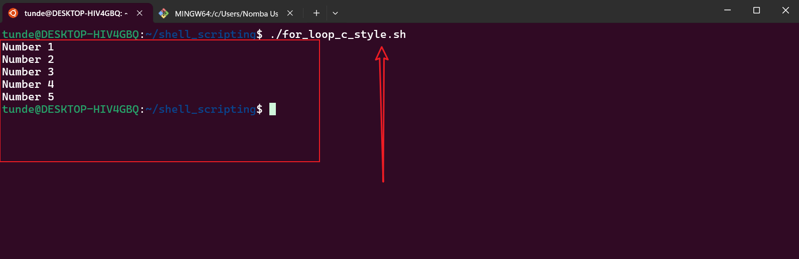

---

## Best Practices

1. **Use Comments**: Add comments to explain the purpose of your code, especially for complex logic.
2. **Validate Input**: Always validate user input to avoid unexpected behavior or errors.
3. **Use Meaningful Variable Names**: Use descriptive variable names to make your code more readable.
4. **Test Scripts**: Test your scripts in a safe environment before deploying them to production.
5. **Error Handling**: Include error handling to manage unexpected scenarios gracefully.
6. **Use ShellCheck**: Use tools like `ShellCheck` to lint your shell scripts and catch potential issues.

---

By following these examples and best practices, you can effectively use control flow statements in shell scripting to automate tasks and handle complex logic.


