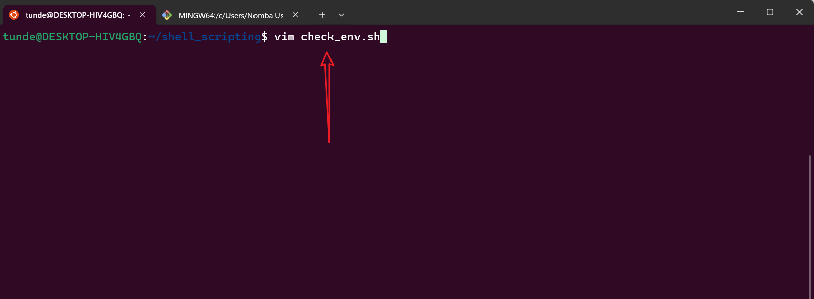
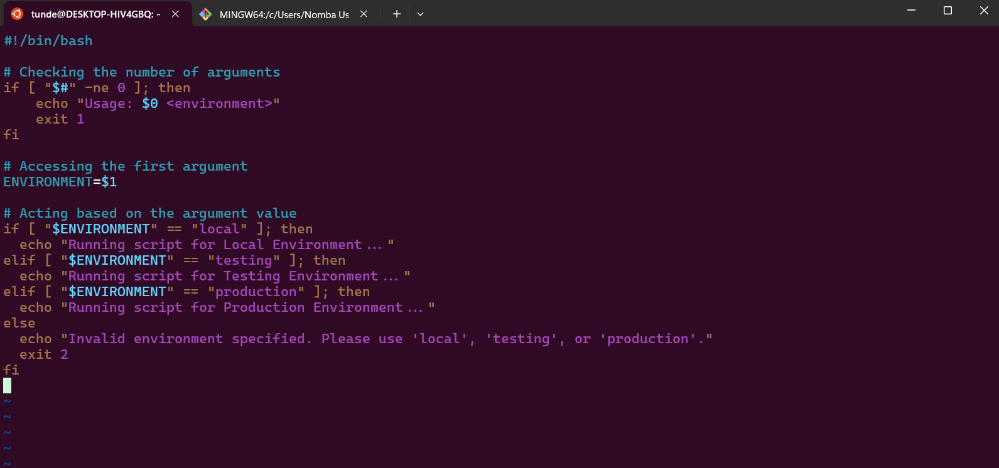
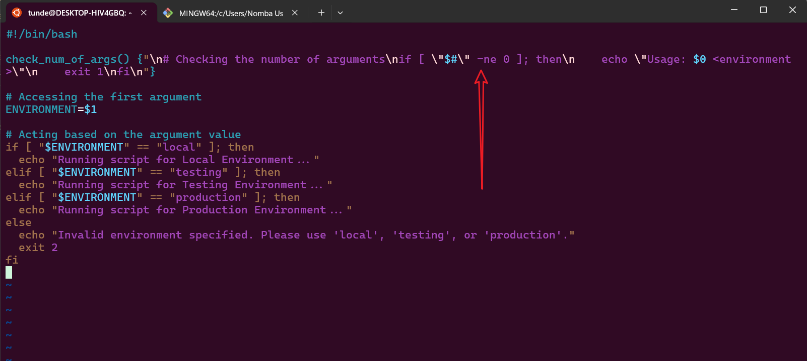
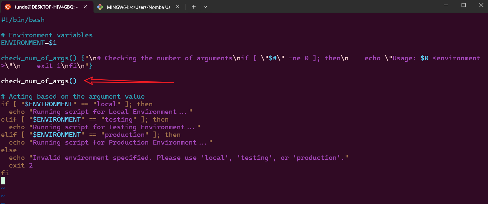
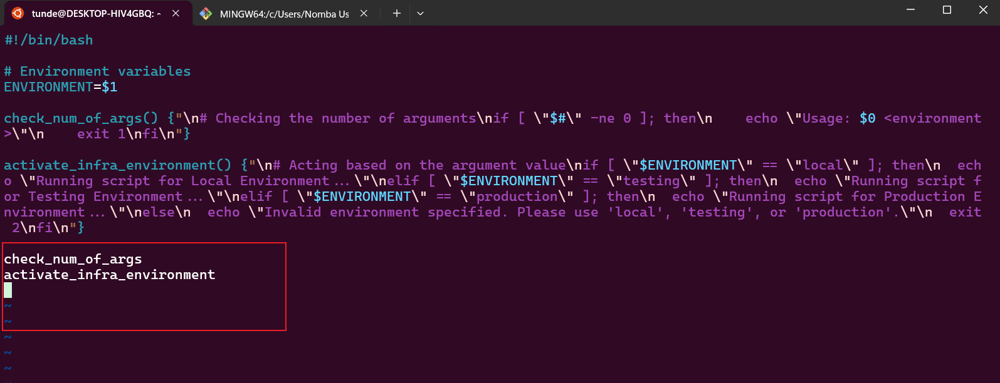
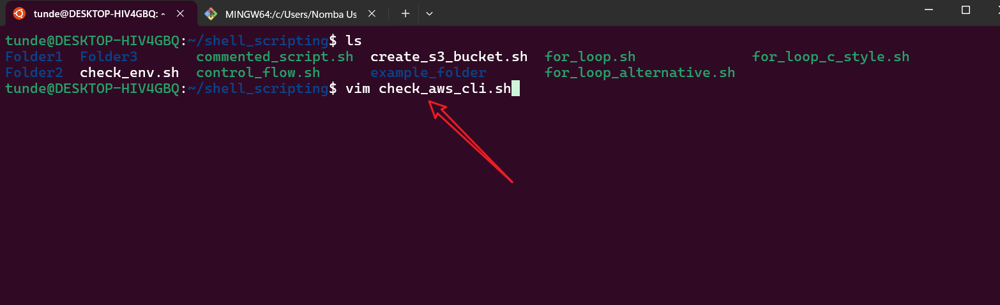
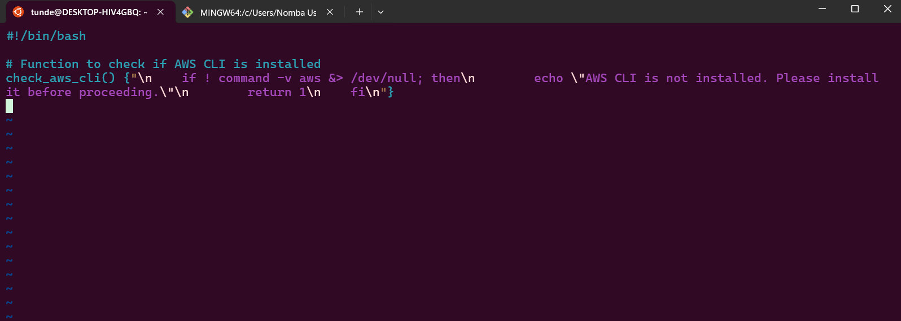
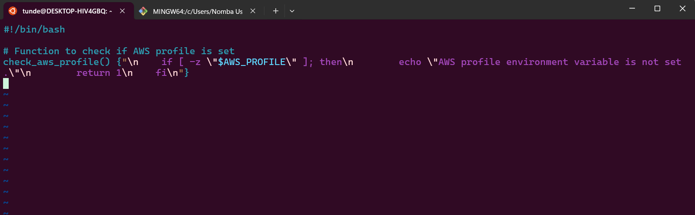
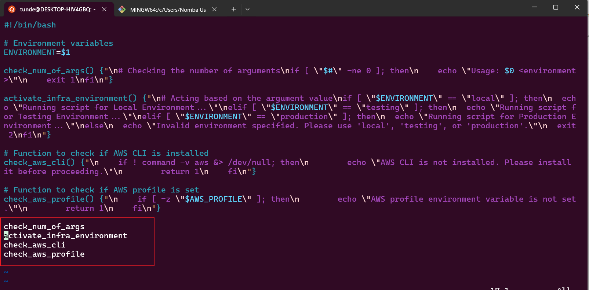

# Shell Scripting Use of Functions
Functions are essential in shell scripting for modularity and reusability. They allow you to encapsulate code into reusable blocks, making your scripts cleaner and easier to maintain. Below is a guide on how to define and use functions in shell scripts.

## Defining a Function
To define a function, use the following syntax:
```bash
function_name() {
    # code to be executed
}
```

## Calling a Function
To call a function, simply use its name followed by parentheses:
```bash
function_name
```
To break down the above example:
- `function_name` is the name of the function you want to define or call.
- The parentheses `()` are optional when calling the function, but they are often used for clarity.
- The curly braces `{}` enclose the code block that will be executed when the function is called.
- The `#` symbol is used for comments in shell scripts, and anything following it on the same line will be ignored by the shell.
- The `function` keyword is optional in bash, but it can be used for clarity. In POSIX-compliant shells, you should use the `function_name()` syntax without the `function` keyword.

## Case Study: DataWise Solution's Client
In this case study we will be creating a shell script that checks the following:
- Check if the script has an argument passed to it.
- Check if AWS CLI is installed.
- Check if environment variables exits to authenticate to AWS.

## Premise
### Initial Script without Functions
```bash
#!/bin/bash

# Checking the number of arguments
if [ "$#" -ne 0 ]; then
    echo "Usage: $0 <environment>"
    exit 1
fi

# Accessing the first argument
ENVIRONMENT=$1

# Acting based on the argument value
if [ "$ENVIRONMENT" == "local" ]; then
  echo "Running script for Local Environment..."
elif [ "$ENVIRONMENT" == "testing" ]; then
  echo "Running script for Testing Environment..."
elif [ "$ENVIRONMENT" == "production" ]; then
  echo "Running script for Production Environment..."
else
  echo "Invalid environment specified. Please use 'local', 'testing', or 'production'."
  exit 2
fi
```
### Creating the shell file called `check_env.sh` with vim editor
```bash
vim check_env.sh
```


### Adding the initial script to the file
- Press `i` to enter insert mode in vim.
- Paste the initial script into the file.
- Press `Esc` to exit insert mode.
- Type `:wq` to save and exit vim.
```bash
:wq
```


### Updating the script to use functions
```bash
#!/bin/bash

check_num_of_args() {"\n# Checking the number of arguments\nif [ \"$#\" -ne 0 ]; then\n    echo \"Usage: $0 <environment>\"\n    exit 1\nfi\n"}

# Accessing the first argument
ENVIRONMENT=$1

# Acting based on the argument value
if [ "$ENVIRONMENT" == "local" ]; then
  echo "Running script for Local Environment..."
elif [ "$ENVIRONMENT" == "testing" ]; then
  echo "Running script for Testing Environment..."
elif [ "$ENVIRONMENT" == "production" ]; then
  echo "Running script for Production Environment..."
else
  echo "Invalid environment specified. Please use 'local', 'testing', or 'production'."
  exit 2
fi
```


### Adding a call to the function
```bash
#!/bin/bash

# Environment variables
ENVIRONMENT=$1

check_num_of_args() {"\n# Checking the number of arguments\nif [ \"$#\" -ne 0 ]; then\n    echo \"Usage: $0 <environment>\"\n    exit 1\nfi\n"}

check_num_of_args()

# Acting based on the argument value
if [ "$ENVIRONMENT" == "local" ]; then
  echo "Running script for Local Environment..."
elif [ "$ENVIRONMENT" == "testing" ]; then
  echo "Running script for Testing Environment..."
elif [ "$ENVIRONMENT" == "production" ]; then
  echo "Running script for Production Environment..."
else
  echo "Invalid environment specified. Please use 'local', 'testing', or 'production'."
  exit 2
fi
```


### Encapsulating the infrastructure check in a function
```bash
#!/bin/bash

# Environment variables
ENVIRONMENT=$1

check_num_of_args() {"\n# Checking the number of arguments\nif [ \"$#\" -ne 0 ]; then\n    echo \"Usage: $0 <environment>\"\n    exit 1\nfi\n"}

activate_infra_environment() {"\n# Acting based on the argument value\nif [ \"$ENVIRONMENT\" == \"local\" ]; then\n  echo \"Running script for Local Environment...\"\nelif [ \"$ENVIRONMENT\" == \"testing\" ]; then\n  echo \"Running script for Testing Environment...\"\nelif [ \"$ENVIRONMENT\" == \"production\" ]; then\n  echo \"Running script for Production Environment...\"\nelse\n  echo \"Invalid environment specified. Please use 'local', 'testing', or 'production'.\"\n  exit 2\nfi\n"}

check_num_of_args
activate_infra_environment
```


## Creating the script to check if AWS CLI is installed
### Creating the shell file called `check_aws_cli.sh` with vim editor
```bash
vim check_aws_cli.sh
```


### Addiing the script with the function to check if AWS CLI is installed
```bash
#!/bin/bash

# Function to check if AWS CLI is installed
check_aws_cli() {"\n    if ! command -v aws &> /dev/null; then\n        echo \"AWS CLI is not installed. Please install it before proceeding.\"\n        return 1\n    fi\n"}
```
Let's break down the above code:
- The `check_aws_cli` function checks if the AWS CLI command is available in the system's PATH using the `command -v` command.
- If the command is not found, it prints a message indicating that AWS CLI is not installed and returns a non-zero status code (1) to indicate failure.
- If the command is found, the function will return a zero status code (0) indicating success.
- The `return` command is used to exit the function and return a value to the caller. In this case, it returns 1 if AWS CLI is not installed and 0 if it is installed.



## To config AWS CLI using the `aws configure` command

### Check if environment variable exists to authenticate to AWS
To programmatically create resources in AWS, you need to configure authentication using various means such as environment variables, configuration files, or IAM roles.
The ~/.aws/credentials and ~/.aws/config files are commonly used to store AWS credentials and configuration settings, respectively.
Running the `aws configure` command you ran earlier creates these files. You can use the `cat` command to open them and see the content.

## Credentials File (~/.aws/credentials)
The credentials file typically contains AWS access key ID and secret access key pairs. You will have only the default section at first, but you can add other environments as required—just as we have for testing and production below.
It is formatted as follows:
```ini
[default]
aws_access_key_id = YOUR_ACCESS_KEY_ID
aws_secret_access_key = YOUR_SECRET_ACCESS_KEY

[profile testing]
aws_access_key_id = YOUR_TESTING_ENVIRONMENT_ACCESS_KEY_ID
aws_secret_access_key = YOUR_TESTING_ENVIRONMENT_SECRET_ACCESS_KEY

[profile production]
aws_access_key_id = YOUR_PRODUCTION_ENVIRONMENT_ACCESS_KEY_ID
aws_secret_access_key = YOUR_PRODUCTION_ENVIRONMENT_SECRET_ACCESS_KEY
```
## Config File (~/.aws/config)
The config file contains the default region and output format. It is formatted as follows:
```ini
[default]
region = us-east-1
output = json

[profile testing]
region = us-west-2
output = json

[profile production]
region = us-west-2
output = json
```
## Adding a function that checks AWS profile environment variables
```bash
#!/bin/bash

# Function to check if AWS profile is set
check_aws_profile() {"\n    if [ -z \"$AWS_PROFILE\" ]; then\n        echo \"AWS profile environment variable is not set.\"\n        return 1\n    fi\n"}
```
Let's break down the above code:
- The `check_aws_profile` function checks if the `AWS_PROFILE` environment variable is set using the `-z` test operator, which returns true if the string is empty.
- If the variable is not set, it prints a message indicating that the AWS profile environment variable is not set and returns a non-zero status code (1) to indicate failure.
- If the variable is set, the function will return a zero status code (0) indicating success.
- The `return` command is used to exit the function and return a value to the caller. In this case, it returns 1 if the AWS profile environment variable is not set and 0 if it is set.



## Combining the functions into a single script
```bash
#!/bin/bash

# Environment variables
ENVIRONMENT=$1

check_num_of_args() {"\n# Checking the number of arguments\nif [ \"$#\" -ne 0 ]; then\n    echo \"Usage: $0 <environment>\"\n    exit 1\nfi\n"}

activate_infra_environment() {"\n# Acting based on the argument value\nif [ \"$ENVIRONMENT\" == \"local\" ]; then\n  echo \"Running script for Local Environment...\"\nelif [ \"$ENVIRONMENT\" == \"testing\" ]; then\n  echo \"Running script for Testing Environment...\"\nelif [ \"$ENVIRONMENT\" == \"production\" ]; then\n  echo \"Running script for Production Environment...\"\nelse\n  echo \"Invalid environment specified. Please use 'local', 'testing', or 'production'.\"\n  exit 2\nfi\n"}

# Function to check if AWS CLI is installed
check_aws_cli() {"\n    if ! command -v aws &> /dev/null; then\n        echo \"AWS CLI is not installed. Please install it before proceeding.\"\n        return 1\n    fi\n"}

# Function to check if AWS profile is set
check_aws_profile() {"\n    if [ -z \"$AWS_PROFILE\" ]; then\n        echo \"AWS profile environment variable is not set.\"\n        return 1\n    fi\n"}

check_num_of_args
activate_infra_environment
check_aws_cli
check_aws_profile
```

### Save and exit the file
```bash
:wq
```
## In Summary
- Functions are a powerful feature in shell scripting that allows you to encapsulate code into reusable blocks.
- They help improve code readability and maintainability by allowing you to break down complex scripts into smaller, manageable pieces.
- Functions can take arguments, return values, and be called from anywhere in the script.
- By using functions, you can create modular scripts that are easier to understand and maintain.
- In this case study, we created a shell script that checks the number of arguments, verifies if AWS CLI is installed, and checks if the AWS profile environment variable is set. This demonstrates how functions can be used to encapsulate specific tasks and improve the overall structure of the script.
- The script is designed to be modular, allowing for easy updates and modifications in the future.
- By using functions, we can easily add new checks or modify existing ones without affecting the overall structure of the script.
- This modular approach makes it easier to maintain and extend the script as needed.