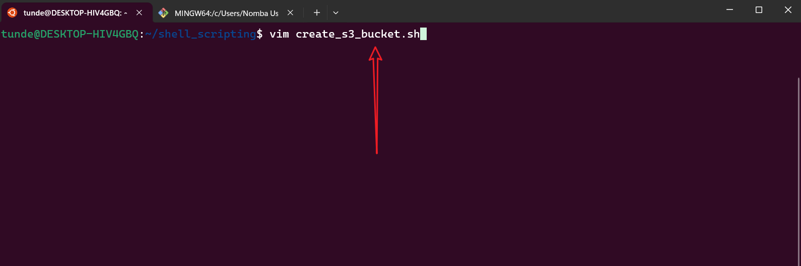
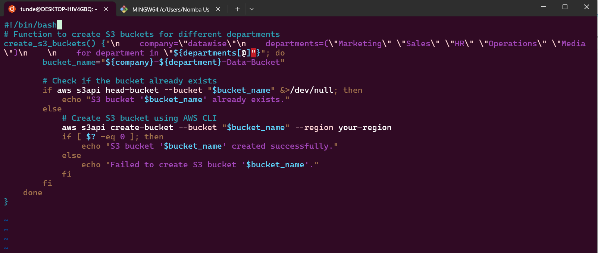

# Handling Errors in Shell Scripting Summary
From this mini project on error handling in shell scripting, I learned the importance of anticipating and managing potential issues that may arise during script execution to ensure reliability and usability. Key techniques include identifying potential errors such as invalid input or failed commands, using conditional statements (`if`, `elif`, `else`) to detect and respond to errors by checking command exit statuses (`$?`), and providing informative error messages to guide users in resolving problems. A practical example involved handling an S3 bucket existence error in AWS CLI scripts by checking if a bucket already exists before creating it, thereby preventing script failure and improving robustness.
### Handling Errors in Shell Scripting Example Use Cases
Here are some practical examples of how error handling can be applied in real-world shell scripting scenarios:
1. **Attempting to create an S3 bucket**: Before creating an S3 bucket, check if it already exists to avoid errors.
```bash
#!/bin/bash
# Function to create S3 buckets for different departments
create_s3_buckets() {"\n    company=\"datawise\"\n    departments=(\"Marketing\" \"Sales\" \"HR\" \"Operations\" \"Media\")\n    \n    for department in \"${departments[@]"}"; do
        bucket_name="${company}-${department}-Data-Bucket"
        
        # Check if the bucket already exists
        if aws s3api head-bucket --bucket "$bucket_name" &>/dev/null; then
            echo "S3 bucket '$bucket_name' already exists."
        else
            # Create S3 bucket using AWS CLI
            aws s3api create-bucket --bucket "$bucket_name" --region your-region
            if [ $? -eq 0 ]; then
                echo "S3 bucket '$bucket_name' created successfully."
            else
                echo "Failed to create S3 bucket '$bucket_name'."
            fi
        fi
    done
}
```
### Image one


### Image two


The above script checks if an S3 bucket exists before creating it, preventing potential errors and ensuring a smoother execution of the script.