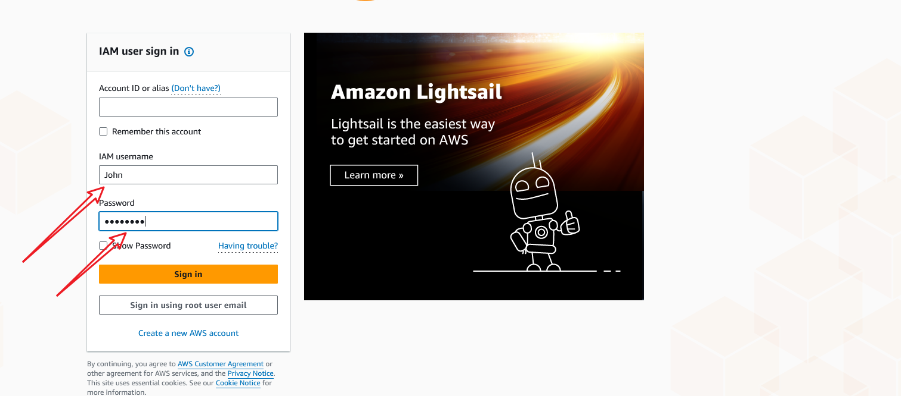
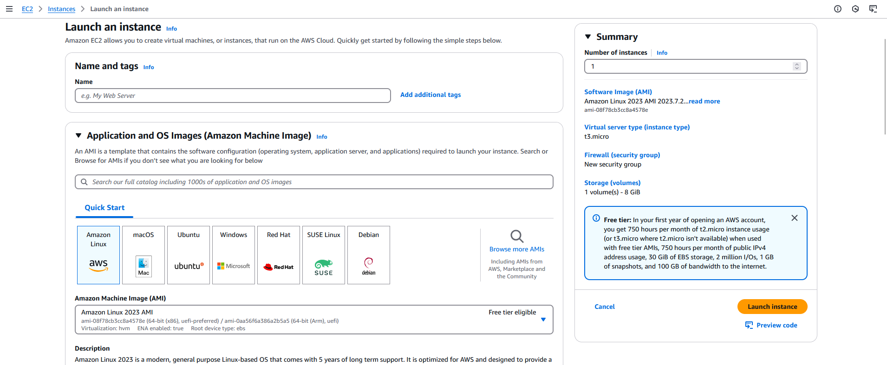
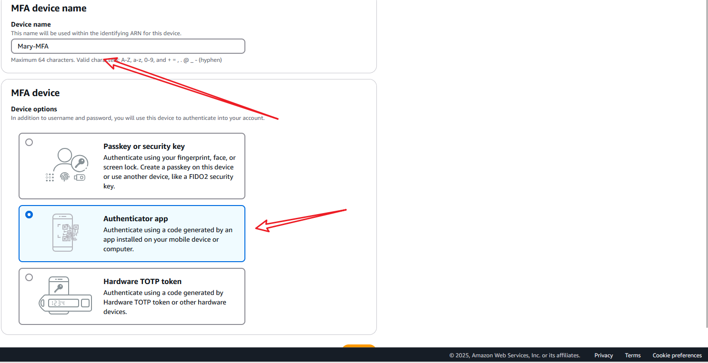
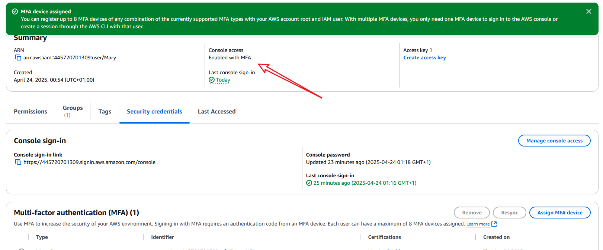

# Introduction to Cloud Computing – Security & Identity Management (IAM)
# Project Simulation: Zappy E-bank (Fintech) 
## Table of Contents
- [Introduction to Cloud Computing – Security & Identity Management (IAM)](#introduction-to-cloud-computing--security--identity-management-iam)
- [Project Simulation: Zappy E-bank (Fintech)](#project-simulation-zappy-e-bank-fintech)
- [Table of Contents](#table-of-contents)
- [Project Overview](#project-overview)
- [Project Objectives](#project-objectives)
- [Concepts Short Description](#concepts-short-description)
  - [IAM (Identity and Access Management)](#iam-identity-and-access-management)
  - [S3 (Simple Storage Service)](#s3-simple-storage-service)
  - [EC2 (Elastic Compute Cloud)](#ec2-elastic-compute-cloud)
  - [MFA (Multi-Factor Authentication)](#mfa-multi-factor-authentication)
  - [IAM Policies](#iam-policies)
    - [IAM Groups](#iam-groups)
    - [IAM Roles](#iam-roles)
    - [IAM Users](#iam-users)
    - [IAM Permissions](#iam-permissions)
- [Project Requirements](#project-requirements)
- [Project Steps](#project-steps)
  - [1. Creating IAM Users, Policies, and Groups](#1-creating-iam-users-policies-and-groups)
  - [2. Creating an S3 Bucket](#2-creating-an-s3-bucket)
  - [3. Creating an EC2 Instance](#3-creating-an-ec2-instance)
  - [4. Setting up MFA (Multi-Factor Authentication)](#4-setting-up-mfa-multi-factor-authentication)
  - [5. Project Experience and Reflection](#5-project-experience-and-reflection)
  - [6. Best Practices for Security and Identity Management in the Cloud](#6-best-practices-for-security-and-identity-management-in-the-cloud)
  - [7. Conclusion](#7-conclusion)

## Project Overview
This project would simulate a fictional bank called Zappy E-bank, which is an online bank that provides banking services. The project would demonstrate the process of creating IAM users, policies, and groups, as well as creating an S3 bucket and an EC2 instance. The project would also include setting up MFA (Multi-Factor Authentication) for the IAM users to enhance security. The project would be implemented using AWS services and would be documented in a clear and concise manner.
The project would also include screenshots and code snippets to illustrate the process. The project would be designed to be easy to follow and understand, even for those who are new to AWS and IAM. The project would also include best practices for security and identity management in the cloud.

***Bonus:*** The project would also include setting up MFA (Multi-Factor Authentication) for the IAM users to enhance security. The project would be implemented using AWS services and would be documented in a clear and concise manner. The project would also include screenshots and code snippets to illustrate the process. The project would be designed to be easy to follow and understand, even for those who are new to AWS and IAM. The project would also include best practices for security and identity management in the cloud.

## Project Objectives
- Create IAM users, policies, and groups for the Zappy E-bank project.
- Create an S3 bucket to store customer data and bank statements.
- Create an EC2 instance to host the Zappy E-bank application.
- Set up MFA (Multi-Factor Authentication) for the IAM users to enhance security.
- Document the process with screenshots and code snippets.
- Provide best practices for security and identity management in the cloud.
- Provide a clear and concise project report that is easy to follow and understand.
- Provide a project experience and takeaways section to reflect on the project and what was learned.
- Provide a conclusion section to summarize the project and its objectives.

## Concepts Short Description
### IAM (Identity and Access Management)
IAM is a web service that helps you securely control access to AWS services and resources for your users. With IAM, you can create and manage AWS users and groups, and use permissions to allow and deny their access to AWS resources. IAM is a global service that is not specific to any region. IAM is used to manage access to AWS services and resources securely. It allows you to create and manage users, groups, roles, and permissions.
IAM is a key component of AWS security and is used to control access to AWS resources. IAM allows you to create and manage users, groups, roles, and permissions. IAM is a global service that is not specific to any region. IAM is used to manage access to AWS services and resources securely. It allows you to create and manage users, groups, roles, and permissions.

### S3 (Simple Storage Service)
S3 is an object storage service that offers industry-leading scalability, data availability, security, and performance. Customers of all sizes and industries can use S3 to store and protect any amount of data for a range of use cases, such as data lakes, websites, mobile applications, backup and restore, archive, enterprise applications, IoT devices, and big data analytics. S3 is designed for 99.999999999% (11 9's) durability and stores data across multiple devices in multiple facilities. S3 is a highly durable storage service that is designed to provide 99.999999999% durability and 99.99% availability.

### EC2 (Elastic Compute Cloud)
EC2 is a web service that provides resizable compute capacity in the cloud. It is designed to make web-scale cloud computing easier for developers. EC2 provides a simple web interface that you can use to obtain and configure capacity with minimal friction. It allows you to launch as many or as few virtual servers as you need, configure security and networking, and manage storage. EC2 is a web service that provides resizable compute capacity in the cloud. It is designed to make web-scale cloud computing easier for developers.

### MFA (Multi-Factor Authentication)
MFA is a security mechanism that requires more than one form of verification to access an account or system. It adds an extra layer of security by requiring users to provide two or more verification factors to gain access to a resource, such as a bank account, email account, or online service. MFA is used to enhance security and protect against unauthorized access. It is a security mechanism that requires more than one form of verification to access an account or system.

### IAM Policies
IAM policies are JSON documents that define permissions for AWS resources. They specify what actions are allowed or denied on specific resources. IAM policies can be attached to users, groups, or roles to grant permissions. Policies can be managed (AWS-managed or customer-managed) or inline (embedded directly in a user, group, or role). IAM policies are used to define permissions for AWS resources. They specify what actions are allowed or denied on specific resources.
Policies can be managed (AWS-managed or customer-managed) or inline (embedded directly in a user, group, or role). IAM policies are JSON documents that define permissions for AWS resources. They specify what actions are allowed or denied on specific resources. Policies can be attached to users, groups, or roles to grant permissions.
#### IAM Groups
IAM groups are collections of IAM users. You can use groups to manage permissions for multiple users at once. Instead of assigning permissions to each user individually, you can assign permissions to a group and add users to that group. This simplifies permission management and makes it easier to apply consistent permissions across multiple users.
#### IAM Roles
IAM roles are similar to IAM users, but they are intended to be assumed by trusted entities, such as AWS services or applications. Roles allow you to delegate access to AWS resources without sharing long-term credentials. You can create a role with specific permissions and then allow trusted entities to assume that role temporarily.
#### IAM Users
IAM users are individual identities that you create in IAM to represent a person or application that interacts with AWS resources. Each IAM user has its own set of security credentials (access keys, passwords, etc.) and can be assigned permissions through policies. IAM users are used to manage access to AWS resources for individuals or applications.
#### IAM Permissions
IAM permissions are rules that define what actions are allowed or denied on specific AWS resources. Permissions are specified in IAM policies, which can be attached to users, groups, or roles. Permissions determine what actions a user or application can perform on AWS resources, such as S3 buckets or EC2 instances.
Permissions can be granted or denied based on the policies attached to the user, group, or role. IAM permissions are rules that define what actions are allowed or denied on specific AWS resources. Permissions are specified in IAM policies, which can be attached to users, groups, or roles. Permissions determine what actions a user or application can perform on AWS resources, such as S3 buckets or EC2 instances. Permissions can be granted or denied based on the policies attached to the user, group, or role.

## Project Requirements
- AWS root account access
- Basic knowledge of AWS services and IAM concepts
- AWS CLI installed and configured (optional)
- AWS Management Console access
- Basic knowledge of JSON and IAM policies
- Basic knowledge of EC2 and S3 services
- Basic knowledge of MFA (Multi-Factor Authentication)
- Basic knowledge of security best practices in the cloud

## Project Steps
### 1. Login to AWS Management Console as the root user
- Go to the AWS Management Console website (www.aws.amazon.com) and log in using your root account credentials.
- Navigate to the IAM (Identity and Access Management) service from the AWS Management Console.

- Complete the captcha verification if prompted.

- Complete the MFA (Multi-Factor Authentication) verification if prompted.

- Once logged in, from the AWS Management Console, navigate to the IAM (Identity and Access Management) service. 
***Note:** You can also use the search bar at the top of the console to find IAM quickly.)

- Once in the IAM dashboard, you will see an overview of your IAM resources, including users, groups, roles, and policies. This is where you will manage access to your AWS resources.

### 2. Create a new policy for development team called `Developer` to use EC2.
- In the IAM dashboard, click on "Policies" in the left navigation pane.

- Click on the "Create policy" button to create a new policy.

- In the service search bar, type "EC2" and select "EC2" from the list of services.

- Select all actions for EC2 by checking the box next to "All EC2 actions", and all for resources by checking the box next to "All resources".

- Click on "Next: Tags" to proceed to the next step.

- Provide a policy name `Developer` and an optional description. The name should be unique and descriptive of the policy's purpose.
- Click on "Next: Review" to proceed to the next step.
- Review the policy details and click on "Create policy" to finalize the creation of the policy.

- Click on `Create policy` to create the policy.
- On the policy dashboard, search the policy name `Developer` to verify that the policy was created successfully. You should see the policy listed among other AWS managed policies.

### 3. Create a new policy for the data analyst team called `analyst` to use S3.
- In the IAM dashboard, click on "Policies" in the left navigation pane.
- Click on the "Create policy" button to create a new policy.

- In the service search bar, type "S3" and select "S3" from the list of services.

- Select all actions for S3 by checking the box next to "All S3 actions", and all for resources by checking the box next to "All resources".

- Click on "Next: Tags" to proceed to the next step.

- Provide a policy name `analyst` and an optional description. The name should be unique and descriptive of the policy's purpose.
- Click on "Next: Review" to proceed to the next step.
- Review the policy details and click on "Create policy" to finalize the creation of the policy.

- Click on `Create policy` to create the policy.

- On the policy dashboard, search the policy name `analyst` to verify that the policy was created successfully. You should see the policy listed among other AWS managed policies.

### 4. Create a group called `Development-Team` and attach the `Developer` policy to it.
- In the IAM dashboard, click on "Groups" in the left navigation pane.

- Click on the "Create group" button to create a new group.
- Provide a group name `Development-Team` and click on "Create" to finalize the creation of the group.
- After the group is created, you will be redirected to the group details page.
- Click on the "Permissions" tab to attach the `Developer` policy to the group.
- Click on the "Attach policies" button.

- Search for the `Developer` policy in the search bar and check the box next to it.
- Click on the "Attach policy" button to attach the policy to the group.

- On the group dashboard, you will see the `Development-Team` group listed with the `Developer` policy attached to it. You will notice that the group has no users yet.

### 5. Create a group called `Analyst-Team` and attach the `analyst` policy to it.
- In the IAM dashboard, click on "Groups" in the left navigation pane.
- Click on the "Create group" button to create a new group.
- Provide a group name `Analyst-Team` and attach the `analyst` policy to it, then click on "Create" to finalize the creation of the group.

- On the group dashboard, you will see the `Analyst-Team` group listed with the `analyst` policy attached to it. You will notice that the group has no users yet.
- You will also notice the two groups listed in the UserGroup dashboard.

- Click on the `Analyst-Team` group to view its details.

- Click on the "Development-Team" group to view its details.

### 6. Creating IAM users 'John' for the `Development-Team` group and 'Mary' for the `Analyst-Team` group.
- In the IAM dashboard, click on "Users" in the left navigation pane.

- Click on the "Add user" button to create a new user.

- Provide a user name `John` and select the "Provide user access to AWS Management Console".
- Set the console password to "Autogenerated password" and uncheck the "Require password reset" option.

- Click on "Next: Permissions" to proceed to the next step.
- Select the `Development-Team` group to add the user to that group.
- Click on "Next: Tags" to proceed to the next step.

- Click on "Next: Review" to proceed to the next step.

- Review the user details and click on "Create user" to finalize the creation of the user.
- Download the CSV file containing the user's access key and secret key. This is important for accessing AWS resources programmatically.

- Going back to the IAM dashboard, you will see the `John` user listed under the `Development-Team` group.

- Repeat the same steps to create a user `Mary` for the `Analyst-Team` group.
- In the IAM dashboard, click on "Users" in the left navigation pane.
- Click on the "Add user" button to create a new user.

- Provide a user name `Mary` and select the "Provide user access to AWS Management Console".
- Set the console password to "Autogenerated password" and uncheck the "Require password reset" option.
- Click on "Next: Permissions" to proceed to the next step.
- Select the `Analyst-Team` group to add the user to that group.
- Click on "Next: Tags" to proceed to the next step.

- Click on "Next: Review" to proceed to the next step.
- Review the user details and click on "Create user" to finalize the creation of the user.

- Download the CSV file containing the user's access key and secret key. This is important for accessing AWS resources programmatically.

***Note: On the review page, you also have the option to send an email to the user with their login information. This is useful for providing the user with their access credentials.***

- Going back to the IAM dashboard, you will see the `Mary` user listed under the `Analyst-Team` group.

- Click on the `Mary` user to view its details.

### 7. Test the IAM users by logging in to the AWS Management Console using their credentials.
- Open a new browser tab and go to the AWS Management Console login page (https://aws.amazon.com/console/).
- Click on the "Sign in to the Console" button.

- The systen will require that you reset your password. Click on the "Reset password" button to proceed.

- You now have access to the AWS Management Console as the `John` user. You can now test the permissions granted to the user by trying to access different AWS services.

- Search for `EC2` in the search bar and click on it to access the EC2 dashboard.

- Click on the "Instances" link in the left navigation pane to view the list of EC2 instances.
- Launch an EC2 instance by clicking on the "Launch instance" button.

- By being able to launch an EC2 instance, you can confirm that the `John` user has the necessary permissions to use EC2.

- Test the `Mary` user by logging in to the AWS Management Console using their credentials.
- Open a new browser tab and go to the AWS Management Console login page (https://aws.amazon.com/console/).
- Click on the "Sign in to the Console" button.
- Enter the `Mary` user credentials (username and password) to log in.
- The system will require that you reset your password. Click on the "Reset password" button to proceed.

- You now have access to the AWS Management Console as the `Mary` user. You can now test the permissions granted to the user by trying to access different AWS services.

- Search for `S3` in the search bar and click on it to access the S3 dashboard.
- Click on the "Create bucket" button to create a new S3 bucket.

- By being able to create an S3 bucket, you can confirm that the `Mary` user has the necessary permissions to use S3.

## ***Bonus Activity:*** Implement MFA (Multi-Factor Authentication) for the IAM users.
- Ensure you are logged in to the AWS Management Console as the root user.
- In the IAM dashboard, click on "Users" in the left navigation pane.
- Click on the `John` user to view its details.
- Click on the "Security credentials" tab to view the security credentials for the user.

- Click on the "Manage" link next to "Assigned MFA device" to set up MFA for the user.
- Provide a name for the MFA device and select the type of MFA device you want to use (e.g., Virtual MFA device, U2F security key, etc.).

- For this demo the google authenticator app will be used. Download the Google Authenticator app on your mobile device and scan the QR code displayed on the screen.

- Scan the QR code using the Google Authenticator app on your mobile device. The app will generate a time-based one-time password (TOTP) that you will use to complete the MFA setup.

- Click on add MFA to add the MFA device to the user.
- Enter the two consecutive TOTP codes generated by the Google Authenticator app in the provided fields.
- Click on "Assign MFA" to finalize the setup of the MFA device for the user.
- You will see a confirmation message indicating that the MFA device has been successfully assigned to the user.
- You will also see the MFA device listed under the "Assigned MFA device" section.

- Repeat the same steps to set up MFA for the `Mary` user.
- In the IAM dashboard, click on "Users" in the left navigation pane.
- Click on the `Mary` user to view its details.
- Click on the "Security credentials" tab to view the security credentials for the user.
- Click on the "Manage" link next to "Assigned MFA device" to set up MFA for the user.
- Provide a name for the MFA device and select the type of MFA device you want to use (e.g., Virtual MFA device, U2F security key, etc.).
- For this demo the google authenticator app will be used. Download the Google Authenticator app on your mobile device and scan the QR code displayed on the screen.
- Click on add MFA to add the MFA device to the user.
- Enter the two consecutive TOTP codes generated by the Google Authenticator app in the provided fields.
- Click on "Assign MFA" to finalize the setup of the MFA device for the user.
- You will see a confirmation message indicating that the MFA device has been successfully assigned to the user.
- You will also see the MFA device listed under the "Assigned MFA device" section.

## 5. Project Experience and Reflection
- The project provided a hands-on experience with AWS IAM, S3, EC2, and MFA.
- It helped in understanding the importance of IAM in managing access to AWS resources securely.
- The project also highlighted the significance of using MFA to enhance security and protect against unauthorized access.
- The project was a great opportunity to learn about AWS services and how to implement security best practices in the cloud.
- The project also provided insights into the process of creating IAM users, policies, and groups, as well as creating S3 buckets and EC2 instances.
- The project helped in understanding the importance of IAM in managing access to AWS resources securely.
- The project also highlighted the significance of using MFA to enhance security and protect against unauthorized access.
- The project was a great opportunity to learn about AWS services and how to implement security best practices in the cloud.
- The project also provided insights into the process of creating IAM users, policies, and groups, as well as creating S3 buckets and EC2 instances.
- The project helped in understanding the importance of IAM in managing access to AWS resources securely.
- The project also highlighted the significance of using MFA to enhance security and protect against unauthorized access.
- The project also highlighted the difference between IAM users, groups, and roles, and how they can be used to manage access to AWS resources effectively.

### Differences between IAM Users, Groups, and Policies
- **IAM Users**: Individual identities that represent a person or application that interacts with AWS resources. Each IAM user has its own set of security credentials (access keys, passwords, etc.) and can be assigned permissions through policies.
- **IAM Groups**: Collections of IAM users. You can use groups to manage permissions for multiple users at once. Instead of assigning permissions to each user individually, you can assign permissions to a group and add users to that group. This simplifies permission management and makes it easier to apply consistent permissions across multiple users.
- **IAM Policies**: JSON documents that define permissions for AWS resources. They specify what actions are allowed or denied on specific resources. IAM policies can be attached to users, groups, or roles to grant permissions. Policies can be managed (AWS-managed or customer-managed) or inline (embedded directly in a user, group, or role). IAM policies are used to define permissions for AWS resources. They specify what actions are allowed or denied on specific resources. Policies can be attached to users, groups, or roles to grant permissions.

### Importance of Principles of Least Privilege and MFA
- **Principle of Least Privilege**: This principle states that users should only be granted the minimum permissions necessary to perform their job functions. This helps to reduce the risk of unauthorized access and potential security breaches. By following this principle, organizations can minimize the attack surface and limit the impact of compromised credentials.
- **MFA (Multi-Factor Authentication)**: MFA adds an extra layer of security by requiring users to provide two or more verification factors to gain access to a resource, such as a bank account, email account, or online service. This helps to protect against unauthorized access and enhances the overall security of the system. By implementing MFA, organizations can significantly reduce the risk of account compromise and unauthorized access to sensitive data.

### Reflection on the IAM users created for the project
- The IAM users created for the project (`John` and `Mary`) were assigned specific permissions based on their roles within the organization. `John` was given permissions to use EC2, while `Mary` was given permissions to use S3. This demonstrates the principle of least privilege, as each user has only the permissions necessary to perform their job functions.

## 6. Best Practices for Security and Identity Management in the Cloud
- Use IAM roles instead of IAM users whenever possible. Roles allow you to delegate access to AWS resources without sharing long-term credentials. This helps to reduce the risk of credential compromise and simplifies permission management.
- Implement the principle of least privilege by granting users only the permissions necessary to perform their job functions. This helps to reduce the risk of unauthorized access and potential security breaches.
- Use MFA (Multi-Factor Authentication) to enhance security and protect against unauthorized access. MFA adds an extra layer of security by requiring users to provide two or more verification factors to gain access to a resource.
- Regularly review and audit IAM policies, users, and groups to ensure that permissions are up to date and aligned with the principle of least privilege. This helps to identify and remove any unnecessary permissions that may pose a security risk.
- Use AWS CloudTrail to monitor and log API calls made by IAM users, roles, and groups. This helps to track changes made to IAM resources and provides visibility into user activity within the AWS environment.
- Implement strong password policies for IAM users, including password complexity requirements and regular password rotation. This helps to reduce the risk of credential compromise and enhances overall security.
- Use AWS Config to monitor and assess the configuration of IAM resources. This helps to ensure compliance with security best practices and provides visibility into changes made to IAM resources over time.
- Use AWS Organizations to manage multiple AWS accounts and apply security policies across accounts. This helps to simplify permission management and enhance security across the organization.
- Regularly back up IAM policies, users, and groups to ensure that you have a copy of your IAM configuration in case of accidental deletion or changes.
- Use AWS Identity and Access Management (IAM) Access Analyzer to identify and analyze resource policies that allow access to your resources from outside your AWS account. This helps to identify and mitigate potential security risks associated with resource sharing.
- Use AWS Secrets Manager to securely store and manage sensitive information, such as access keys and passwords. This helps to reduce the risk of credential compromise and enhances overall security.
- Use AWS Key Management Service (KMS) to manage encryption keys for your AWS resources. This helps to protect sensitive data and ensures that only authorized users have access to encryption keys.

## 7. Conclusion
- The project successfully demonstrated the process of creating IAM users, policies, and groups, as well as creating S3 buckets and EC2 instances.

