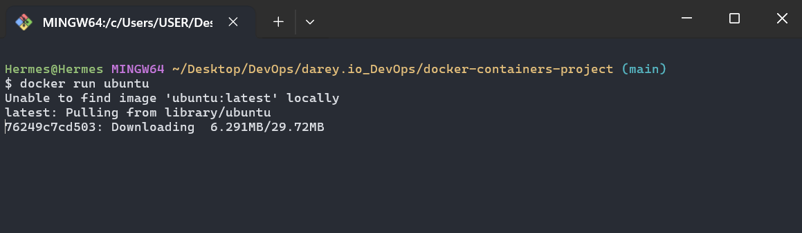
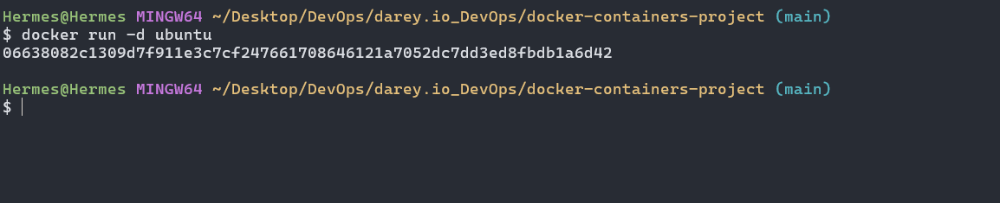
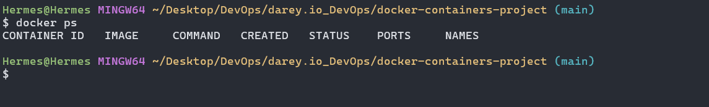
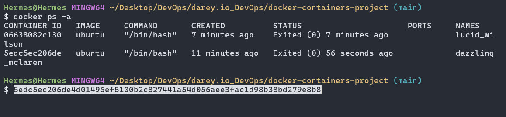
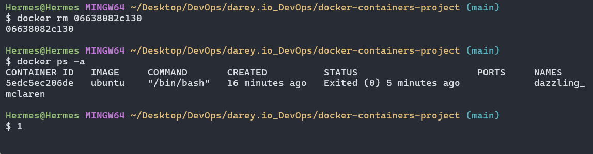

# 🚀 Docker Containers Quickstart Guide

Welcome! This guide will help you get started with Docker containers, providing practical commands and visual examples. Whether you're new to Docker or need a refresher, you'll find clear steps and explanations below.

---

## 📦 What Are Docker Containers?

> Docker containers are lightweight, portable, and self-sufficient units that package an application and its dependencies. They ensure consistent behavior across different environments and are built from Docker images. Containers share the host OS kernel but run in isolated user spaces, making them efficient and fast to start.

---

## 🏁 Running Your First Container

To launch an interactive Ubuntu container, use:

```bash
docker run -it ubuntu
```



**What does this do?**

- `docker run`: Creates and starts a new container.
- `-it`: Combines two options:
  - `-i` (interactive): Keeps standard input open for interaction.
  - `-t` (tty): Allocates a terminal interface.
- `ubuntu`: Specifies the image to use.

---

## 🕹️ Running Containers in Detached Mode

To run Ubuntu in the background (detached mode):

```bash
docker run -d ubuntu
```



**Explanation:**

- `-d`: Runs the container in the background and prints the container ID.

---

## 📋 Listing Containers

**Show only running containers:**

```bash
docker ps
```



**Show all containers (including stopped):**

```bash
docker ps -a
```



---

## 🔄 Managing Container Lifecycle

Start, stop, remove, or restart containers with these commands:

- **Start a container:**
  ```bash
  docker start <container_id_or_name>
  ```
- **Stop a container:**
  ```bash
  docker stop <container_id_or_name>
  ```
- **Remove a container:**
  ```bash
  docker rm <container_id_or_name>
  ```
- **Restart a container:**
  ```bash
  docker restart <container_id_or_name>
  ```



---

## 📝 Tips & Best Practices

- Name your containers for easier management: `docker run --name mycontainer ubuntu`
- Use `docker logs <container_id_or_name>` to view container output.
- Clean up unused containers/images regularly: `docker system prune`
- Explore more with `docker help` or the [official Docker documentation](https://docs.docker.com/).

---

Happy Dockering! 🐳
