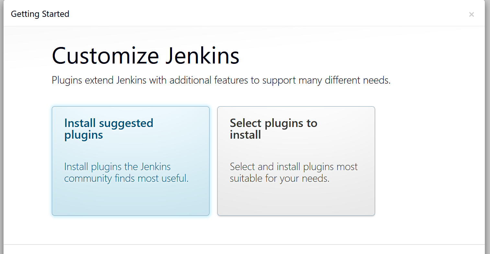

# Introduction to Jenkins

Jenkins is an open-source automation server that enables developers to build, test, and deploy their software projects efficiently. It provides a robust platform for continuous integration and continuous delivery (CI/CD) by automating various stages of the software development lifecycle.

## Key Features

- **Extensibility**: Jenkins supports a wide range of plugins that extend its functionality, allowing users to customize their CI/CD pipelines.
- **Pipeline as Code**: Jenkins allows users to define their build pipelines using code, making it easier to manage and version control.
- **Distributed Builds**: Jenkins can distribute build tasks across multiple machines, improving build performance and scalability.
- **Integration with Various Tools**: Jenkins integrates seamlessly with various version control systems, build tools, and deployment platforms.
- **Extensive Documentation**: Jenkins has extensive documentation that covers its features, plugins, and configuration options.
- **Active Community**: Jenkins has a large and active community that contributes to its development and provides support through forums and online resources.

## Getting Started

Installing Jenkins on AWS EC2 Instance

1. **Create an EC2 Instance**: Launch a new EC2 instance using an Amazon Linux 2 AMI or Ubuntu AMI.
2. **Connect to the Instance**: Use SSH to connect to your EC2 instance.


3. **Update the Package Index**:

   ```bash
   sudo yum update -y  # For Amazon Linux
   sudo apt update -y  # For Ubuntu
   ```

   

4. **Install JDK**:

   ```bash
   sudo apt install default-jdk-headless -y  # For Ubuntu
   sudo yum install java-11-amazon-corretto -y  # For Amazon Linux
   ```

   

5. **Install Jenkins**:

   ```bash
       wget -q -O - https://pkg.jenkins.io/debian-stable/jenkins.io.key | sudo apt-key add -
    sudo sh -c 'echo deb https://pkg.jenkins.io/debian-stable binary/ > \
    /etc/apt/sources.list.d/jenkins.list'
    sudo apt update
    sudo apt-get install jenkins
   ```

   

6. **Confirm Jenkins is Installed**:

   ```bash
   sudo systemctl status jenkins
   ```

   

7. **Create an Inbound Rule in Security Group**: Allow traffic on port 8080 (default Jenkins port) in the security group associated with your EC2 instance.

   

8. **Access Jenkins**: Open a web browser and navigate to `http://<your-ec2-public-ip>:8080`. You should see the Jenkins setup wizard.

   

9. **Check your Initial Admin Password**:

   ```bash
   sudo cat /var/lib/jenkins/secrets/initialAdminPassword
   ```

   

10. **Complete the Setup**: Follow the on-screen instructions to complete the Jenkins setup, including installing recommended plugins and creating your first admin user.
    

11. **Create an Admin User**: Set up your admin user account for Jenkins.

    

12. **Start Using Jenkins**: You can now start creating jobs and pipelines in Jenkins.

    

## Best Practices

- **Regularly Update Jenkins**: Regularly update Jenkins to ensure it remains up-to-date with the latest features and bug fixes.
- **Use Continuous Integration**: Use Jenkins for continuous integration and continuous delivery, automating the build, test, and deployment processes.
- **Secure Jenkins**: Implement security best practices, such as using strong passwords, enabling HTTPS, and restricting access to Jenkins.
- **Backup Jenkins Configuration**: Regularly back up your Jenkins configuration and job data to prevent data loss.
- **Monitor Jenkins Performance**: Monitor Jenkins performance and resource usage to ensure it runs smoothly and efficiently.

## Conclusion

Jenkins is a powerful tool for automating the software development process. By following the steps outlined in this guide, you can set up Jenkins on an AWS EC2 instance and begin leveraging its capabilities for continuous integration and continuous delivery.
