# Linux Administration Basic Mini Project

## Description
This project demonstrates the fundamental steps of Linux administration using AWS EC2 instances. It covers the process of accessing AWS services, managing EC2 instances, and establishing secure connections between local machines and cloud resources. This guide serves as a practical introduction to cloud-based Linux administration.

## Project Steps

### 1. AWS Console Access
The first step involves accessing the AWS Management Console. This is your central hub for managing all AWS services and resources.

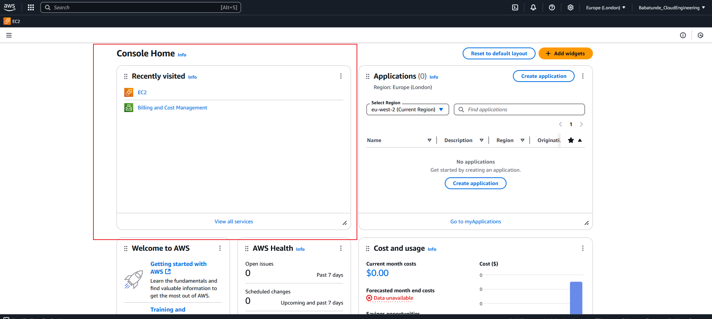

**Key Points:**
- Secure login through AWS Management Console
- Access to all AWS services and resources
- Dashboard provides overview of your AWS environment

### 2. EC2 Instance Management
The EC2 (Elastic Compute Cloud) service page allows you to view and manage your virtual servers in the cloud.

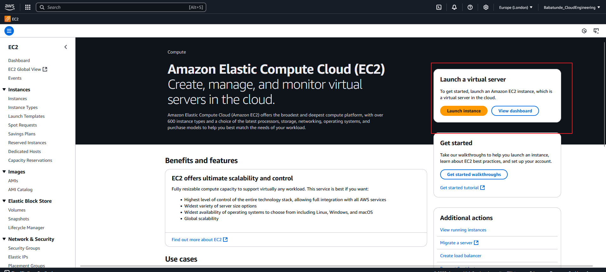

**Key Features:**
- Overview of all EC2 instances
- Instance status and configuration details
- Resource utilization metrics

### 3. EC2 Instance Operations
Proper instance management is crucial for both cost optimization and security. This section demonstrates how to control your EC2 instances.

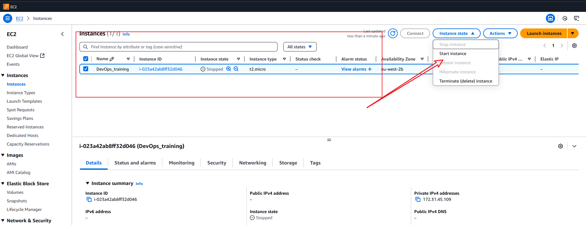

**Best Practices:**
- Start instances only when needed
- Stop instances when not in use to optimize costs
- Monitor instance state regularly
- Use appropriate instance types for your workload

### 4. Installed MobaXterm
This section shows the screenshot of the MobaXterm installed on my local machine.

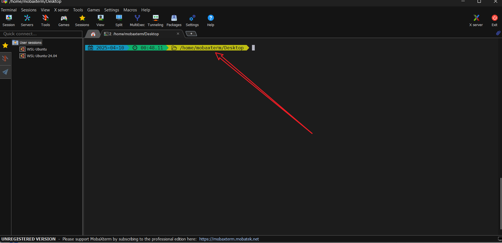

**Key Features:**
- Secure SSH connections
- File transfer capabilities
- Terminal emulation
- Multi-platform support

### 5. Confirming the .pem file
This section shows the screenshot of the .pem file that was downloaded from AWS console.
using the below command to confirm the .pem file
```
ls -l
```

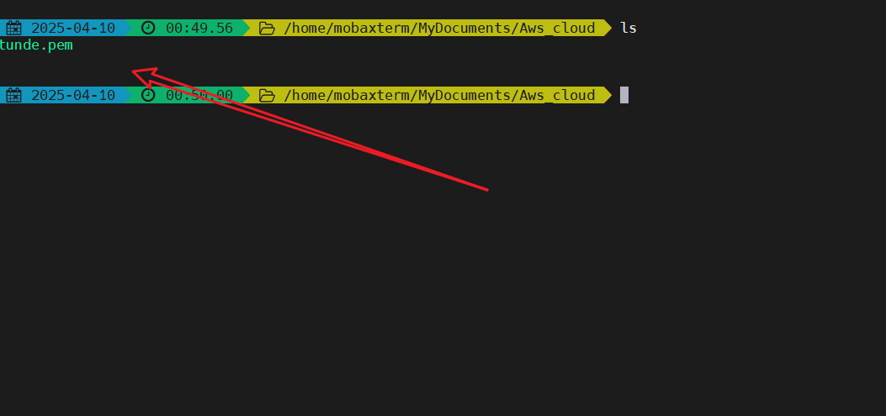

**Key Features:**
- Secure SSH connections
- File transfer capabilities

### 6. Getting the public IP address of the EC2 instance
This section shows the screenshot of the public IP address of the EC2 instance.

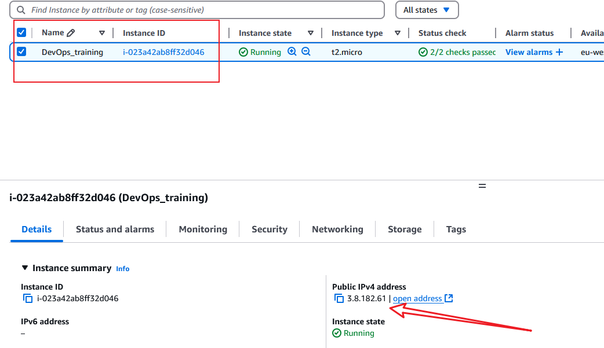

**Key Features:**
- Public IP address of the EC2 instance

### 7. Connecting to the EC2 instance
This section shows the screenshot of the connection to the EC2 instance.
Using the command below to connect to the EC2 instance
```
ssh -i "linux-key.pem" ubuntu@
```

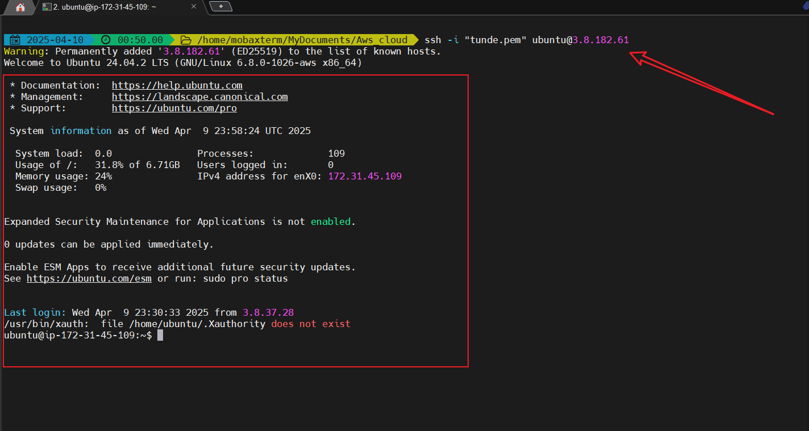

**Key Features:**
- Connection to the EC2 instance
- SSH connection
- File transfer capabilities


### 8. Updating the package list
This section shows the screenshot of the package list.
Using the command below to update the package list
```
sudo apt update
```

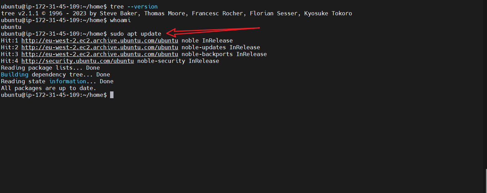

**Key Features:**
- Updating the package list

### 9. Installing tree command
This section shows the screenshot of the tree command.
Using the command below to install the tree command
```
sudo apt install tree
```

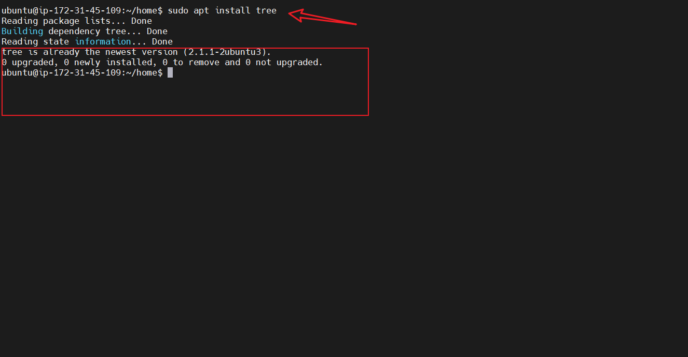

**Key Features:**
- Installing the tree command

### 10. Using tree command
This section shows the screenshot of the tree command.
Using the command below to use the tree command
```
tree /
```
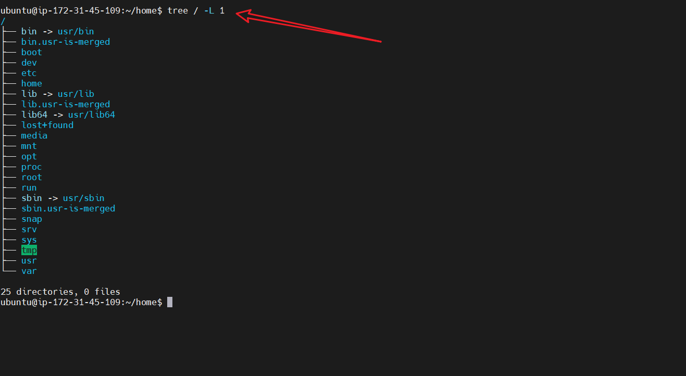

**Key Features:**
- Using the tree command

### 11. Upgrading the package
This section shows the screenshot of the upgrading the package.
Using the command below to upgrade the package
```
sudo apt upgrade
```

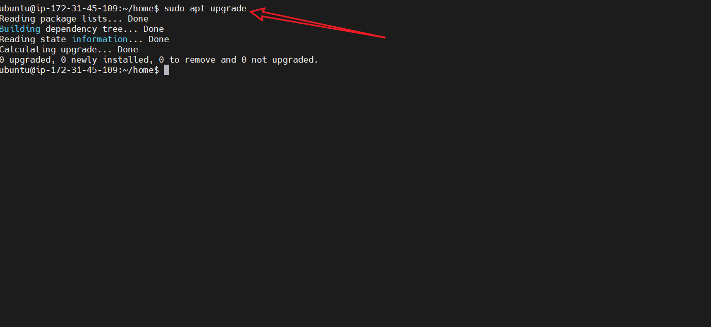

**Key Features:**
- Upgrading the package

### 12. Removing tree command
This section shows the screenshot of the removing the tree command.
Using the command below to remove the tree command
```
sudo apt remove tree
```

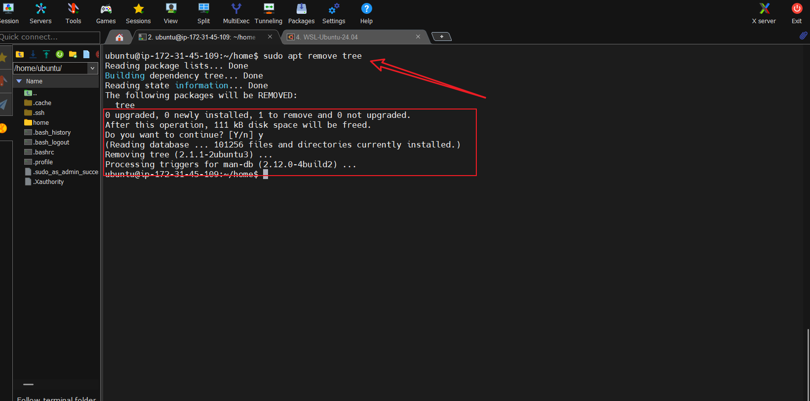

**Key Features:**
- Removing the tree command

### 13. Installing Nginx
This section shows the screenshot of the installing Nginx.
Using the command below to install Nginx
```
sudo apt install nginx
```

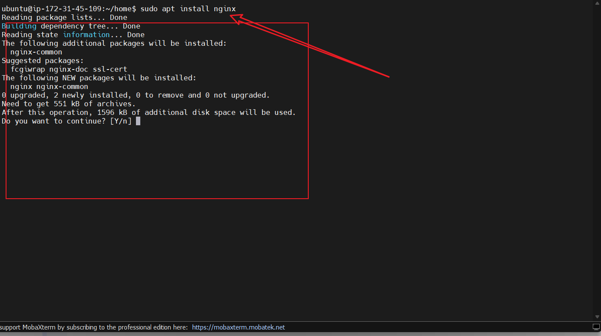

**Key Features:**
- Installing Nginx


