# Linux Text Editor Mini Project

A comprehensive guide to using two popular Linux text editors: Vim and Nano.

## Overview

This project demonstrates the basic usage of two essential Linux text editors:
- **Vim**: A powerful, modal text editor
- **Nano**: A user-friendly, beginner-friendly text editor

## Features

Both editors support the following basic operations:
- Creating new files
- Opening existing files
- Editing text
- Saving changes
- Exiting the editor

## Vim Editor Guide

Vim is a modal text editor with different modes for different operations. Here's how to use it:

### Basic Operations

1. **Opening/Creating a File**
   ```bash
   vim exercise.txt
   ```
   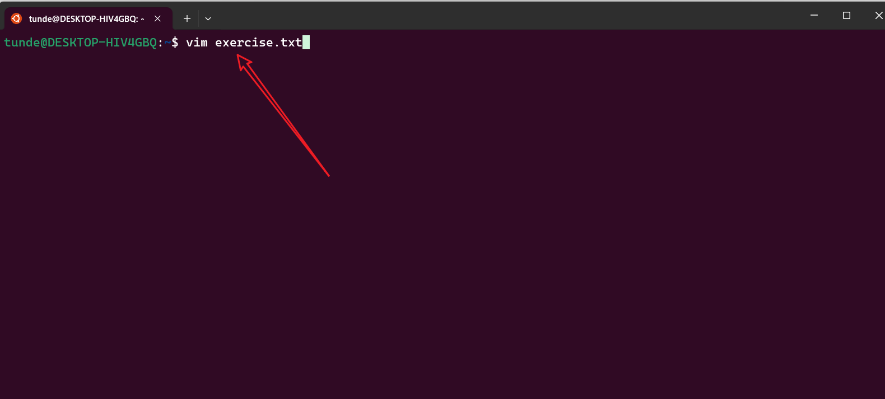

2. **Entering Insert Mode**
   - Press `i` to start typing
   - The cursor will blink, indicating insert mode
   ```bash
   i
   ```
   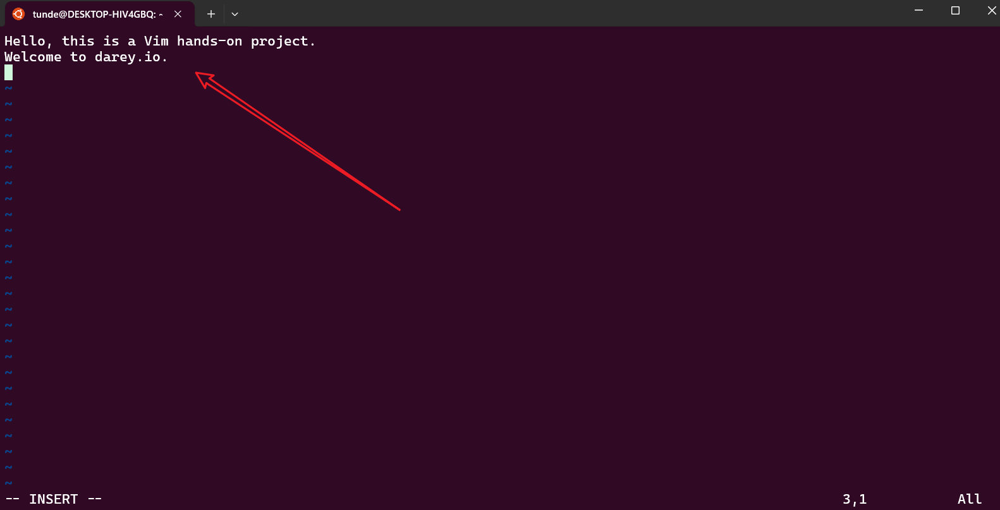

3. **Deleting Lines**
   - Press `dd` to delete an entire line
   ```bash
   dd
   ```
   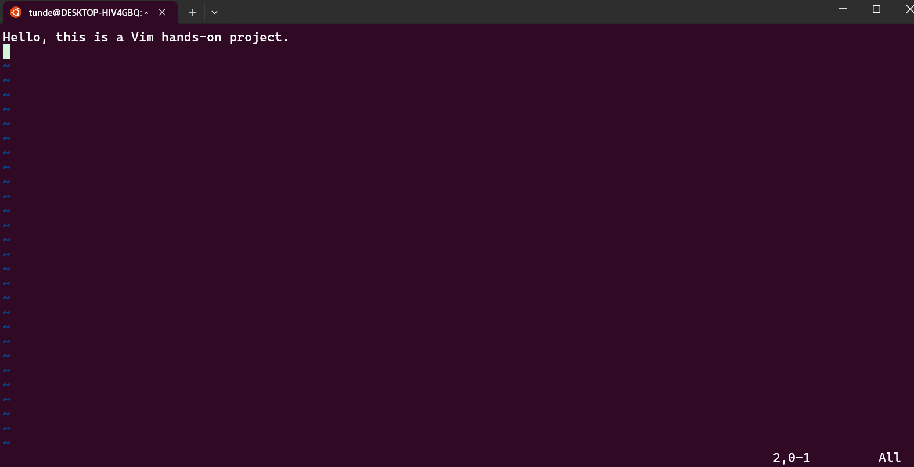

4. **Deleting Characters**
   - Press `x` to delete a single character
   ```bash
   x
   ```
   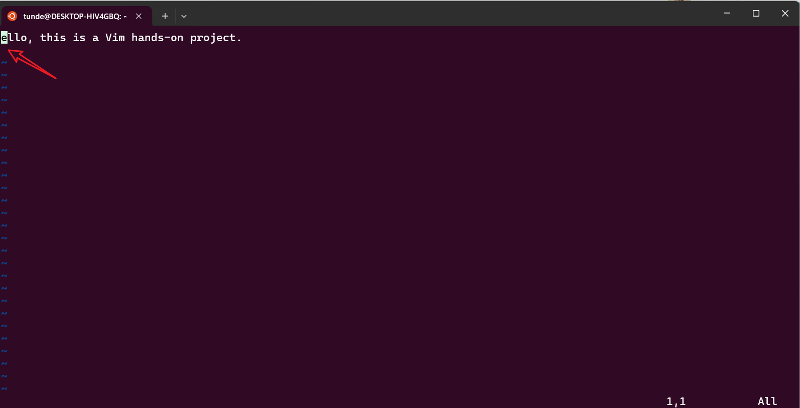

5. **Undoing Changes**
   - Press `u` to undo the last change
   ```bash
   u
   ```
   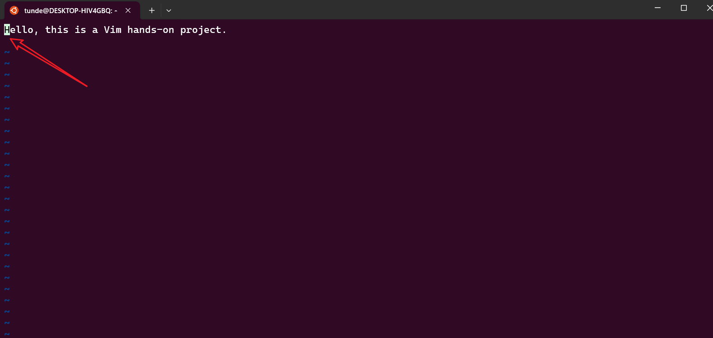

### Saving and Exiting

1. **Save and Exit**
   - Press `esc` to return to command mode
   - Type `:wq` and press `enter`
   ```bash
   :wq
   ```
   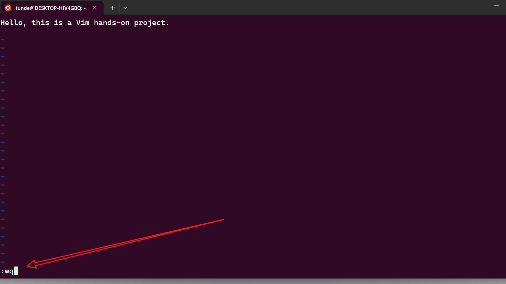

2. **Exit Without Saving**
   - Press `esc` to return to command mode
   - Type `:q!` and press `enter`
   ```bash
   :q!
   ```
   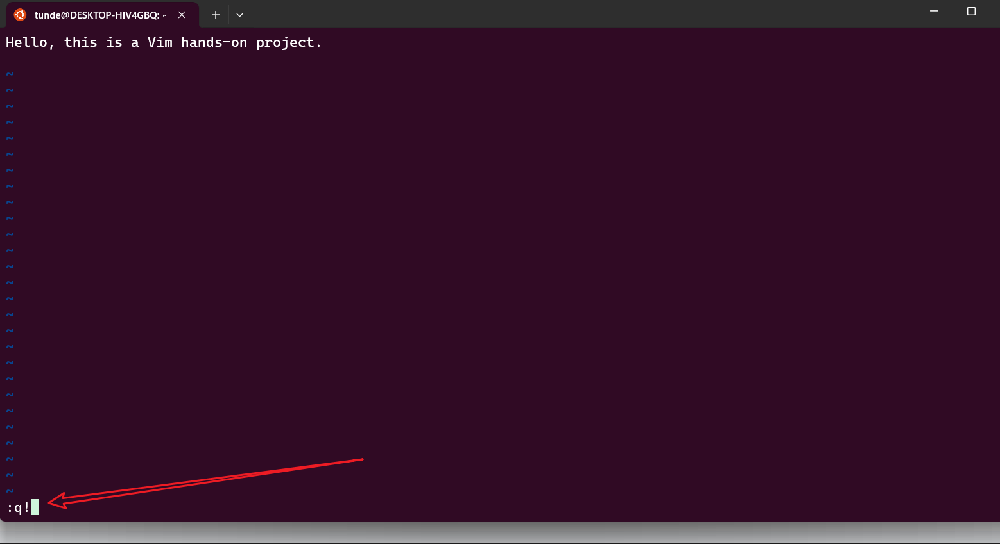

## Nano Editor Guide

Nano is a straightforward text editor, perfect for beginners. Here's how to use it:

### Basic Operations

1. **Opening/Creating a File**
   ```bash
   nano nano_file.txt
   ```
   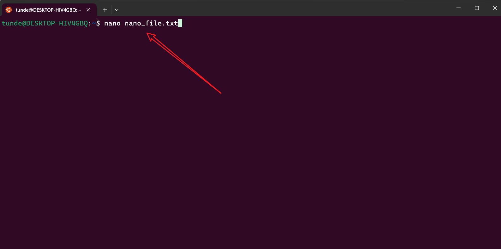

2. **Saving Changes**
   - Press `Ctrl + O` to save
   - Press `Enter` to confirm
   ```bash
   ctrl + o
   ```
   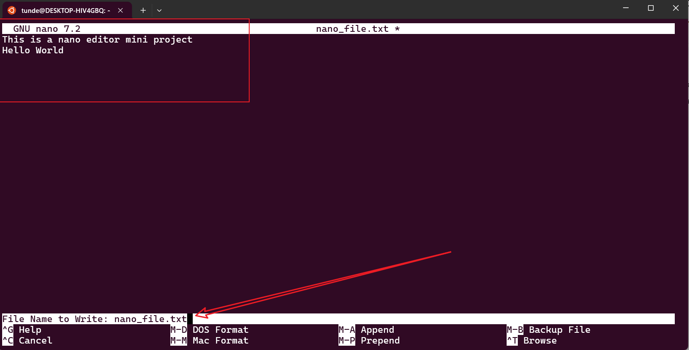

3. **Exiting Nano**
   - Press `Ctrl + X`
   - Press `Y` to save changes (if needed)
   - Press `Enter` to confirm
   ```bash
   ctrl + x
   enter
   ```
   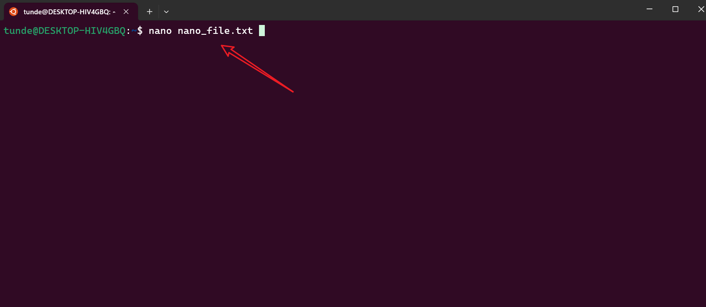

4. **Adding New Lines**
   - Simply press `Enter` to add a new line
   - Save and reopen the file to see changes
   ```bash
   nano nano_file.txt
   ```
   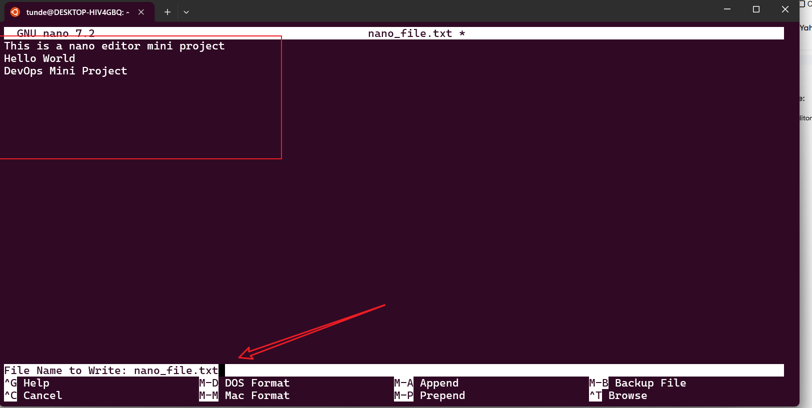

## Tips
- Vim is more powerful but has a steeper learning curve
- Nano is more intuitive for beginners
- Both editors are pre-installed on most Linux distributions
- Use `man vim` or `man nano` in terminal for detailed documentation

## Contributing
Feel free to contribute to this project by submitting issues or pull requests.

## License
This project is open source and available under the MIT License.


